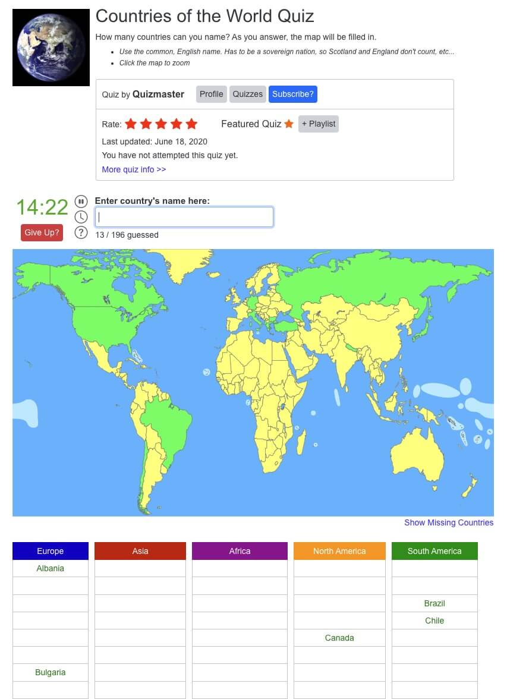
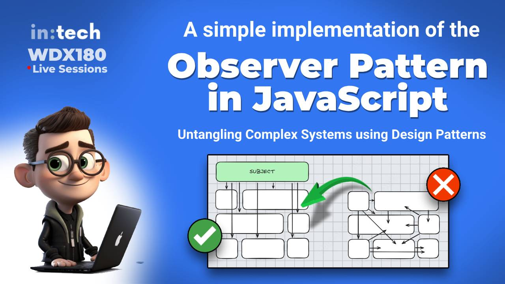
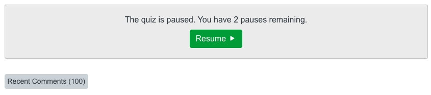
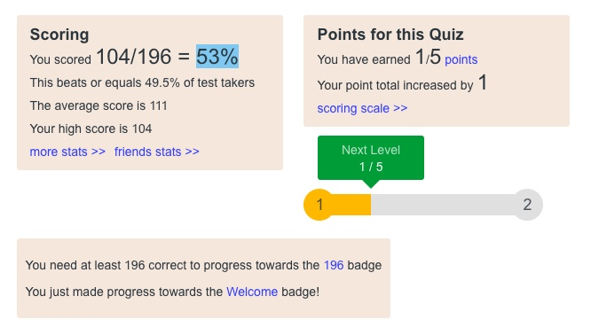
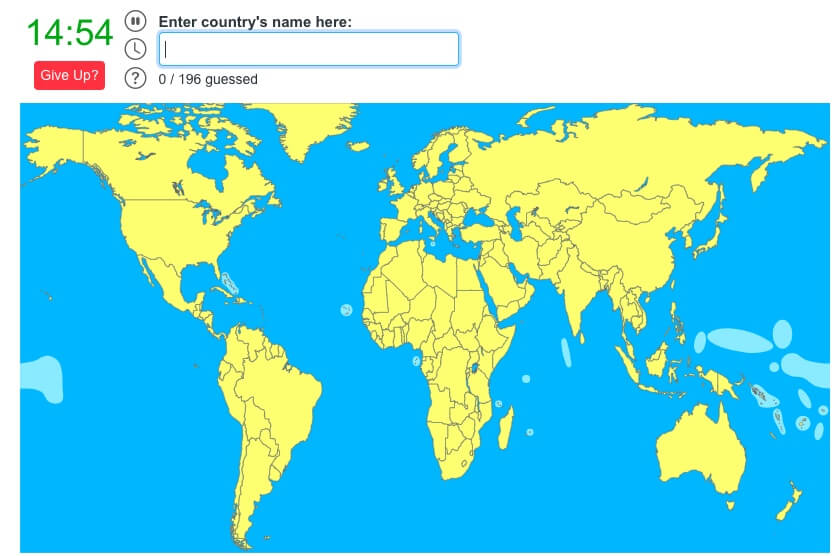

<h1 id="{{ Week 18-Intermediate JavaScript | slugify }}">
  Week 18 | Intermediate JavaScript
</h1>

  

  <h2 class="week-controls__previous_week">

    

      

      <a href="../week{{ previous_week_num }}">Week {{ previous_week_num }} &#8678;</a>
    

  </h2>

  Updated: 10/2/2025

  <h2 class="week-controls__next_week">

    

      

      <a href="../week{{ next_week_num }}">&#8680; Week {{ next_week_num }}</a>
    

  </h2>

---

<!-- Week 18 - Day 1 | Recreate Countries of the World Quiz Game -->

  

    <h2>
      Week 18 - Day 1 | Recreate Countries of the World Quiz Game</h2>
  

### Schedule

  - **Watch the lectures**
  - **Study the suggested material**
  - **Practice on the topics and share your questions**

### Study Plan

  

  In these lectures, we are going to try and recreate an online quiz game entitled **Countries of the World Quiz**.

  You can find the online quiz game on [this link](https://www.jetpunk.com/quizzes/how-many-countries-can-you-name)_blank.

  Your instructor will share the video lectures with you. Here are the topics covered:

  - **Part 1:** Q&A. Recreating `Countries of the World Quiz` game (Part 1)
  - **Part 2:** Recreating `Countries of the World Quiz` game (Part 2)

  You can find the lecture code [here](https://github.com/in-tech-gration/WDX-180/tree/main/curriculum/week18/assets/code/country-quiz){:target="_blank"}

  **Lecture Notes & Questions:**

  - **Reminder:** [...document.querySelectorAll("td")] => `document.querySelectorAll("td")`  
    - There is a difference between [**NodeList**](https://developer.mozilla.org/en-US/docs/Web/API/NodeList){:target="_blank"} and [**HTMLCollection**](https://developer.mozilla.org/en-US/docs/Web/API/HTMLCollection){:target="_blank"}  
      - `NodeList` => `@@iterator` => `for..of`
  - **console.dir**( HTMLElement objects ) for a different view on the console  
  - [HTMLDivElement](https://developer.mozilla.org/en-US/docs/Web/API/HTMLDivElement){:target="_blank"} <= [HTMLElement](https://developer.mozilla.org/en-US/docs/Web/API/HTMLElement){:target="_blank"}  
  - [HTMLCollection](https://developer.mozilla.org/en-US/docs/Web/API/HTMLCollection){:target="_blank"} does not support `forEach` (you’ll need to convert to array)  
  - Convert array-like objects *(HTMLCollection, NodeList, arguments,etc.)* to Arrays:  
    - **Array.from** (check the MD)  
    - **[...someArrayLikeObjectHere]**  
  - [**NodeList**](https://developer.mozilla.org/en-US/docs/Web/API/NodeList){:target="_blank"} supports forEach  
  - **DOM API**:  
    - `document.getElementById // A single HTMLElement`  
    - `document.querySelector  // A single HTMLElement` 
    - `document.getElementsByClassName // HTMLCollection`  
    - `document.getElementsByTagName // HTMLCollection`  
    - `document.querySelectorAll // NodeList`  
  <!-- - The different objects that are returned by the DOM API: [codepen](https://codepen.io/kostasx/pen/yLwRdee?editors=1011)   -->
  - 2 big categories of graphics in computers: Bitmaps (or Raster) vs Vectors  
  - Include a folder in VSCode workspace: `code -a .`  
  - Search for “json countries github” to find resources for use in JS  
  - [**Array some()**](https://developer.mozilla.org/en-US/docs/Web/JavaScript/Reference/Global_Objects/Array/some){:target="_blank"}

  **References & Resources:**

  - [Free SVG World Map](https://simplemaps.com/resources/svg-world){:target="_blank"}

  - [Color this sofa! – SVG + Blend Mode trick](https://codepen.io/kostasx/pen/abbZyzj){:target="_blank"}
  - [Undraw (free vector illustrations)](https://undraw.co/illustrations){:target="_blank"}

  - SVG Editors:
    - [https://boxy-svg.com/app](https://boxy-svg.com/app){:target="_blank"}
    - [https://www.vectorpea.com](https://www.vectorpea.com){:target="_blank"}

  - Free Vectors:
    - [SVGP*rn](https://svgporn.com/){:target="_blank"}
    - [SVG and PNG tech icons](https://techicons.dev/){:target="_blank"}
    - [https://www.vecteezy.com/](https://www.vecteezy.com/){:target="_blank"}

<!-- Summary -->

### Exercises

  Complete the quiz game and make sure to implement the following requirements:

  - Enable case-insensitive input
  - Clear input value once we have the correct input
  - Update count of found countries
  - Add some styling to the game so that it looks like the original game
  - Find out how to properly center and display an SVG  
    - Learn about the `width`, `height` and `viewbox` attributes  
  - Deal with cases/values like *Curaçao*  
  - Deal with cases like "St. Eustatius (Netherlands)"  
  - Question/Study: What are some use cases for `submit` vs `change` vs `input` events?  
    - For example, Google search input uses the “input” event

  **IMPORTANT:** Make sure to complete all the tasks found in the **daily Progress Sheet** and update the sheet accordingly. Once you've updated the sheet, don't forget to `commit` and `push`. The progress draft sheet for this day is: **/user/week18/progress/progress.draft.w18.d01.csv**

  You should **NEVER** update the `draft` sheets directly, but rather work on a copy of them according to the instructions [found here](../week01/resources/PROGRESS-WORKFLOW.md).

### Extra Resources

  ---

  _Photo by [Monstera Production](https://www.pexels.com/photo/a-world-map-on-the-wall-7412035/)_

<!-- Sources and Attributions -->
  

<!-- Week 18 - Day 2 | The Observer Pattern -->

  

    <h2>
      Week 18 - Day 2 | The Observer Pattern</h2>
  

### Schedule

  - **Watch the lecture**
  - **Study the suggested material**
  - **Practice on the topics and share your questions**

### Study Plan

  {:target="_blank"}

  Watch our lecture on: [Intro to Design Patterns: A Simple Implementation of the Observer Pattern in JavaScript](https://youtu.be/fRpYNR_vM5A){:target="_blank"}

  The lecture code can be found [here](https://github.com/in-tech-gration/WDX-180/tree/main/curriculum/modules/computer_science/design_patterns/observer_pattern/source_code){:target="_blank"}.

  **References and resources for further study:**

  - [On Complex Systems](https://en.wikipedia.org/wiki/Complex_system){:target="_blank"}
  - [The Publish/Subscribe pattern](https://en.wikipedia.org/wiki/Publish%E2%80%93subscribe_pattern){:target="_blank"}
  - [Implementing the PubSub pattern in JS](https://medium.com/@ignatovich.dm/implementing-the-pub-sub-pattern-in-javascript-a-guide-for-beginners-44714a76d8c7){:target="_blank"}
  - [The Observer pattern at patterns.dev](https://www.patterns.dev/vanilla/observer-pattern){:target="_blank"}
  - [The Observer Pattern](https://refactoring.guru/design-patterns/observer){:target="_blank"}
  - [CRUD explained in 1 minute](https://www.youtube.com/shorts/AkDe3weBBsY){:target="_blank"}
  - [Private Properties in ES6 Classes](https://developer.mozilla.org/en-US/docs/Web/JavaScript/Reference/Classes/Private_properties){:target="_blank"}
  - [What is a Complex System?](https://www.youtube.com/watch?v=vp8v2Udd_PM){:target="_blank"} 
  - [Water CSS](https://watercss.kognise.dev){:target="_blank"}

  

<!-- Summary -->

### Exercises

  Your task for today is to try and complete all the challenges in the email app that we started developing during the lecture and implement all the required features (delete messages, display messages, star messages, mark messages as unread/read, etc.)

  It would be even better to try and work with one of these really cool email client clones:

  - [https://codepen.io/triss90/pen/WwvyRa](https://codepen.io/triss90/pen/WwvyRa){:target="_blank"}
  - [https://codepen.io/jonvadillo/pen/zzKawv](https://codepen.io/jonvadillo/pen/zzKawv){:target="_blank"}
  - [https://codepen.io/kostasx/pen/mybZpMR](https://codepen.io/kostasx/pen/mybZpMR){:target="_blank"}
  - {:target="_blank"}

  ---

  If you have some time left, you can take a look at the next challenge for this week, which is to try and replicate all the features of the Countries Quiz game that we've covered on [Week 18, Day 01](https://in-tech-gration.github.io/WDX-180/curriculum/week18/){:target="_blank"}:

  - Star quiz button
  - Timer
  - List of Continents and countries found (and not found)
  - Pause timer button
  - Disable timer button
  - Help box
  - Give up button
  - Guesses counter
  - Advanced: show missing countries 
  - Your extra features!?

  

  

  

  

  

  You can find the lecture code [here](https://github.com/in-tech-gration/WDX-180/tree/main/curriculum/week18/assets/code/country-quiz){:target="_blank"}

  Perhaps you can try using the Observer pattern on the quiz game? That would definitely be a great challenge. Give it a try!

  The original game can be found [here](https://www.jetpunk.com/quizzes/how-many-countries-can-you-name){:target="_blank"}.

  **IMPORTANT:** Make sure to complete all the tasks found in the **daily Progress Sheet** and update the sheet accordingly. Once you've updated the sheet, don't forget to `commit` and `push`. The progress draft sheet for this day is: **/user/week18/progress/progress.draft.w18.d02.csv**

  You should **NEVER** update the `draft` sheets directly, but rather work on a copy of them according to the instructions [found here](../week01/resources/PROGRESS-WORKFLOW.md).

<!-- Extra Resources -->

<!-- Sources and Attributions -->
  

<!-- Week 18 - Day 3 | TBA -->

  

    <h2>
      Week 18 - Day 3 | TBA</h2>
  

### Schedule

  - **Watch the lectures**
  - **Study the suggested material**
  - **Practice on the topics and share your questions**

### Study Plan

  Your instructor will share the video lectures with you. Here are the topics covered:

  - **Part 1:** 
  - **Part 2:**

  You can find the lecture code [here](){:target="_blank"}

  **Lecture Notes & Questions:**

  **References & Resources:**

<!-- Summary -->

<!-- Exercises -->

<!-- Extra Resources -->

<!-- Sources and Attributions -->
  

<!-- Week 18 - Day 4 | TBA -->

  

    <h2>
      Week 18 - Day 4 | TBA</h2>
  

### Schedule

  - **Study the suggested material**
  - **Practice on the topics and share your questions**

<!-- Study Plan -->

<!-- Summary -->

<!-- Exercises -->

<!-- Extra Resources -->

<!-- Sources and Attributions -->
  

<!-- Week 18 - Day 5 | TBA -->

  

    <h2>
      Week 18 - Day 5 | TBA</h2>
  

### Schedule

  - **Watch the lectures**
  - **Study the suggested material**
  - **Practice on the topics and share your questions**

### Study Plan

  Your instructor will share the video lectures with you. Here are the topics covered:

  - **Part 1:** 
  - **Part 2:**

  You can find the lecture code [here](){:target="_blank"}

  **Lecture Notes & Questions:**

  **References & Resources:**

<!-- Summary -->

<!-- Exercises -->

<!-- Extra Resources -->

<!-- Sources and Attributions -->
  

**Weekly feedback:** Hey, it's really important for us to know how your experience with the course has been so far, so don't forget to fill in and submit your [**mandatory** feedback form](https://forms.gle/S6Zg3bbS2uuwsSZF9){:target="_blank"} before the day ends. Thanks you!

---

<!-- COMMENTS: -->
