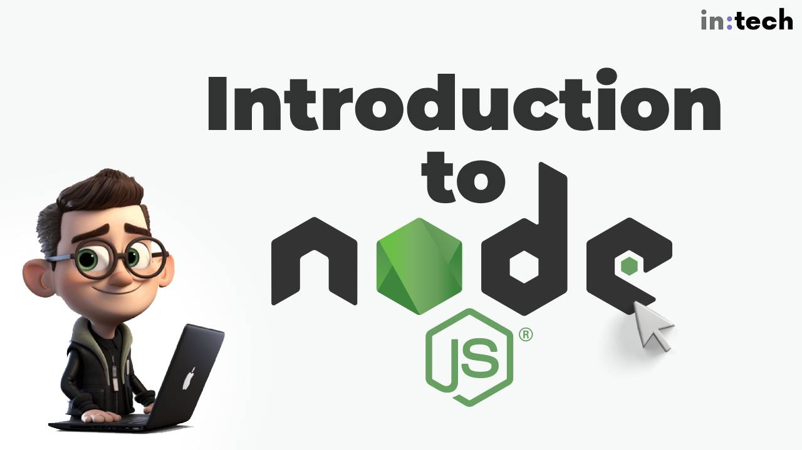

<hr class="mb-0">

<h1 id="{{ Week 19-Node JS | slugify }}">
  <span class="week-prefix">Week 19 |</span> Node JS
</h1>



<div class="week-controls">

  

  <h2 class="week-controls__previous_week">

    

      

      <a href="../week{{ previous_week_num }}">Week {{ previous_week_num }} &#8678;</a>
    

  </h2>

  <span>Updated: 16/2/2025</span>

  <h2 class="week-controls__next_week">

    

      

      <a href="../week{{ next_week_num }}">&#8680; Week {{ next_week_num }}</a>
    

  </h2>

</div>

---

<!-- Week 19 - Day 1 | Introduction to Node.js -->
<details markdown="1">
  <summary>
    <h2>
      <span class="summary-day">Week 19 - Day 1</span> | Introduction to Node.js</h2>
  </summary>

### Schedule

  - **Watch the lectures**
  - **Study the suggested material**
  - **Practice on the topics and share your questions**

### Study Plan

  Your instructor will share the video lectures with you. 

  You can find the lecture code [here](https://github.com/in-tech-gration/WDX-180/tree/main/curriculum/week19/assets/code/day01){:target="_blank"}

  You can find the slides [here](https://learn.js.org/learn/nodejs/introduction.html#/){:target="_blank"}

  **Lecture Notes**

  - **Node.js vs Browser Environment**: The lecture highlights the differences between running JavaScript code in Node.js and a browser environment.
  
  - **Window and Global Objects**: The instructor explains how to use the `window` and `global` objects to distinguish between Node.js and browser environments.
  
  - **Type of Operator**: The lecture covers how the `type of` operator returns a string, and it's always lowercase, so you should compare with a lowercase string.
  
  - **Runkit Environment**: The instructor shows how to use the Runkit environment to test JavaScript code online and see the output in a nice HTML format.
  
  - **npm Packages**: The lecture touches on npm packages and how some can be run on both Node.js and browser environments, while others are specific to one or the other.

  - Use `window` to check if you're in a browser environment

  - Use `global` to check if you're in a Node.js environment

  - Be careful when comparing strings with the `type of` operator, as it always returns a lowercase string.

  - Some npm packages can be run on both Node.js and browser environments.

  - **window.document === document**  

  - **Ctrl+L** => Clear the console (both Node+Browser)  

  - When converting bytes to megabytes or gigabytes, use 1024 instead of 1000 to avoid incorrect conversions.
  
  - Use the `process.argv` array to access command-line arguments in Node.js.
  
  - Be careful when using the `fs` module, as it can delete files on your system.

  **Code Snippets:**

  - **Checking the runtime environment:**

  ```js
  if ( typeof window === "undefined" ){ // switch to global  
    console.log("Should be run in the Browser");  
  }  
  ```

  ```js
  // Only runs in Node:  
  try {  
    global; // switch to windows for code that runs in the browser  
    console.log("Hello World!", 5 * 2 );  
  } catch(error){  
    console.log( "Sorry, only runs in Node");  
  }
  ```

  **References & Resources:**

  - [**Introduction to Node.js with Ryan Dahl**](https://www.youtube.com/watch?v=jo_B4LTHi3I){:target="_blank"}  
  - [**Node.js at PayPal**](https://medium.com/paypal-tech/node-js-at-paypal-4e2d1d08ce4f){:target="_blank"}  
  - [**https://www.npmjs.com**](https://www.npmjs.com/){:target="_blank"}

  - Run Node.js as a Service  
    - [Runkit](https://runkit.com/home){:target="_blank"}  
    - [Replit](https://replit.com/templates){:target="_blank"}  

  - *“Node. js versions get an even number, like 16.14. 0, while Current releases have an odd version number, like 17.5. 0”*  
  - [Node.js endoflife timeline](https://endoflife.date/nodejs){:target="_blank"}  

  - [**globalThis**](https://developer.mozilla.org/en-US/docs/Web/JavaScript/Reference/Global_Objects/globalThis){:target="_blank"} **& [Global Object](https://developer.mozilla.org/en-US/docs/Glossary/Global_object){:target="_blank"}**  
  
  - [**What is a REPL?**](https://www.digitalocean.com/community/tutorials/what-is-repl){:target="_blank"}  
  
  - [**Node.js Docs**](https://nodejs.org/api/documentation.html){:target="_blank"}  
  
  - [**MDN: Introduction to the server side**](https://developer.mozilla.org/en-US/docs/Learn/Server-side/First_steps/Introduction){:target="_blank"}

  - Free `Nodejs` hosting  
    - [https://fly.io/](https://fly.io/){:target="_blank"}  
    - [https://render.com/](https://render.com/){:target="_blank"}  
    - [https://azure.microsoft.com/en-us/free/nodejs](https://azure.microsoft.com/en-us/){:target="_blank"}  
    - [https://aws.amazon.com/getting-started/projects/deploy-nodejs-web-app/services-costs/](https://aws.amazon.com/getting-started/projects/deploy-nodejs-web-app/services-costs/){:target="_blank"}  

  - [Nodejs Builtin Modules](https://www.w3schools.com/nodejs/ref_modules.asp){:target="_blank"}  
    - [os](https://www.w3schools.com/nodejs/ref_os.asp){:target="_blank"}

### Summary

  The first part of the lecture discusses the differences between running JavaScript code in a Node.js environment versus a browser environment. The instructor explains how to distinguish between these two environments using the `window` and `global` objects, and how to write code that is compatible with both.

  The second part of the lecture covers various aspects of Node.js programming, including system interactions using the `os` module, process management, and file operations:

  - **Using the `os` module**: The lecturer demonstrates how to use the `os` module to get information about the system, such as total and free memory. They also show how to convert bytes to megabytes or gigabytes.
  
  - **Process management**: The lecturer introduces the concept of process management in Node.js, showing how to access command-line arguments through the `process.argv` array.

  - **System interactions**: Using the `os` module to get information about the system, such as memory usage.

  - **Process management**: Accessing command-line arguments and managing processes in Node.js.

  - **File operations**: (Not covered in detail) Using the `fs` module for file system interactions.

### Exercises

  - Explore the features of Nodejs (modules, REPL, etc.)  

  - Complete the tasks found in the comments of the lecture code (search for the `TODO` keyword).

  - Install [https://github.com/workshopper/learnyounode](https://github.com/workshopper/learnyounode){:target="_blank"} and complete the first 2 exercises (HELLO WORLD, BABY STEPS)  
    - [**Guide**](https://www.youtube.com/watch?v=z_HHcw85Nhs){:target="_blank"}  

  - Other tasks that you should practice on:  
    - Create an app that shows your systems total and free memory  
    - Create an app that accepts 2 numbers and adds them together  
    - Create an app that accepts 2 numbers and a command (add/sub/mul/div) and accordingly adds, subtracts, multiplies or divides those numbers. Make sure to move all the math operations in a separate module.  
    - Create an app that shows the time, e.g. node time.js

  **Note:** Prefer GitBash in Windows for running node and other CLI tools

  **IMPORTANT:** Make sure to complete all the tasks found in the **daily Progress Sheet** and update the sheet accordingly. Once you've updated the sheet, don't forget to `commit` and `push`. The progress draft sheet for this day is: **/user/week19/progress/progress.draft.w19.d01.csv**

  You should **NEVER** update the `draft` sheets directly, but rather work on a copy of them according to the instructions [found here](../week01/resources/PROGRESS-WORKFLOW.md).


<!-- Extra Resources -->

<!-- Sources and Attributions -->
  
</details>

<hr class="mt-1">

<!-- Week 19 - Day 2 | Node.JS Practice -->
<details markdown="1">
  <summary>
    <h2>
      <span class="summary-day">Week 19 - Day 2</span> | Node.JS Practice</h2>
  </summary>

### Schedule

  - **Study the suggested material**
  - **Practice on the topics and share your questions**

### Study Plan

  - Watch (or re-watch) yesterday's lecture 
  - Complete all the coding challenges and exercises from Day 01

<!-- Summary -->

<!-- Exercises -->

<!-- Extra Resources -->

<!-- Sources and Attributions -->
  
</details>

<hr class="mt-1">

<!-- Week 19 - Day 3 | TBA -->
<details markdown="1">
  <summary>
    <h2>
      <span class="summary-day">Week 19 - Day 3</span> | TBA</h2>
  </summary>

### Schedule

  - **Watch the lectures**
  - **Study the suggested material**
  - **Practice on the topics and share your questions**

### Study Plan

  Your instructor will share the video lectures with you. Here are the topics covered:

  - **Part 1:** 
  - **Part 2:**

  You can find the lecture code [here](){:target="_blank"}

  **Lecture Notes & Questions:**

  **References & Resources:**

<!-- Summary -->

<!-- Exercises -->

<!-- Extra Resources -->

<!-- Sources and Attributions -->
  
</details>

<hr class="mt-1">

<!-- Week 19 - Day 4 | TBA -->
<details markdown="1">
  <summary>
    <h2>
      <span class="summary-day">Week 19 - Day 4</span> | TBA</h2>
  </summary>

### Schedule

  - **Study the suggested material**
  - **Practice on the topics and share your questions**

<!-- Study Plan -->

<!-- Summary -->

<!-- Exercises -->

<!-- Extra Resources -->

<!-- Sources and Attributions -->
  
</details>

<hr class="mt-1">

<!-- Week 19 - Day 5 | TBA -->
<details markdown="1">
  <summary>
    <h2>
      <span class="summary-day">Week 19 - Day 5</span> | TBA</h2>
  </summary>

### Schedule

  - **Watch the lectures**
  - **Study the suggested material**
  - **Practice on the topics and share your questions**

### Study Plan

  Your instructor will share the video lectures with you. Here are the topics covered:

  - **Part 1:** 
  - **Part 2:**

  You can find the lecture code [here](){:target="_blank"}

  **Lecture Notes & Questions:**

  **References & Resources:**

<!-- Summary -->

<!-- Exercises -->

<!-- Extra Resources -->

<!-- Sources and Attributions -->
  
</details>


<hr class="mt-1">

**Weekly feedback:** Hey, it's really important for us to know how your experience with the course has been so far, so don't forget to fill in and submit your [**mandatory** feedback form](https://forms.gle/S6Zg3bbS2uuwsSZF9){:target="_blank"} before the day ends. Thanks you!


---

<!-- COMMENTS: -->
<script src="https://utteranc.es/client.js"
  repo="in-tech-gration/WDX-180"
  issue-term="pathname"
  theme="github-dark"
  crossorigin="anonymous"
  async>
</script>