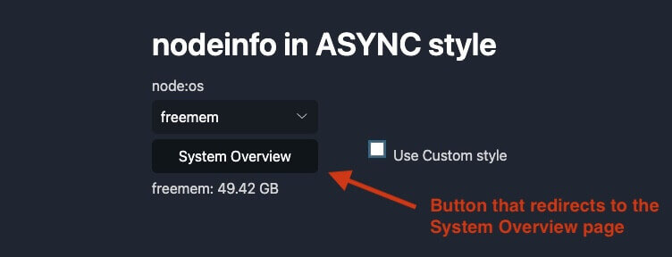
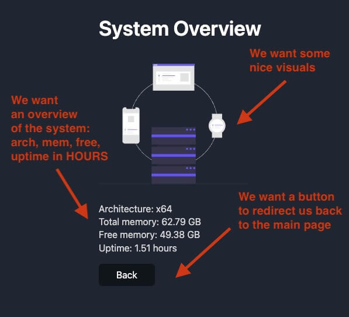

<h1 id="{{ Week 20-Node JS | slugify }}">
  Week 20 | Node JS
</h1>

  

  <h2 class="week-controls__previous_week">

    <!-- ADD CHECK FOR WEEK open:true (remove if false) -->
    

      

      <a href="../week{{ previous_week_num }}">Week {{ previous_week_num }} &#8678;</a>
    

  </h2>

  Updated: 28/2/2024

  <h2 class="week-controls__next_week">

    <!-- ADD CHECK FOR WEEK open:true (remove if false) -->
    

      

      <a href="../week{{ next_week_num }}">&#8680; Week {{ next_week_num }}</a>
    

  </h2>

---

<!-- Week 20 - Day 1 | Node JS -->

  

    <h2>
      Week 20 - Day 1 | Node JS</h2>
  

### Schedule

  - **Lecture: Node JS**
  - **Practice**
  - **Work on Project (Group/Personal)**

<!-- Study Plan -->

<!-- Summary -->

<!-- Exercises -->

<!-- Extra Resources -->

<!-- Sources and Attributions -->
  

<!-- Week 20 - Day 2 | Group Project -->

  

    <h2>
      Week 20 - Day 2 | Group Project</h2>
  

### Schedule

  - **Work on Project (Group/Personal)**

<!-- Study Plan -->

<!-- Summary -->

<!-- Exercises -->

<!-- Extra Resources -->

<!-- Sources and Attributions -->
  

<!-- Week 20 - Day 3 | Node JS -->

  

    <h2>
      Week 20 - Day 3 | Node JS</h2>
  

### Schedule

  - **Lecture: Node JS**
  - **Practice**
  - **Work on Project (Group/Personal)**

<!-- Study Plan -->

<!-- Summary -->

<!-- Exercises -->

<!-- Extra Resources -->

<!-- Sources and Attributions -->
  

<!-- Week 20 - Day 4 | Tiny Server Refactoring -->

  

    <h2>
      Week 20 - Day 4 | Tiny Server Refactoring</h2>
  

### Schedule

  - [Study](#study-plan)
  - [Exercises](#exercises)
  <!-- - [Extra Resources](#extra-resources) -->

### Study Plan

  

  In this exercise we are going to study and refactor the code of a tiny Web Server that uses the built-in `node:os` module to return system information back to the user. Our aim is to detect parts of the code that can be improved and detect any [`code smells`](https://martinfowler.com/bliki/CodeSmell.html) that can be removed.

  > _"A code smell is a surface indication that usually corresponds to a deeper problem in the system."_ ~ Martin Fowler

  **Requirements:**

  - Fundamental knowledge of Node.js
  - Familiarity with the `node:os`, [`node:fs`](https://www.youtube.com/watch?v=Z_p1yFGS0Ak&list=PLC3y8-rFHvwh8shCMHFA5kWxD9PaPwxaY&index=27){:target="_blank"} and [`node:http`](https://www.youtube.com/watch?v=3Z-pAgra-tw&list=PLC3y8-rFHvwh8shCMHFA5kWxD9PaPwxaY&index=30){:target="_blank"} built-in modules.
  - Familiarity with the [basic Web Server boileplate](https://nodejs.org/en/learn/getting-started/introduction-to-nodejs#an-example-nodejs-application){:target="_blank"}

  **Here's the plan...**

  ---

  **1) First, let's start by watching a series of short videos from `Jacob Sorber` on `Code Smells`:**

  

  - [Smelly code and long functions](https://www.youtube.com/watch?v=ll4XT0MYKN0){:target="_blank"}
  - [Smelly code and bad names](https://www.youtube.com/watch?v=zx7euEEZ0H4){:target="_blank"}
  - [Code Smells: Duplicate Code (DRY)](https://www.youtube.com/watch?v=ck_RfVOYgjQ){:target="_blank"}
  - [Smelly code and Magic Numbers](https://www.youtube.com/watch?v=p8RC_i9t0MU){:target="_blank"}

  This will take you around 20 minutes. After you've finished watching these videos, take a piece of paper and write down what you've learned in the form of a checklist.

<!-- ### Summary -->

<!-- Summary -->

### Exercises
  

  **2) Download, study and run the following code:**

  <!--  -->

  

  <!--  -->

  [Source code here](https://github.com/in-tech-gration/WDX-180/tree/main/curriculum/modules/javascript/nodejs/webserver/refactoring/assets/original_code){:target="_blank"} or [here _(index.js)_](https://in-tech-gration.github.io/WDX-180/curriculum/modules/javascript/nodejs/webserver/refactoring/assets/original_code/index.js){:target="_blank"} and [here _(style.css)_](https://in-tech-gration.github.io/WDX-180/curriculum/modules/javascript/nodejs/webserver/refactoring/assets/original_code/style.css){:target="_blank"}.

  This is a **Node.js app**, so you must execute the code using the `node` command from the terminal:

  `node index.js`

  See if you can find any `code smells` and ways to improve the code based on the newly acquired knowledge before moving forward. **Make sure to take a short break before moving on**. 🚶‍♀️

  

  **3) Watch the Code Review and refactor accordingly**

  Watch [this video](https://www.youtube.com/watch?v=3eO2hfBbCy0){:target="_blank"} and then apply the same refactoring to the original source code.

  Once you've finished code refactoring, can you spot any more code smells?

  There's still a lot to be improved.

  

  **4) New requirements!**

  

  The boss came up with some new requirements for the project! 

  Here are the new features you must implement on the refactored code:

  

  The `System Overview` page should look like this:

  

  As you can see, the boss is kind of a visual guy.

  **Good luck!**

  ---

  > **Questions, comments, suggestions? Please leave them on the comment section below.**

  

<!-- Extra Resources -->

### Sources and Attributions

  - Initial Node.js code: [Alex Kokh](https://github.com/alkozp){:target="_blank"}

<!-- ### Extra Resources -->
  

<!-- Week 20 - Day 5 | Node JS -->

  

    <h2>
      Week 20 - Day 5 | Node JS</h2>
  

### Schedule

  - **Lecture: Node JS**
  - **Practice**
  - **Work on Project (Group/Personal)**

<!-- Study Plan -->

<!-- Summary -->

<!-- Exercises -->

<!-- Extra Resources -->

<!-- Sources and Attributions -->
  

**Weekly feedback:** Hey, it's really important for us to know how your experience with the course has been so far, so don't forget to fill in and submit your [**mandatory** feedback form](https://forms.gle/S6Zg3bbS2uuwsSZF9){:target="_blank"} before the day ends. Thanks you!

