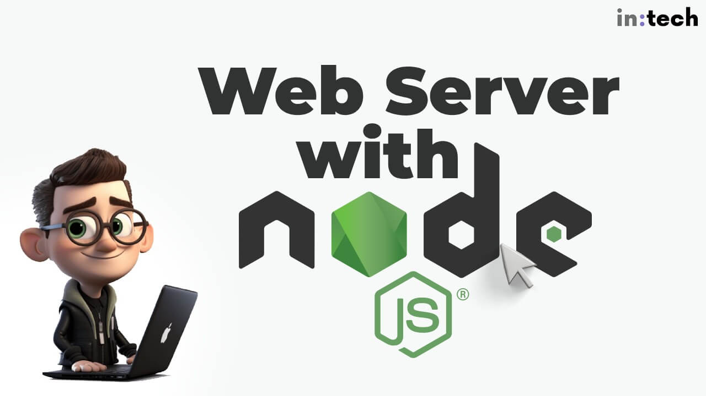
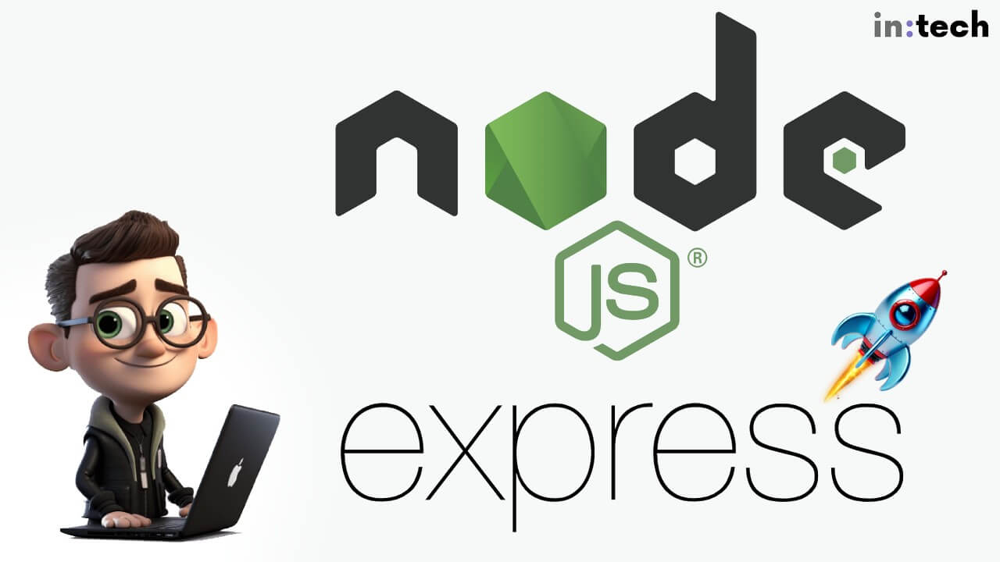

<hr class="mb-0">

<h1 id="{{ Week 20-Node JS Web Server | slugify }}">
  <span class="week-prefix">Week 20 |</span> Node JS Web Server
</h1>



<div class="week-controls">

  

  <h2 class="week-controls__previous_week">

    

      

      <a href="../week{{ previous_week_num }}">Week {{ previous_week_num }} &#8678;</a>
    

  </h2>

  <span>Updated: 26/2/2025</span>

  <h2 class="week-controls__next_week">

    

      

      <a href="../week{{ next_week_num }}">&#8680; Week {{ next_week_num }}</a>
    

  </h2>

</div>

---

<!-- Week 20 - Day 1 | Web Server in Node.js -->
<details markdown="1">
  <summary>
    <h2>
      <span class="summary-day">Week 20 - Day 1</span> | Web Server in Node.js</h2>
  </summary>

### Schedule

  - **Watch the lectures**
  - **Study the suggested material**
  - **Practice on the topics and share your questions**

### Study Plan

  Your instructor will share the video lectures with you. 

  You can find the lecture code [here](https://github.com/in-tech-gration/WDX-180/tree/main/curriculum/week20/assets/day01/code){:target="_blank"}

  **References & Resources:**

  - **How to get unstuck (tips):**   
    - Use console.log to see what exactly is happening (xray)  
    - [Read the docs](https://nodejs.org/docs/latest/api/){:target="_blank"}!  
      - Alternative:  
        - [w3schools](https://www.w3schools.com/nodejs/){:target="_blank"}  
        - [Geeksforgeeks](https://www.geeksforgeeks.org/nodejs/){:target="_blank"}  
    - Read very carefully the exercise steps (without panic)  
    - Never move on to the next step unless you’ve understood the previous steps  
  - Popular web servers:  
    - Apache  
    - Nginx  
  - When you connect to a website using the HTTPS protocol, your browser is implicitly appending the :443 port number at the end of the domain (or IP)  
    - [What is a port number?](https://www.techtarget.com/searchnetworking/definition/port-number#:~:text=Port%20443.,connects%20directly%20to%20this%20port.){:target="_blank"}  
    - in-tech-gration.github.io ⇒ DNS ⇒ Translate domain to IP ⇒ 100.10.32.11:443  
  - Dissecting an HTTP request for an image file  
    - [https://upload.wikimedia.org/wikipedia/commons/thumb/7/74/A-Cat.jpg/2560px-A-Cat.jpg](https://upload.wikimedia.org/wikipedia/commons/thumb/7/74/A-Cat.jpg/2560px-A-Cat.jpg){:target="_blank"}  
      - **Using the https:// protocol**  
      - to connect to the **upload.wikimedia.org** domain  
      - DNS translation => **upload.wikimedia.org** => IP  
      - [https://www.dnsqueries.com/en/dns_lookup.php](https://www.dnsqueries.com/en/dns_lookup.php){:target="_blank"} => ​​	185.15.59.240  
      - The browser connects to **185.15.59.240:443**  
      - Tries to find something in the **public/** folder of the web server  
      - We are looking for public/wikipedia/commons/thumb/7/74/A-Cat.jpg/2560px-A-Cat.jpg  
      - If the file is found, we get status 200, Content-Type “image/jpeg” and of course the file itself  
      - 304: [https://developer.mozilla.org/en-US/docs/Web/HTTP/Status/304](https://developer.mozilla.org/en-US/docs/Web/HTTP/Status/304){:target="_blank"}  
  - URI Encoding turns spaces into **%20, hello world => hello%20world**  
  - In Node.js createServer:  
    - request => What the user/browser is asking for  
    - response => What we/server is giving back to them  
  - The ? part is called the URL Query String  
  - [Online tool for DNS translation to IP](https://www.dnsqueries.com/en/dns_lookup.php){:target="_blank"}

### Summary

  The lecture covers the basics of building a web server using Node.js. The instructor demonstrates how to create a simple web server that responds to GET requests, checks for specific file types, and returns a 404 error if the requested file is not found.

  **Key Concepts:**

  * **Building a web server with Node.js**: The lecture shows how to create a basic web server using these technologies.
  * **Request handling**: The instructor explains how to check the request type (e.g., GET, POST) and respond accordingly.
  * **File system interaction**: The lecture demonstrates how to read files from the file system based on specific conditions.
  * **Error handling**: The instructor discusses the importance of proper error handling and shows how to return a 404 error when a requested file is not found.
    * Understanding routes and how to serve specific files based on URL requests
    * Creating a JSON API using Node.js
    * Serving data in JSON format
    * Exploring the concept of login mechanisms using Node.js
    * Creating a basic login system using JSON APIs

  **Key Points:**

  * **Return statements are crucial**: The instructor emphasizes that every path in an if statement should have a corresponding return statement or null value to avoid errors.
  * **Error handling is essential**: The lecture highlights the importance of proper error handling and shows how to handle errors like "Cannot set headers after they are sent to the client."
    * Understanding how JavaScript can be used on both the frontend (browser) and backend (server)
    * Exploring the possibilities of combining HTML/CSS/JavaScript with Node.js for creating dynamic web applications

### Exercises

  - Start with the [basic Web server](https://nodejs.org/en/learn/getting-started/introduction-to-nodejs){:target="_blank"} and play around with different routes  
  - Look for innovative and cool 404 pages  
    - [https://www.canva.com/learn/404-page-design/](https://www.canva.com/learn/404-page-design/){:target="_blank"}  
  - Translate domain names into IPs: **nslookup intechgration.io**  
  - TVMaze JSON API: [https://api.tvmaze.com/search/shows?q=breaking%20bad](https://api.tvmaze.com/search/shows?q=breaking%20bad){:target="_blank"}

  **IMPORTANT:** Make sure to complete all the tasks found in the **daily Progress Sheet** and update the sheet accordingly. Once you've updated the sheet, don't forget to `commit` and `push`. The progress draft sheet for this day is: **/user/week20/progress/progress.draft.w20.d01.csv**

  You should **NEVER** update the `draft` sheets directly, but rather work on a copy of them according to the instructions [found here](../modules/curriculum/progress_workflow.md).


<!-- Extra Resources -->

<!-- Sources and Attributions -->
  
</details>

<hr class="mt-1">

<!-- Week 20 - Day 2 | Node.JS Practice -->
<details markdown="1">
  <summary>
    <h2>
      <span class="summary-day">Week 20 - Day 2</span> | Node.JS Practice</h2>
  </summary>

### Schedule

  - **Study the suggested material**
  - **Practice on the topics and share your questions**

### Study Plan

  Here's the plan for today: **build things!**

  Scroll down to the `Exercises` section and start coding.

<!-- Summary -->

### Exercises

  - 1) Create a basic Nodejs Webserver that serves a simple HTML form with an email and password input fields. You must be able to login successfully using the email "admin@gmail.com" and password "1234" and land on an admin page (be creative) otherwise get redirected to an unauthorized page.

  - 2) Try out the fetch API in Node.js: replace `kostasx` with your GitHub username

  ```js
  const URL = "https://api.github.com/users/kostasx";
  fetch(URL)
    .then((response) => response.json())
    .then((data) => {
      // console.log the name, company and location from the data
      // In the following format "<name> is currently working at <company> and is based in <location>", example "Kostas Minaidis is working at Intechgration.io and is based in Athens, Greece / Berlin, Germany"
    })
    .catch((error) => console.error("Error:", error));
  ```

  - 3) Integrate the above code into a [web server](https://nodejs.org/en/learn/getting-started/introduction-to-nodejs#an-example-nodejs-application){:target="_blank"}. 

  - 4) Create another Nodejs Web server that displays fetches and displays jokes from the following API:

    - [https://v2.jokeapi.dev/joke/Programming](https://v2.jokeapi.dev/joke/Programming){:target="_blank"}
    - [https://sv443.net/jokeapi/v2/](https://sv443.net/jokeapi/v2/){:target="_blank"}

  - 5) [Download this JSON](https://github.com/in-tech-gration/WDX-180/blob/main/curriculum/week20/assets/day02/countries.json){:target="_blank"} and create a Nodejs webserver that accepts a request through the URL with the name of a country and searches through the JSON to find information for that country. It then sends back the appropriate object to the client in either JSON or HTML format

  - 💡 Remember to always handle errors in a graceful and informative manner: `console.log(error)` is not enough! ⚠️

  ```js
  const result = await fetch(url)
      .then((response) => { return response.json(); })
      .then((data) => { return data; })
      .catch((err) => { console.log(err); }); // <= This one should also return something useful back
  ```

  **IMPORTANT:** Make sure to complete all the tasks found in the **daily Progress Sheet** and update the sheet accordingly. Once you've updated the sheet, don't forget to `commit` and `push`. The progress draft sheet for this day is: **/user/week20/progress/progress.draft.w20.d02.csv**

  You should **NEVER** update the `draft` sheets directly, but rather work on a copy of them according to the instructions [found here](../modules/curriculum/progress_workflow.md).


<!-- Extra Resources -->

<!-- Sources and Attributions -->
  
</details>

<hr class="mt-1">

<!-- Week 20 - Day 3 | Introduction to Express.js -->
<details markdown="1">
  <summary>
    <h2>
      <span class="summary-day">Week 20 - Day 3</span> | Introduction to Express.js</h2>
  </summary>

### Schedule

  - **Study the suggested material**
  - **Practice on the topics and share your questions**

### Study Plan

  

  - Study (read **and** practice) the [**Introducing Express**](https://developer.mozilla.org/en-US/docs/Learn_web_development/Extensions/Server-side/Express_Nodejs/Introduction#introducing_express){:target="_blank"} section from MDN's `Web Frameworks` documentation page.

  **Express CRUD App**

  - Create a folder and run the following commands

  ```bash
  npm init -y
  npm install express body-parser uuid
  ```

  - Now create a file name `app.js` and paste the following code:

  ```js
  const express = require('express')
  const bodyParser = require('body-parser');
  const { v4: uuidv4 } = require('uuid');

  const tasks = [
    { 
      id: 0, 
      title: 'homework', 
      completed: false 
    }, 
    { 
      id: 1, 
      title: 'study', 
      completed: false 
    }, 
    { 
      id: 2, 
      title: 'cook', 
      completed: false 
    }, 
    { 
      id: 3,
      title: 'clean',
      completed: false 
    },
    { 
      id: 4, 
      title: 'laundry', 
      completed: false 
    }
  ]
  // CRUD todo app 

  const app = express();
  app.use(bodyParser.json());

  app.get('/', function (req, res) {
      res.send('Hello World')
  })
  // R - Read done
  app.get('/tasks', (req, res) => {
      res.json(tasks)
  })

  // C - Create 
  app.post('/tasks', (request, response) => {
      console.log(request.body.title)
      // { id: 0, title: 'homework', completed: false }
      const newTask = {
          id : uuidv4(),
          title: request.body.title,
          completed: false
      }
      tasks.push(newTask);
      response.json(tasks);
  });

  // U - Update
  app.put('/tasks/:title', (request, response) => {
    // { id: 0, title: 'homework', completed: true }
    const result = tasks.find(({ title }) => title === request.params.title );

    if(!result) {
      return response.status(404).json({ 
        error: `task ${request.params.title} not found`
      }) 
    }

    result.completed = true;
    response.send(tasks);

  });

  // D - Delete?

  app.listen(3003, () => {
      console.log('Server running on port 3003')
  })
  ```

  - Run the app using `node app.js`. An Express web server should be up and running at `http://localhost:3003/tasks`. Explore the code, make sure to understand exactly what's happening in each line and move on to the `Exercises` section once done.

<!-- Summary -->

### Exercises

  - Challenge: Implement the `DELETE` CRUD operation in `app.js` and make sure that all CRUD operations behave as expected.

  - Challenge: Use the browser's `Fetch API` to make a POST fetch request to add (create) a new todo task. Use a `DELETE` and an `UPDATE` HTTP request (again via Fetch API) to delete and update a task.

  **IMPORTANT:** Make sure to complete all the tasks found in the **daily Progress Sheet** and update the sheet accordingly. Once you've updated the sheet, don't forget to `commit` and `push`. The progress draft sheet for this day is: **/user/week20/progress/progress.draft.w20.d03.csv**

  You should **NEVER** update the `draft` sheets directly, but rather work on a copy of them according to the instructions [found here](../modules/curriculum/progress_workflow.md).


### Extra Resources

  - [THE BEGINNER’S GUIDE: Understanding Node.js & Express.js fundamentals](https://medium.com/@LindaVivah/the-beginners-guide-understanding-node-js-express-js-fundamentals-e15493462be1){:target="_blank"}

  - [How to structure an Express.js REST API with best practices](https://blog.treblle.com/egergr/){:target="_blank"}

<!-- Sources and Attributions -->
  
</details>

<hr class="mt-1">

<!-- Week 20 - Day 4 | Tiny Server Refactoring -->
<details markdown="1">
  <summary>
    <h2>
      <span class="summary-day">Week 20 - Day 4</span> | Tiny Server Refactoring</h2>
  </summary>

### Schedule

  - [Study](#study-plan)
  - [Exercises](#exercises)
  <!-- - [Extra Resources](#extra-resources) -->

### Study Plan

  

  In this exercise we are going to study and refactor the code of a tiny Web Server that uses the built-in `node:os` module to return system information back to the user. Our aim is to detect parts of the code that can be improved and detect any [`code smells`](https://martinfowler.com/bliki/CodeSmell.html) that can be removed.

  > _"A code smell is a surface indication that usually corresponds to a deeper problem in the system."_ ~ Martin Fowler


  **Requirements:**

  - Fundamental knowledge of Node.js
  - Familiarity with the `node:os`, [`node:fs`](https://www.youtube.com/watch?v=Z_p1yFGS0Ak&list=PLC3y8-rFHvwh8shCMHFA5kWxD9PaPwxaY&index=27){:target="_blank"} and [`node:http`](https://www.youtube.com/watch?v=3Z-pAgra-tw&list=PLC3y8-rFHvwh8shCMHFA5kWxD9PaPwxaY&index=30){:target="_blank"} built-in modules.
  - Familiarity with the [basic Web Server boileplate](https://nodejs.org/en/learn/getting-started/introduction-to-nodejs#an-example-nodejs-application){:target="_blank"}

  **Here's the plan...**

  ---


  **1) First, let's start by watching a series of short videos from `Jacob Sorber` on `Code Smells`:**

  

  - [Smelly code and long functions](https://www.youtube.com/watch?v=ll4XT0MYKN0){:target="_blank"}
  - [Smelly code and bad names](https://www.youtube.com/watch?v=zx7euEEZ0H4){:target="_blank"}
  - [Code Smells: Duplicate Code (DRY)](https://www.youtube.com/watch?v=ck_RfVOYgjQ){:target="_blank"}
  - [Smelly code and Magic Numbers](https://www.youtube.com/watch?v=p8RC_i9t0MU){:target="_blank"}

  This will take you around 20 minutes. After you've finished watching these videos, take a piece of paper and write down what you've learned in the form of a checklist.

<!-- ### Summary -->


<!-- Summary -->

### Exercises
  <hr style="margin-top: 3rem; margin-bottom: 4rem">


  **2) Download, study and run the following code:**

  <!--  -->


  


  <!--  -->


  [Source code here](https://github.com/in-tech-gration/WDX-180/tree/main/curriculum/modules/javascript/nodejs/webserver/refactoring/assets/original_code){:target="_blank"} or [here _(index.js)_](https://in-tech-gration.github.io/WDX-180/curriculum/modules/javascript/nodejs/webserver/refactoring/assets/original_code/index.js){:target="_blank"} and [here _(style.css)_](https://in-tech-gration.github.io/WDX-180/curriculum/modules/javascript/nodejs/webserver/refactoring/assets/original_code/style.css){:target="_blank"}.

  This is a **Node.js app**, so you must execute the code using the `node` command from the terminal:

  `node index.js`

  See if you can find any `code smells` and ways to improve the code based on the newly acquired knowledge before moving forward. **Make sure to take a short break before moving on**. 🚶‍♀️

  <hr style="margin-top: 4rem; margin-bottom: 4rem">


  **3) Watch the Code Review and refactor accordingly**

  Watch [this video](https://www.youtube.com/watch?v=3eO2hfBbCy0){:target="_blank"} and then apply the same refactoring to the original source code.

  Once you've finished code refactoring, can you spot any more code smells?

  There's still a lot to be improved.

  <hr style="margin-top: 4rem; margin-bottom: 4rem">


  **4) New requirements!**

  

  The boss came up with some new requirements for the project! 

  Here are the new features you must implement on the refactored code:

  


  The `System Overview` page should look like this:

  


  As you can see, the boss is kind of a visual guy.

  **Good luck!**

  ---


  > **Questions, comments, suggestions? Please leave them on the comment section below.**


  <script src="https://utteranc.es/client.js"
    repo="in-tech-gration/WDX-180"
    issue-term="pathname"
    theme="github-dark"
    crossorigin="anonymous"
    async>
  </script>


  **IMPORTANT:** Make sure to complete all the tasks found in the **daily Progress Sheet** and update the sheet accordingly. Once you've updated the sheet, don't forget to `commit` and `push`. The progress draft sheet for this day is: **/user/week20/progress/progress.draft.w20.d04.csv**

  You should **NEVER** update the `draft` sheets directly, but rather work on a copy of them according to the instructions [found here](../modules/curriculum/progress_workflow.md).


<!-- Extra Resources -->

### Sources and Attributions

  - Initial Node.js code: [Alex Kokh](https://github.com/alkozp){:target="_blank"}

<!-- ### Extra Resources -->
  
</details>

<hr class="mt-1">

<!-- Week 20 - Day 5 | CRUD Operations in Express.JS -->
<details markdown="1">
  <summary>
    <h2>
      <span class="summary-day">Week 20 - Day 5</span> | CRUD Operations in Express.JS</h2>
  </summary>

### Schedule

  - **Watch the lectures**
  - **Study the suggested material**
  - **Practice on the topics and share your questions**

### Study Plan

  Your instructor will share the video lectures with you. Here are the topics covered:

  - **Part 1:** CRUD Operations with ExpressJS (Part 1) 
  - **Part 2:** CRUD Operations with ExpressJS (Part 2)

  You can find the lecture code [here](https://github.com/in-tech-gration/WDX-180/tree/main/curriculum/week20/assets/day05/code){:target="_blank"}, the lecture notes [here](https://github.com/in-tech-gration/WDX-180/blob/main/curriculum/week20/assets/day05/code/NOTES.md){:target="_blank"} and the diagrams right [here](https://github.com/in-tech-gration/WDX-180/tree/main/curriculum/week20/assets/day05/diagrams){:target="_blank"}.

  **Lecture Notes & Questions:**

  - The **fs module can only read files** of all sorts (even .js) but **does not execute** the code found inside these files!   

  - `JSON.parse()` will parse a JSON string but **will not execute any code** and cannot parse JS, only JSON.  

  - `Auth*`:  
    - Authentication (`AuthN`): let the system know **who you are**  
    - Authorization (`AuthZ`): let the system give you special permissions (**what you can do** on the system)  

  - NodeJS Modules: 2 ways of importing/exporting modules  
    - CommonJS: **modules.exports = {}** + **require()**  
    - ESM: **export + import**  
      - **Example:**  
        - `const express = require("express"); // CommonJS`  
        - `import express from "express"; // ESModules`  

  - JS/Node project setup:  
    - `npm init` and `npm install <module(s)>` => **ONCE per PROJECT**  
    - **Basic Express App setup:**  
      - `mkdir my-express-app`  
      - `cd my-express-app`  
      - `npm init` => manual process where you supply some basic information about the project  
      - `npm init -y`  
      - Recipe: `package.json` <= created by `npm init`  
      - Ingredients: express, cors  
        - `npm install express cors`  
        - OR: `npm i express cors`  
        - OR: `npm i express`  
        - `npm i cors`  

  - **QUESTION:** When should we use the **object literal** vs the Constructor (or a class)?  
    - `tasks.push({ content: “Learn JS”, completed: false })`  
      - Use the **object literal syntax** when the object structure is simple  
      - Use the **object literal syntax** when you are not handling too many instances  
      - Use the **object literal syntax** when you create the object in a few places  
    - `tasks.push( new Task(“Learn JS”) )`;  
      - Use the Constructor/class syntax when the object structure is **complex**  
      - Use the Constructor/class syntax when there is a lot of default properties  
      - Use the Constructor/class syntax when you are creating many instances  
      - Use the Constructor/class syntax when you are creating objects in many places in your code

  **References & Resources:**

<!-- Summary -->

### Exercises

  - **Tracing the program execution** and understanding how each part works: Comment every single line of code in the example that we’ve looked at. Each comment should describe exactly what each line does.  
    - If any line of code is unclear or ambiguous, drop a question on Slack or leave a comment. 

  - **Convert function constructors into classes**: for example **function Task** can be transformed into a **class Task**

  **IMPORTANT:** Make sure to complete all the tasks found in the **daily Progress Sheet** and update the sheet accordingly. Once you've updated the sheet, don't forget to `commit` and `push`. The progress draft sheet for this day is: **/user/week20/progress/progress.draft.w20.d05.csv**

  You should **NEVER** update the `draft` sheets directly, but rather work on a copy of them according to the instructions [found here](../modules/curriculum/progress_workflow.md).


<!-- Extra Resources -->

<!-- Sources and Attributions -->
  
</details>


<hr class="mt-1">

**Weekly feedback:** Hey, it's really important for us to know how your experience with the course has been so far, so don't forget to fill in and submit your [**mandatory** feedback form](https://forms.gle/S6Zg3bbS2uuwsSZF9){:target="_blank"} before the day ends. Thanks you!


---

<!-- COMMENTS: -->
<script src="https://utteranc.es/client.js"
  repo="in-tech-gration/WDX-180"
  issue-term="pathname"
  theme="github-dark"
  crossorigin="anonymous"
  async>
</script>