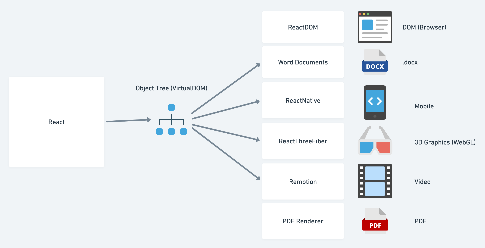
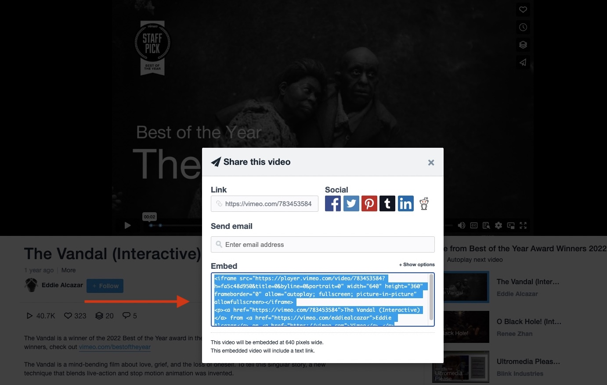
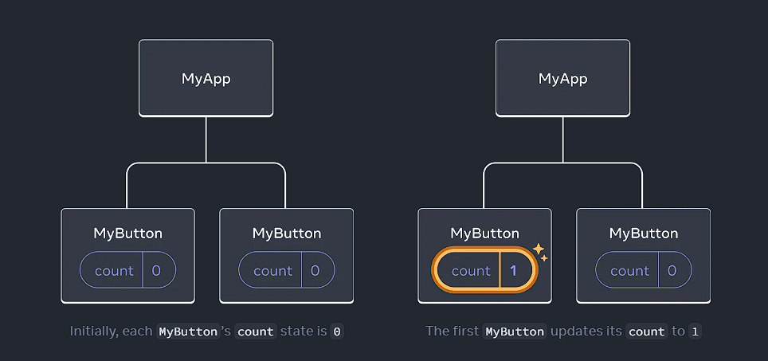
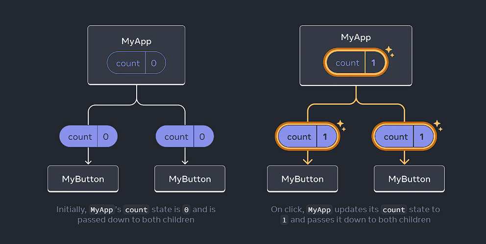

<hr class="mb-0">

<h1 id="{{ Week 21-React JS | slugify }}">
  <span class="week-prefix">Week 21 |</span> React JS
</h1>


<div class="week-controls">

  

  <h2 class="week-controls__previous_week">

    

      

      <a href="../week{{ previous_week_num }}">Week {{ previous_week_num }} &#8678;</a>
    

  </h2>

  <span>Updated: 7/3/2025</span>

  <h2 class="week-controls__next_week">

    

      

      <a href="../week{{ next_week_num }}">&#8680; Week {{ next_week_num }}</a>
    

  </h2>

</div>

---

<!-- Week 21 - Day 1 | Intro to React - Lecture -->
<details markdown="1">
  <summary>
    <h2>
      <span class="summary-day">Week 21 - Day 1</span> | Intro to React - Lecture</h2>
  </summary>

### Schedule

  - **Watch the lectures**
  - **Study the suggested material**
  - **Practice on the topics and share your questions**

### Study Plan

  Your instructor will share the video lectures with you. Here are the topics covered:

  - **Part 1:** 
    - History
    - Front-End Frameworks
    - Abstractions
    - Modularization
    - Custom elements
    - Reusability
    - Single Responsibility Principle
    - Higher Abstraction Thinking
    - JSX & Transpilers
    - Adding React to a Website
    - React Core, React DOM & React Native
    - Babel
    - Creating a Component

  - **Part 2:** 
    - Layout
    - Tidied markup
    - React project setup && frameworks
    - Vite setup
    - React Strick Mode
    - Steps for Component creation
    - React Fragments

  You can find the lecture code (created using `vite`) [here](https://github.com/in-tech-gration/WDX-180/tree/main/curriculum/week21/assets/day01/code){:target="_blank"} and the lecture diagrams [here](https://github.com/in-tech-gration/WDX-180/tree/main/curriculum/week21/assets/day01/diagrams){:target="_blank"}.

  **Lecture Notes & Questions:**

  - **ALWAYS** develop JS apps with the Browser console open  
  - Use the **.jsx** extension in files that use JSX. For plain JS files, you can stick with the **.js**  
  - How to include a folder inside a VSCode workspace from the CLI?  
    - `code -a some_folder/path`  
  - Avoid duplicate folders when creating a new React project using Vite: you **do not need to create a new folder manually** *(e.g. mkdir my-react-project)*. The npm create vite command will do this automatically.

  **Questions:**  

  - *When should we use the self-closing syntax vs the open/closing tags with Components?*  
    - Use `<SelfClosing />` when no content is required  
    - Use `<OpenClose>`When content is between the tags`</OpenClose>`  
  - *Does **`<React.StrictMode>`** end up in production build when using Vite?*  
    - According to the [React docs](https://react.dev/reference/react/StrictMode#enabling-strict-mode-for-entire-app){:target="_blank"}: *“All of these checks are development-only and do not impact the production build.”*  
  - *Can Vite optimize images automatically?*  
    - There seems to be a plugin available: [https://github.com/FatehAK/vite-plugin-image-optimizer](https://github.com/FatehAK/vite-plugin-image-optimizer){:target="_blank"}  
  - *What about WebVitals in Vite?*  
  - *What is the `<></>` syntax?*  
    - It’s called the [**React Fragment**](https://react.dev/reference/react/Fragment){:target="_blank"}  
  - *Can we turn a PWA into an Android app?*  
    - There seems to be an app created by Google called [BubbleWrap](https://www.youtube.com/watch?v=QJlbMfW3jPc){:target="_blank"}

  **References & Resources:**

  - The [old React docs](https://legacy.reactjs.org/){:target="_blank"} (Outdated, but useful from time to time.)  
  - The [new React docs](https://react.dev/){:target="_blank"} (Preferred. Make sure to bookmark!)  
  - Browser Extension for drawing on the page: [**Page Marker Draw on Web**](https://chromewebstore.google.com/detail/page-marker-draw-on-web/jfiihjeimjpkpoaekpdpllpaeichkiod){:target="_blank"}  
  - [**Progressive Web Apps**](https://web.dev/explore/progressive-web-apps){:target="_blank"} *(before going deeper into the native mobile application development, you might want to check this first.)*  
  - [**ElectronJS**](https://www.electronjs.org/){:target="_blank"} *(mentioned during the lecture)* allows you to developer Desktop apps (that do not require a browser) using HTML, CSS and JS (+JS libraries like React). VSCode, Skype, Slack and other applications are ElectronJS apps.  
  - [Add React in a minute](https://legacy.reactjs.org/docs/add-react-to-a-website.html#add-react-in-one-minute){:target="_blank"} (a bit outdated, from the old docs)  
  - [ReactPDF](https://react-pdf.org/){:target="_blank"}  
  - [ReactThreeFiber](https://github.com/pmndrs/react-three-fiber){:target="_blank"} (for rendering 3D graphics)  
  - [Remotion](https://www.remotion.dev/){:target="_blank"}: create videos using React  
  - [WebNapkin](https://webnapkin.netlify.app/){:target="_blank"}: a simple drawing tool (work-in-progress) made in React  
  - Optimizing images (for free): [**TinyPNG**](https://tinypng.com/){:target="_blank"} *(also **supports other formats such as JPG** not just PNG)*  
    - If you have a Mac, you can also use [ImageOptim](https://imageoptim.com/mac){:target="_blank"}  
  - How can you create a new React project?  
    - Using Vite: **npm create vite@latest**  
    - Using Create-React-App (CRA): **npx create-react-app my-app**  
    - Using Next.js (full-stack framework. Make sure that you need the extra baggage that comes with it)  
    - Using Gatsby (full-stack framework)  
    - Using Webpack (quite hard. Use it only if you want full and total control and configuration over the development process)  
  - Vite project structure:  
    - **node_modules/**: npm dependencies  
    - **public/**: static files  
    - **src/**: where all the application code lives  
    -   **assets/**: static assets and resources, e.g. images that will be imported dynamically (through *import()*)  
    - The src folder should be your main focus

<!-- Summary -->

<!-- Exercises -->

<!-- Extra Resources -->

<!-- Sources and Attributions -->
  
</details>

<hr class="mt-1">

<!-- Week 21 - Day 2 | Intro to React - Part 1 -->
<details markdown="1">
  <summary>
    <h2>
      <span class="summary-day">Week 21 - Day 2</span> | Intro to React - Part 1</h2>
  </summary>

### Schedule

  - [Study](#study-plan-NN)

### Study Plan

  **Intro to React / Part 1**

  

  - How to create and nest components
  - How to add markup and styles
  - How to display data
  - How to render conditions and lists

## Creating and nesting components 


React apps are made out of *components*. A component is a piece of the UI (user interface) that has its own logic and appearance. A component can be as small as a button, or as large as an entire page.

React components are JavaScript functions that return markup:

```jsx
function MyButton() {
  return (
    <button>I'm a button</button>
  );
}
```

Now that you've declared `MyButton`, you can nest it into another component:

<!-- ```js {5} -->


```jsx
export default function MyApp() {
  return (
    <div>
      <h1>Welcome to my app</h1>
      <MyButton />
    </div>
  );
}
```

Notice that `<MyButton />` starts with a capital letter. That's how you know it's a React component. React component names must always start with a capital letter, while HTML tags must be lowercase.

Have a look at the result by running it locally.

<!-- <Sandpack> 

```jsx
function MyButton() {
  return (
    <button>
      I'm a button
    </button>
  );
}

export default function MyApp() {
  return (
    <div>
      <h1>Welcome to my app</h1>
      <MyButton />
    </div>
  );
}
```

</Sandpack> -->


The `export default` keywords specify the main component in the file. If you're not familiar with some piece of JavaScript syntax, [MDN](https://developer.mozilla.org/en-US/docs/web/javascript/reference/statements/export){:target="_blank"} and [javascript.info](https://javascript.info/import-export){:target="_blank"} have great references.

## Writing markup with JSX


The markup syntax you've seen above is called *JSX*. It is optional, but most React projects use JSX for its convenience. 

JSX is stricter than HTML. You have to close tags like `<br />`. Your component also can't return multiple JSX tags. You have to wrap them into a shared parent, like a `<div>...</div>` or an empty `<>...</>` wrapper:

<!-- ```js {3,6} -->


```jsx
function AboutPage() {
  return (
    <>
      <h1>About</h1>
      <p>Hello there.<br />How do you do?</p>
    </>
  );
}
```

If you have a lot of HTML to port to JSX, you can use an [online converter.](https://transform.tools/html-to-jsx){:target="_blank"}

## Adding styles


In React, you specify a CSS class with `className`. It works the same way as the HTML [`class`](https://developer.mozilla.org/en-US/docs/Web/HTML/Global_attributes/class){:target="_blank"} attribute:

```jsx

```

Then you write the CSS rules for it in a separate CSS file:

```css
/* In your CSS */
.avatar {
  border-radius: 50%;
}
```

React does not prescribe how you add CSS files. In the simplest case, you'll add a [`<link>`](https://developer.mozilla.org/en-US/docs/Web/HTML/Element/link){:target="_blank"} tag to your HTML. If you use a build tool or a framework, consult its documentation to learn how to add a CSS file to your project.

## Displaying data 


JSX lets you put markup into JavaScript. Curly braces let you "escape back" into JavaScript so that you can embed some variable from your code and display it to the user. For example, this will display `user.name`:

<!-- ```js {3} -->


```jsx
return (
  <h1>
    {user.name}
  </h1>
);
```

You can also "escape into JavaScript" from JSX attributes, but you have to use curly braces *instead of* quotes. For example, `className="avatar"` passes the `"avatar"` string as the CSS class, but `src={user.imageUrl}` reads the JavaScript `user.imageUrl` variable value, and then passes that value as the `src` attribute:

<!-- ```js {3,4} -->


```jsx
return (
  
);
```

You can put more complex expressions inside the JSX curly braces too, for example, [string concatenation](https://javascript.info/operators#string-concatenation-with-binary){:target="_blank"}:

<!-- <Sandpack> -->




```jsx
const user = {
  name: 'Hedy Lamarr',
  imageUrl: 'https://i.imgur.com/yXOvdOSs.jpg',
  imageSize: 90,
};

export default function Profile() {
  return (
    <>
      <h1>{user.name}</h1>
      
    </>
  );
}
```



```css
.avatar {
  border-radius: 50%;
}

.large {
  border: 4px solid gold;
}
```

<!-- </Sandpack> -->




In the above example, `style={{}}` is not a special syntax, but a regular `{}` object inside the `style={ }` JSX curly braces. You can use the `style` attribute when your styles depend on JavaScript variables.



## Conditional rendering


In React, there is no special syntax for writing conditions. Instead, you'll use the same techniques as you use when writing regular JavaScript code. For example, you can use an [`if`](https://developer.mozilla.org/en-US/docs/Web/JavaScript/Reference/Statements/if...else){:target="_blank"} statement to conditionally include JSX:

```jsx
let content;
if (isLoggedIn) {
  content = <AdminPanel />;
} else {
  content = <LoginForm />;
}
return (
  <div>
    {content}
  </div>
);
```

If you prefer more compact code, you can use the [conditional `?` operator.](https://developer.mozilla.org/en-US/docs/Web/JavaScript/Reference/Operators/Conditional_Operator){:target="_blank"} Unlike `if`, it works inside JSX:

```jsx
<div>
  {isLoggedIn ? (
    <AdminPanel />
  ) : (
    <LoginForm />
  )}
</div>
```

When you don't need the `else` branch, you can also use a shorter [logical `&&` syntax](https://developer.mozilla.org/en-US/docs/Web/JavaScript/Reference/Operators/Logical_AND#short-circuit_evaluation){:target="_blank"}:

```jsx
<div>
  {isLoggedIn && <AdminPanel />}
</div>
```

All of these approaches also work for conditionally specifying attributes. If you're unfamiliar with some of this JavaScript syntax, you can start by always using `if...else`.

## Rendering lists 


You will rely on JavaScript features like [`for` loop](https://developer.mozilla.org/en-US/docs/Web/JavaScript/Reference/Statements/for){:target="_blank"} and the [array `map()` function](https://developer.mozilla.org/en-US/docs/Web/JavaScript/Reference/Global_Objects/Array/map){:target="_blank"} to render lists of components.

For example, let's say you have an array of products:

```jsx
const products = [
  { title: 'Cabbage', id: 1 },
  { title: 'Garlic', id: 2 },
  { title: 'Apple', id: 3 },
];
```

Inside your component, use the `map()` function to transform an array of products into an array of `<li>` items:

```jsx
const listItems = products.map(product =>
  <li key={product.id}>
    {product.title}
  </li>
);

return (
  <ul>{listItems}</ul>
);
```

Notice how `<li>` has a `key` attribute. For each item in a list, you should pass a string or a number that uniquely identifies that item among its siblings. Usually, a key should be coming from your data, such as a database ID. React uses your keys to know what happened if you later insert, delete, or reorder the items.

<!-- <Sandpack> -->




```jsx
const products = [
  { title: 'Cabbage', isFruit: false, id: 1 },
  { title: 'Garlic', isFruit: false, id: 2 },
  { title: 'Apple', isFruit: true, id: 3 },
];

export default function ShoppingList() {
  const listItems = products.map(product =>
    <li
      key={product.id}
      style={{
        color: product.isFruit ? 'magenta' : 'darkgreen'
      }}
    >
      {product.title}
    </li>
  );

  return (
    <ul>{listItems}</ul>
  );
}
```



<!-- </Sandpack> -->


<!-- Summary -->

### Exercises

  Complete the following coding challenges:

  - [BackChat](https://github.com/in-tech-gration/WDX-180/blob/main/curriculum/modules/javascript/frameworks/react/exercises/BackChat/README.md){:target="_blank"}
  - [Holy Grail](https://github.com/in-tech-gration/WDX-180/blob/main/curriculum/modules/javascript/frameworks/react/exercises/HolyGrail/README.md){:target="_blank"}

  **IMPORTANT:** Make sure to complete all the tasks found in the **daily Progress Sheet** and update the sheet accordingly. Once you've updated the sheet, don't forget to `commit` and `push`. The progress draft sheet for this day is: **/user/week21/progress/progress.draft.w21.d02.csv**

  You should **NEVER** update the `draft` sheets directly, but rather work on a copy of them according to the instructions [found here](../modules/curriculum/progress_workflow.md).


### Extra Resources

- [Who was Hedy Lamar?](https://www.youtube.com/watch?v=_rlXHNeQD-s){:target="_blank"}
- Vimeo trailers you can embed without login: [https://vimeo.com/ondemand/browse](https://vimeo.com/ondemand/browse){:target="_blank"}

### Sources and Attributions

- [https://react.dev/learn](https://react.dev/learn){:target="_blank"}

---


> **Questions, comments, suggestions? Please leave them on the comment section below.**


<script src="https://utteranc.es/client.js"
  repo="in-tech-gration/WDX-180"
  issue-term="pathname"
  theme="github-dark"
  crossorigin="anonymous"
  async>
</script>
  
</details>

<hr class="mt-1">

<!-- Week 21 - Day 3 | JSX & Component Props -->
<details markdown="1">
  <summary>
    <h2>
      <span class="summary-day">Week 21 - Day 3</span> | JSX & Component Props</h2>
  </summary>

### Schedule

  - **Watch the lectures**
  - **Study the suggested material**
  - **Practice on the topics and share your questions**

### Study Plan

  

  Your instructor will share the video lectures with you. Here are the topics covered:

  - **Part 1:** Lecture Topics (**thanks to Aris Giotis ❤️**)
    - How compilation works: 08:59
    - Question: same function with different output: 9:30
    - Why to use tsx in StackBlitz: 12:13
    - ReactStrictMode removal: 14:04
    - The ! symbol in TypeScript (non-null): 17:18
    - The ts-nocheck directive: 19:42
    - The Chicken/egg function analogy: 21:22
    - Call the function: 22:38
    - How Babel works: 23:51
    - Nested components & Babel: 23:51
    - Can we use arrow functions: 30:00
    - Define component into their own file: 30:43
    - Returning JSX syntax vs function call: 33:01
    - Component in own file: 34:38
    - Export - import function: 36:31
    - Using JSX extension when importing: 41:11
    - Components with parameters: 43:59
    - Returning a single value: 49:19
    - JSX to JS transformer: 52:26
    - Discarded content: 57:58
    - Props: 58:41
    - Props.children: 1:04:27
    - Undefined: 1:10:01
    - Can you add an attribute: 1:11:21
    - Unexpected string rendering problem: 1:11:37
    - How JSX compiler works: 1:13:28
    - Switching modes: 1:14:25
    - XML mode: 1:14:35
    - Example walkthrough: 1:20:23
    - Think like "JS": 1:23:15
    - Counter of opening & closing tags: 1:23:55
    - RULE 2: ALWAYS CLOSE self-closing elements: 1:28:25
    - Linting: 1:28:25

  - **Part 2:** Lecture Topics (**thanks to Aris Giotis ❤️**)
    - Challenge: JS in HTML land: 03:32
    - The {} syntax in HTML mode: 04:41
    - (limited functionality) JS expressions: 6:26
    - What is a JS expression: 8:57
    - Can we use variables: 12:47
    - Replace static content: 15:04
    - Always close the self-closing tags: 18:12
    - Undefined and null are invisible: 18:33
    - typeof props.children: 19:44
    - What else is contained in props object: 19:59
    - HTML boolean attributes: 20:36
    - Supplying an attribute to a component (property injection): 20:47
    - Like passing different arguments on the props parameter: 20:42
    - Conditional checking: 23:50
    - Use default color: 23:34
    - Why the check uses typeof: 25:17
    - typeof always returns a string: 26:21
    - Question: 34:29
    - For any other value than string passed as props: 38:58
    - Passing a collection: 42:45
    - Channel component: 46:32
    - iframe HTML tag: 47:49
    - frameborder error: 54:33
    - HTML attributes to camelCase: 56:38
    - Error in JSX: 56:56
    - Template literals: 59:15
    - Exercise description: 1:02:38
    - Share & embed: 1:04:18

  You can find the lecture code [here](https://github.com/in-tech-gration/WDX-180/tree/main/curriculum/week21/assets/day03/code){:target="_blank"}

  **Lecture Notes & Questions:**

  VSCode shortcut: Use **Ctrl + `** => Minimize the Terminal

  **References & Resources:**

  - [**The JS Modules**](https://developer.mozilla.org/en-US/docs/Web/JavaScript/Guide/Modules){:target="_blank"}
  - [Online React jsx to javascript transformer using babel-cli](https://infoheap.com/online-react-jsx-to-javascript/){:target="_blank"}
  - [HTML-to-JSX](https://transform.tools/html-to-jsx){:target="_blank"}

### Summary

  - What does `React` teaches us?
    - **Encapsulation**
    - **Reusability**
    - **Composition & Composability**
    - The **DRY** Principle

### Exercises

  - Practice on `<YouTube />` Component
  - Create a `<Vimeo id="...">` Component

  
  

  **IMPORTANT:** Make sure to complete all the tasks found in the **daily Progress Sheet** and update the sheet accordingly. Once you've updated the sheet, don't forget to `commit` and `push`. The progress draft sheet for this day is: **/user/week21/progress/progress.draft.w21.d03.csv**

  You should **NEVER** update the `draft` sheets directly, but rather work on a copy of them according to the instructions [found here](../modules/curriculum/progress_workflow.md).


<!-- Extra Resources -->

<!-- Sources and Attributions -->
  
</details>

<hr class="mt-1">

<!-- Week 21 - Day 4 | Intro to React - Part 2 -->
<details markdown="1">
  <summary>
    <h2>
      <span class="summary-day">Week 21 - Day 4</span> | Intro to React - Part 2</h2>
  </summary>

### Schedule

  - [Study](#study-plan-NN)

### Study Plan

  **Intro to React / Part 2**

  

  - How to respond to events and update the screen
  - How to share data between components

## Responding to events


You can respond to events by declaring *event handler* functions inside your components:

<!-- ```js {2-4,7} -->


```jsx
function MyButton() {
  function handleClick() {
    alert('You clicked me!');
  }

  return (
    <button onClick={handleClick}>
      Click me
    </button>
  );
}
```

Notice how `onClick={handleClick}` has no parentheses at the end! Do not _call_ the event handler function: you only need to *pass it down*. React will call your event handler when the user clicks the button.

## Updating the screen


Often, you'll want your component to "remember" some information and display it. For example, maybe you want to count the number of times a button is clicked. To do this, add *state* to your component.

First, import [`useState`](https://react.dev/reference/react/useState){:target="_blank"} from React:

```jsx
import { useState } from 'react';
```

Now you can declare a *state variable* inside your component:

```jsx
function MyButton() {
  const [count, setCount] = useState(0);
  // ...
```

You’ll get two things from `useState`: the current state (`count`), and the function that lets you update it (`setCount`). You can give them any names, but the convention is to write `[something, setSomething]`.

The first time the button is displayed, `count` will be `0` because you passed `0` to `useState()`. When you want to change state, call `setCount()` and pass the new value to it. Clicking this button will increment the counter:

<!-- ```js {5} -->


```jsx
function MyButton() {
  const [count, setCount] = useState(0);

  function handleClick() {
    setCount(count + 1);
  }

  return (
    <button onClick={handleClick}>
      Clicked {count} times
    </button>
  );
}
```

React will call your component function again. This time, `count` will be `1`. Then it will be `2`. And so on.

If you render the same component multiple times, each will get its own state. Try the following code below locally and click each button separately:

<!-- <Sandpack> -->


```jsx
import { useState } from 'react';

export default function MyApp() {
  return (
    <div>
      <h1>Counters that update separately</h1>
      <MyButton />
      <MyButton />
    </div>
  );
}

function MyButton() {
  const [count, setCount] = useState(0);

  function handleClick() {
    setCount(count + 1);
  }

  return (
    <button onClick={handleClick}>
      Clicked {count} times
    </button>
  );
}
```

```css
button {
  display: block;
  margin-bottom: 5px;
}
```

<!-- </Sandpack> -->


Notice how each button "remembers" its own `count` state and doesn't affect other buttons.

## Using Hooks


Functions starting with `use` are called *Hooks*. `useState` is a built-in Hook provided by React. You can find other built-in Hooks in the [API reference.](https://react.dev/reference/react){:target="_blank"} You can also write your own Hooks by combining the existing ones.

Hooks are more restrictive than other functions. You can only call Hooks *at the top* of your components (or other Hooks). If you want to use `useState` in a condition or a loop, extract a new component and put it there.

## Sharing data between components


In the previous example, each `MyButton` had its own independent `count`, and when each button was clicked, only the `count` for the button clicked changed:



However, often you'll need components to *share data and always update together*.

To make both `MyButton` components display the same `count` and update together, you need to move the state from the individual buttons "upwards" to the closest component containing all of them.

In this example, it is `MyApp`:



Now when you click either button, the `count` in `MyApp` will change, which will change both of the counts in `MyButton`. Here's how you can express this in code.

First, *move the state up* from `MyButton` into `MyApp`:

<!-- ```js {2-6,18} -->


```jsx
export default function MyApp() {
  const [count, setCount] = useState(0);

  function handleClick() {
    setCount(count + 1);
  }

  return (
    <div>
      <h1>Counters that update separately</h1>
      <MyButton />
      <MyButton />
    </div>
  );
}

function MyButton() {
  // ... we're moving code from here ...
}

```

Then, *pass the state down* from `MyApp` to each `MyButton`, together with the shared click handler. You can pass information to `MyButton` using the JSX curly braces, just like you previously did with built-in tags like ``:

<!-- ```js {11-12} -->


```jsx
export default function MyApp() {
  const [count, setCount] = useState(0);

  function handleClick() {
    setCount(count + 1);
  }

  return (
    <div>
      <h1>Counters that update together</h1>
      <MyButton count={count} onClick={handleClick} />
      <MyButton count={count} onClick={handleClick} />
    </div>
  );
}
```

The information you pass down like this is called _props_. Now the `MyApp` component contains the `count` state and the `handleClick` event handler, and *passes both of them down as props* to each of the buttons.

Finally, change `MyButton` to *read* the props you have passed from its parent component:

<!-- ```js {1,3} -->


```jsx
function MyButton({ count, onClick }) {
  return (
    <button onClick={onClick}>
      Clicked {count} times
    </button>
  );
}
```

When you click the button, the `onClick` handler fires. Each button's `onClick` prop was set to the `handleClick` function inside `MyApp`, so the code inside of it runs. That code calls `setCount(count + 1)`, incrementing the `count` state variable. The new `count` value is passed as a prop to each button, so they all show the new value. This is called "lifting state up". By moving state up, you've shared it between components. Test the code below locally and see how the counters are updated together

<!-- <Sandpack> -->


```jsx
import { useState } from 'react';

export default function MyApp() {
  const [count, setCount] = useState(0);

  function handleClick() {
    setCount(count + 1);
  }

  return (
    <div>
      <h1>Counters that update together</h1>
      <MyButton count={count} onClick={handleClick} />
      <MyButton count={count} onClick={handleClick} />
    </div>
  );
}

function MyButton({ count, onClick }) {
  return (
    <button onClick={onClick}>
      Clicked {count} times
    </button>
  );
}
```

```css
button {
  display: block;
  margin-bottom: 5px;
}
```

<!-- </Sandpack> -->


<!-- Summary -->

<!-- Exercises -->

<!-- Extra Resources -->

### Sources and Attributions

- [https://react.dev/learn](https://react.dev/learn){:target="_blank"}

---


> **Questions, comments, suggestions? Please leave them on the comment section below.**


<script src="https://utteranc.es/client.js"
  repo="in-tech-gration/WDX-180"
  issue-term="pathname"
  theme="github-dark"
  crossorigin="anonymous"
  async>
</script>

  
</details>

<hr class="mt-1">

<!-- Week 21 - Day 5 | React: Styling & Media -->
<details markdown="1">
  <summary>
    <h2>
      <span class="summary-day">Week 21 - Day 5</span> | React: Styling & Media</h2>
  </summary>

### Schedule

  - **Watch the lectures**
  - **Study the suggested material**
  - **Practice on the topics and share your questions**

### Study Plan

  Your instructor will share the video lectures with you. Here are the topics covered:

  - **Part 1:** Lecture Topics (**thanks to Aris Giotis ❤️**) 
    - Question: What is the best tech stack: 23:10
    - Question: Translation API: 34:33
    - React questions: 37:39
    - Question: Resource about spread syntax: 40:48
    - Question: PropTypes: 50:16
    - classNames vs class: 58:48
    - console.log to fully trace your app: 1:13:08
    - Props drilling: 1:15:14
    - Spread operator: 1:20:01
    - 2 syntaxes: 1:23:21
    - No fragments for single element: 1:37:27
    - CSS classes & inline styling: 1:38:00
    - Explicit CSS import: 1:39:50
    - Global CSS & static + dynamic HTML: 1:41:57
    - Use CSS classes: 1:42:40

  - **Part 2:** Lecture Topics (**thanks to Aris Giotis ❤️**)
    - htmlFor attribute: 02:00
    - Codepen: Cookie notice snippet: 04:39
    - HTML to JSX online transformer: 05:41
    - JSX commenting: 06:33
    - HTML to JSX extension: 09:34
    - Inline styling: 12:46
    - Components can have any custom props: 25:29
    - camelCase: 27:46
    - Why use inline styling in React: 33:30
    - JSX is transformed into HTML: 41:53
    - Good practice: Avoid more cognitive load, use positive statements: 48:15
    - Undraw: 01:02:50
    - Importing img: 01:11:47
    - Question: Template literals: 01:21:49
    - HTML entity for apostrophe: 01:31:28
    - Conditional Rendering: 01:31:59
    - One solution: 01:31:59
    - Use && or ? : operators: 01:36:09
    - Question: When to use each operator: 01:40:50
    - Guard operator: 01:43:10
    - How && is working inside if statement: 01:48:10
    - Careful with falsy values in JSX: 01:51:07
    - MDN falsy values: 01:52:23
    - Exercise description: 01:58:16

  You can find the lecture code [here](https://github.com/in-tech-gration/WDX-180/tree/main/curriculum/week21/assets/day05/code){:target="_blank"}

  **Lecture Notes & Questions:**

  - **Tips**  
    - Avoid negation in conditionals (!isTrue => isFalse)  
      - A reminder to avoid negation as much as possible:  
        - Did you see the latest updates?  
        - **Yes, yes, I saw them!**  
        - Did you see the latest updates?  
        - **!No, !No, I saw them!**  
      - [https://medium.com/@Cuadraman/why-to-stop-writting-negavite-code-af5ffb17195](https://medium.com/@Cuadraman/why-to-stop-writting-negavite-code-af5ffb17195){:target="_blank"}  
    - Prefix your booleans with: `is`, `has`, etc.

  - **Questions**  
    - Use spread syntax with restraint. If you’re using it in every other component, something is wrong. Often, it indicates that you should split your components and pass children as JSX  
    - When we are declaring a Component function, using either arrow function or function declaration…  
    - `<span onClick={() => activateVideo()}></span>` => `<span onClick={activateVideo}></span>`  
    - How do we use SASS/SCSS in a React Vite project?  
      - 1) install the preprocessor: **npm install -D sass**  
      - 2) Just import your SCSS files: **import “./style.scss”**;

  **References & Resources:**

  - Study the logical &&: [MDN](https://developer.mozilla.org/en-US/docs/Web/JavaScript/Reference/Operators/Logical_AND){:target="_blank"}  
  - [Falsy values](https://developer.mozilla.org/en-US/docs/Glossary/Falsy){:target="_blank"}   
  - Understand: [Rest Parameters](https://developer.mozilla.org/en-US/docs/Web/JavaScript/Reference/Functions/rest_parameters){:target="_blank"} vs [Spread Syntax](https://developer.mozilla.org/en-US/docs/Web/JavaScript/Reference/Operators/Spread_syntax){:target="_blank"}  
  - [https://undraw.co/](https://undraw.co/){:target="_blank"} Open-source PNG and SVG illustrations  
  - HTML-to-JSX online: [https://transform.tools/html-to-jsx](https://transform.tools/html-to-jsx){:target="_blank"}  
  - VSCode Extension:Name: [**html to JSX**](https://marketplace.visualstudio.com/items?itemName=riazxrazor.html-to-jsx){:target="_blank"}  
  - Preprocessors (CSS-based languages):  
    - [https://lesscss.org/](https://lesscss.org/){:target="_blank"}  
    - [https://sass-lang.com/](https://sass-lang.com/){:target="_blank"}  
  - JSX: Special HTML attributes that have a different syntax  
    - **class**=”card” => **className**=”card”  
    - **for**=”email” => **htmlFor**=”email”  
    - There are no **<!-- html comments –\>**, just JS comments: **{\* js comments only */}**  
    -   **JSX inline styles:**  
      -   1) From HTML go into JS mode using {}  
      -   2) Supply the CSS rules in the form of an object  
      - 3) multi-word CSS properties must be converted to camelCase: font-size => fontSize, margin-bottom => marginBottom, background-size => backgroundSize

<!-- Summary -->

<!-- Exercises -->

<!-- Extra Resources -->

<!-- Sources and Attributions -->
  
</details>


<hr class="mt-1">

**Weekly feedback:** Hey, it's really important for us to know how your experience with the course has been so far, so don't forget to fill in and submit your [**mandatory** feedback form](https://forms.gle/S6Zg3bbS2uuwsSZF9){:target="_blank"} before the day ends. Thanks you!


---

<!-- COMMENTS: -->
<script src="https://utteranc.es/client.js"
  repo="in-tech-gration/WDX-180"
  issue-term="pathname"
  theme="github-dark"
  crossorigin="anonymous"
  async>
</script>