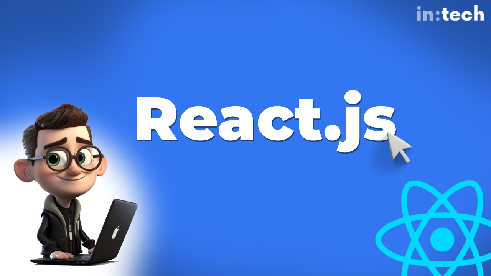

<h1 id="{{ Week 23-React JS | slugify }}">
  Week 23 | React JS
</h1>

  

  <h2 class="week-controls__previous_week">

    

      

      <a href="../week{{ previous_week_num }}">Week {{ previous_week_num }} &#8678;</a>
    

  </h2>

  Updated: 17/3/2025

  <h2 class="week-controls__next_week">

    

      

      <a href="../week{{ next_week_num }}">&#8680; Week {{ next_week_num }}</a>
    

  </h2>

---

<!-- Week 23 - Day 1 | React Hooks: useRef & useEffect -->

  

    <h2>
      Week 23 - Day 1 | React Hooks: useRef & useEffect</h2>
  

### Schedule

  - **Watch the lectures**
  - **Study the suggested material**
  - **Practice on the topics and share your questions**

### Study Plan

  Your instructor will share the video lectures with you. Here are the topics covered:

  - **Part 1:** useState Hook
  - **Part 2:** useRef Hook

  You can find the lecture code [here](https://github.com/in-tech-gration/WDX-180/tree/main/curriculum/week23/assets/day01/code){:target="_blank"}

  Remember, the code is a React app created using [vite](https://vite.dev/guide/#scaffolding-your-first-vite-project){:target="_blank"}.

  **Tips:**  
    - Temporarily disable ESLint: just at a comment at the top of the file: `/* eslint-disable */`  

  **References & Resources:**

  - **Hooks**  
    - [**React Hooks Lifecycle**](https://wavez.github.io/react-hooks-lifecycle/){:target="_blank"}  
      - [**Another view of the Component lifecycle**](https://github.com/in-tech-gration/WDX-180/blob/main/curriculum/week23/assets/day01/diagrams/ReactHooksLifecycle.png){:target="_blank"}  
    - **A family of built-in functions in React that:**  
      - **are prefixed with “use”: useState, useRef, useEffect**  
      - **should ONLY be used inside Component functions**  
      - **should NOT be conditionally executed**  
  - **JavaScript:**  
    - **Highly recommended: [https://github.com/getify/You-Dont-Know-JS/blob/1st-ed/README.md](https://github.com/getify/You-Dont-Know-JS/blob/1st-ed/README.md){:target="_blank"}**  
      - I don’t believe *“Async and Performance”* and *“ES6 and Beyond”* are relevant today as they are a bit outdated these days, so you can skip them.  
      - You can read the 2nd edition of “[Scopes & Closures](https://github.com/getify/You-Dont-Know-JS/blob/2nd-ed/scope-closures/README.md){:target="_blank"}” since it’s ready and wait for the 2nd edition of *“Sync & Async”* and *“ES.Next & Beyond”*  
    - In order to master JS you should definitely master the following concepts:  
      - `this`  
      - anything asynchronous  
      - The object prototype  
    - Check out: [https://learn.js.org/](https://learn.js.org/){:target="_blank"}  
      - Feel free to comment and open a PR or suggest:  
        - [https://github.com/in-tech-gration/LearnJavascript](https://github.com/in-tech-gration/LearnJavascript){:target="_blank"}  
  - [**ReacTree**](https://marketplace.visualstudio.com/items?itemName=ReacTreeDev.reactree){:target="_blank"}  
  - [**Error Lens VSCode Extension**](https://marketplace.visualstudio.com/items?itemName=usernamehw.errorlens){:target="_blank"}  
  - React Rule: useState creates a unique state value for each Component instance  
  - React Rule: Try to avoid mixing native DOM API and React  
    - We reach out to the Refs when there’s no other way of doing something with the DOM.  
    - We use useRef to make use of a vanilla JS library that needs direct access to the DOM (e.g. D3, Google Maps, etc.)  
  - State  
    - If you need a value that depends or is “derived” from a state variable, you probably don’t need another state variable for that. Just try with a simple local variable.

<!-- Summary -->

### Exercises

  - **Try to turn the App.jsx into a shopping cart**  
    - Idea: update shopping cart with number of items added   
    - Idea: Update the total price of the shopping cart  
  - **Study: [useEffect](https://react.dev/reference/react/useEffect){:target="_blank"}**  
  - **Study:** Render & Commit: [https://react.dev/learn/render-and-commit](https://react.dev/learn/render-and-commit){:target="_blank"}
  - **Ideas:** refactor TrafficLight app using `useRef` and `useEffect`

  **IMPORTANT:** Make sure to complete all the tasks found in the **daily Progress Sheet** and update the sheet accordingly. Once you've updated the sheet, don't forget to `commit` and `push`. The progress draft sheet for this day is: **/user/week23/progress/progress.draft.w23.d01.csv**

  You should **NEVER** update the `draft` sheets directly, but rather work on a copy of them according to the instructions [found here](../week01/resources/PROGRESS-WORKFLOW.md).

<!-- Extra Resources -->

<!-- Sources and Attributions -->
  

<!-- Week 23 - Day 2 | TBA -->

  

    <h2>
      Week 23 - Day 2 | TBA</h2>
  

### Schedule

  - **Study the suggested material**
  - **Practice on the topics and share your questions**

<!-- Study Plan -->

<!-- Summary -->

<!-- Exercises -->

<!-- Extra Resources -->

<!-- Sources and Attributions -->
  

<!-- Week 23 - Day 3 | TBA -->

  

    <h2>
      Week 23 - Day 3 | TBA</h2>
  

### Schedule

  - **Watch the lectures**
  - **Study the suggested material**
  - **Practice on the topics and share your questions**

### Study Plan

  Your instructor will share the video lectures with you. Here are the topics covered:

  - **Part 1:** 
  - **Part 2:**

  You can find the lecture code [here](){:target="_blank"}

  **Lecture Notes & Questions:**

  **References & Resources:**

<!-- Summary -->

<!-- Exercises -->

### Extra Resources

  ---

  _Photo by _

<!-- Sources and Attributions -->
  

<!-- Week 23 - Day 4 | TBA -->

  

    <h2>
      Week 23 - Day 4 | TBA</h2>
  

### Schedule

  - **Study the suggested material**
  - **Practice on the topics and share your questions**

<!-- Study Plan -->

<!-- Summary -->

<!-- Exercises -->

<!-- Extra Resources -->

<!-- Sources and Attributions -->
  

<!-- Week 23 - Day 5 | TBA -->

  

    <h2>
      Week 23 - Day 5 | TBA</h2>
  

### Schedule

  - **Watch the lectures**
  - **Study the suggested material**
  - **Practice on the topics and share your questions**

### Study Plan

  Your instructor will share the video lectures with you. Here are the topics covered:

  - **Part 1:** 
  - **Part 2:**

  You can find the lecture code [here](){:target="_blank"}

  **Lecture Notes & Questions:**

  **References & Resources:**

<!-- Summary -->

<!-- Exercises -->

### Extra Resources

  ---

  _Photo by _

<!-- Sources and Attributions -->
  

**Weekly feedback:** Hey, it's really important for us to know how your experience with the course has been so far, so don't forget to fill in and submit your [**mandatory** feedback form](https://forms.gle/S6Zg3bbS2uuwsSZF9){:target="_blank"} before the day ends. Thanks you!

---

<!-- COMMENTS: -->
