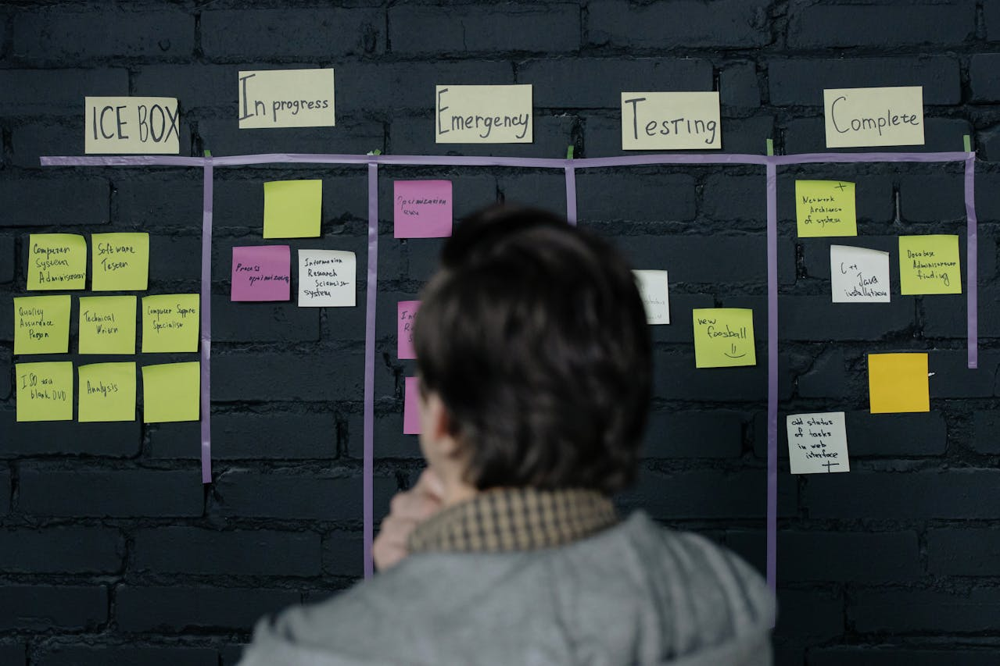

<hr class="mb-0">

<h1 id="{{ Week 25-Advanced JavaScript: Web APIs | slugify }}">
  <span class="week-prefix">Week 25 |</span> Advanced JavaScript: Web APIs
</h1>



<div class="week-controls">

  

  <h2 class="week-controls__previous_week">

    

      

      <a href="../week{{ previous_week_num }}">Week {{ previous_week_num }} &#8678;</a>
    

  </h2>

  <span>Updated: 7/4/2025</span>

  <h2 class="week-controls__next_week">

    

      

      <a href="../week{{ next_week_num }}">&#8680; Week {{ next_week_num }}</a>
    

  </h2>

</div>

---

<!-- Week 25 - Day 1 | Web Storage APIs -->
<details markdown="1">
  <summary>
    <h2>
      <span class="summary-day">Week 25 - Day 1</span> | Web Storage APIs</h2>
  </summary>

### Schedule

  - **Watch the lectures**
  - **Study the suggested material**
  - **Practice on the topics and share your questions**

### Study Plan

  Your instructor will share the video lectures with you. Here are the topics covered:

  - **Part 1:** Web Storage APIs
  - **Part 2:** Web Storage APIs

  You can find the lecture code [here](https://github.com/in-tech-gration/WDX-180/blob/main/curriculum/week25/assets/day01/code/index.html){:target="_blank"} and all other assets [here](https://github.com/in-tech-gration/WDX-180/tree/main/curriculum/week25/assets){:target="_blank"}.

  **Lecture Notes:**

  - The `localStorage` is a read-only property* of the window interface
    - Treat it as read-only.
    - It’s part of the `window.localStorage`
  - `localStorage` data has no expiration time (unlike cookies)
  - `sessionStorage`: data gets cleared when the page session ends — that is, when the page is closed
  - CRUD Methods for `localStorage` and `sessionStorage`: Create/Read/Update/Delete
    - `setItem()` (C)
    - `getItem()` (R)
    - `setItem()` (U)
    - `remoteItem()` (D)
  - _"key(): "The order of keys is user-agent defined, so **you should not rely on it**."_
  - Web Storage APIs work on per-[origin](https://developer.mozilla.org/en-US/docs/Glossary/Origin){:target="_blank"} and per-browser context.

  **Questions:**

  - _Is it safe to store sensitive/private information in the browser’s storage?_
    - You have to be very careful about the things that you store.
    - Avoid saving sensitive/private information.
    - Try encrypting things before you save them.
  
  - _Will there be an error message when the storage limit is reached?_
    - Yes, we’ll get an error.name `QuotaExceededError`

  **References & Resources:**

  - Recommended Study: [Using the Web Storage API (MDN)](https://developer.mozilla.org/en-US/docs/Web/API/Web_Storage_API/Using_the_Web_Storage_API){:target="_blank"} 
    - Make sure not to miss out on the [Responding to storage changes with the StorageEvent](https://developer.mozilla.org/en-US/docs/Web/API/Web_Storage_API/Using_the_Web_Storage_API#responding_to_storage_changes_with_the_storageevent){:target="_blank"} section of the documentation.
  - [https://developer.mozilla.org/en-US/docs/Web/API/Storage/key](https://developer.mozilla.org/en-US/docs/Web/API/Storage/key){:target="_blank"}

  - [List of Web APIs at MDN](https://developer.mozilla.org/en-US/docs/Web/API){:target="_blank"} 

  - [Introduction to web APIs](https://developer.mozilla.org/en-US/docs/Learn/JavaScript/Client-side_web_APIs/Introduction){:target="_blank"} 

  - [Web Storage API](https://developer.mozilla.org/en-US/docs/Web/API/Web_Storage_API){:target="_blank"}

  - Window: [the `localStorage` property](https://developer.mozilla.org/en-US/docs/Web/API/Window/localStorage){:target="_blank"} 

  - [Web Storage (interface)](https://developer.mozilla.org/en-US/docs/Web/API/Storage){:target="_blank"}

<!-- Summary -->

### Exercises

  Become a discoverer: Experiment and find out how localStorage works with different `origins` and when accessed from different browsers:
    - Configure [LiveServer](https://marketplace.visualstudio.com/items?itemName=ritwickdey.LiveServer){:target="_blank"} to use a different default port (5500 => 5501) and see what happens with the localStorage. Also try both ports on a different browser. To find the setting, search for `liveServer.settings.port` in VSCode Settings, Extensions.

  **Coding challenge #1:** Use `localStorage` to keep track of a web page’s horizontal position so that when the user reloads or opens up the page again, they should be looking at the last section. For this one you’ll have to dig out some other APIs (related to browser scrolling, current cursor height)

  **Coding challenge #2:** Try localStorage with React. You might want to try `useEffect` for running localStorage.

  ```js
  // Read:
  useEffect(()=> { localStorage.getItem() }, []);
  // Read/Write/Update/Remove:
  onClick={()=> localStorage.getItem/setItem/removeItem }
  ```

  **IMPORTANT:** Make sure to complete all the tasks found in the **daily Progress Sheet** and update the sheet accordingly. Once you've updated the sheet, don't forget to `commit` and `push`. The progress draft sheet for this day is: **/user/week25/progress/progress.draft.w25.d01.csv**

  You should **NEVER** update the `draft` sheets directly, but rather work on a copy of them according to the instructions [found here](../week01/resources/PROGRESS-WORKFLOW.md).


<!-- Extra Resources -->

<!-- Sources and Attributions -->
  
</details>

<hr class="mt-1">

<!-- Week 25 - Day 2 | The Scrum Framework -->
<details markdown="1">
  <summary>
    <h2>
      <span class="summary-day">Week 25 - Day 2</span> | The Scrum Framework</h2>
  </summary>

### Schedule

  - **Study the suggested material**

### Study Plan

  According to the [Atlassian](https://www.atlassian.com/agile/scrum){:target="_blank"} website:

  > "Scrum is an agile project management framework that helps teams structure and manage their work through a set of values, principles, and practices. Much like a rugby team (where it gets its name) training for the big game, scrum encourages teams to learn through experiences, self-organize while working on a problem, and reflect on their wins and losses to continuously improve."


  In this module, we are going to explore one of the most common and popular project management frameworks. You will watch a [series of YouTube videos](https://www.youtube.com/playlist?list=PL_PJn_AGUdkMhkAkPKIDBf6ShCgYUOs8Y){:target="_blank"} to familiarize yourself with the Scrum framework and the following related concepts, since chances are that one of the companies or teams you are going to work with will employ this framework:

  - Sprints
  - Sprint Planning 
  - Sprint Reviews
  - Ceremonies
  - Backlog
  - Stand-ups
  - Scrum Roles

  **Suggested material for study and practice:**

  - [1. Scrum Framework in a Nutshell](https://www.youtube.com/watch?v=3VvSyXaH31Y){:target="_blank"} (6min)
  - [2. Product Backlog Refinement in a Nutshell](https://www.youtube.com/watch?v=POpCiEXOWkE){:target="_blank"} (5min)
  - [3. Sprint Planning in a Nutshell](https://www.youtube.com/watch?v=8LizzCzsJQg){:target="_blank"} (4min)
  - [4. Daily Scrum in a Nutshell](https://www.youtube.com/watch?v=MARBZbCw9tA){:target="_blank"} (3min)
  - [5. Sprint Review in a Nutshell](https://www.youtube.com/watch?v=-av0l_vbDs4){:target="_blank"} (2min)
  - [6. Sprint Retrospective in a Nutshell](https://www.youtube.com/watch?v=NeZvHdN1Huo){:target="_blank"} (2min)
  - [7. Scrum In A Nutshell](https://www.youtube.com/watch?v=L_sAo93ASTU){:target="_blank"} (5min)

  - Read the [Manifesto for Agile Software Development](https://agilemanifesto.org/){:target="_blank"} as "Scrum is a subset of Agile. It is a lightweight process framework for agile development, and the most widely-used one." [Source](https://www.cprime.com/resources/what-is-agile-what-is-scrum/){:target="_blank"}

  - [What is scrum and how to get started](https://www.atlassian.com/agile/scrum){:target="_blank"}

<!-- Summary -->

<!-- Exercises -->

<!-- Extra Resources -->

### Sources and Attributions

  ---


  _Photo by [cottonbro studio](https://www.pexels.com/photo/manager-considering-project-strategy-by-the-task-board-6804077/)_
  
</details>

<hr class="mt-1">

<!-- Week 25 - Day 3 | TBA -->
<details markdown="1">
  <summary>
    <h2>
      <span class="summary-day">Week 25 - Day 3</span> | TBA</h2>
  </summary>

### Schedule

  - **Watch the lectures**
  - **Study the suggested material**
  - **Practice on the topics and share your questions**

### Study Plan

  Your instructor will share the video lectures with you. Here are the topics covered:

  - **Part 1:** 
  - **Part 2:**

  You can find the lecture code [here](){:target="_blank"}

  **Lecture Notes & Questions:**

  **References & Resources:**

<!-- Summary -->

<!-- Exercises -->

### Extra Resources

  ---


  _Photo by []()_


<!-- Sources and Attributions -->
  
</details>

<hr class="mt-1">

<!-- Week 25 - Day 4 | TBA -->
<details markdown="1">
  <summary>
    <h2>
      <span class="summary-day">Week 25 - Day 4</span> | TBA</h2>
  </summary>

### Schedule

  - **Study the suggested material**
  - **Practice on the topics and share your questions**

<!-- Study Plan -->

<!-- Summary -->

<!-- Exercises -->

<!-- Extra Resources -->

<!-- Sources and Attributions -->
  
</details>

<hr class="mt-1">

<!-- Week 25 - Day 5 | TBA -->
<details markdown="1">
  <summary>
    <h2>
      <span class="summary-day">Week 25 - Day 5</span> | TBA</h2>
  </summary>

### Schedule

  - **Watch the lectures**
  - **Study the suggested material**
  - **Practice on the topics and share your questions**

### Study Plan

  Your instructor will share the video lectures with you. Here are the topics covered:

  - **Part 1:** 
  - **Part 2:**

  You can find the lecture code [here](){:target="_blank"}

  **Lecture Notes & Questions:**

  **References & Resources:**

<!-- Summary -->

<!-- Exercises -->

### Extra Resources

  ---


  _Photo by []()_


<!-- Sources and Attributions -->
  
</details>


<hr class="mt-1">

**Weekly feedback:** Hey, it's really important for us to know how your experience with the course has been so far, so don't forget to fill in and submit your [**mandatory** feedback form](https://forms.gle/S6Zg3bbS2uuwsSZF9){:target="_blank"} before the day ends. Thanks you!


---

<!-- COMMENTS: -->
<script src="https://utteranc.es/client.js"
  repo="in-tech-gration/WDX-180"
  issue-term="pathname"
  theme="github-dark"
  crossorigin="anonymous"
  async>
</script>