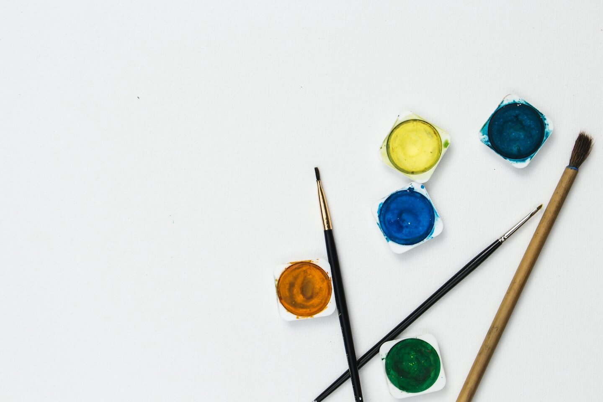
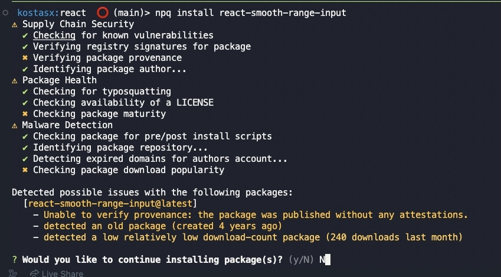

<h1 id="{{ Week 26-Advanced JavaScript - Web APIs | slugify }}">
  Week 26 | Advanced JavaScript - Web APIs
</h1>

  

  <h2 class="week-controls__previous_week">

    

      

      <a href="../week{{ previous_week_num }}">Week {{ previous_week_num }} &#8678;</a>
    

  </h2>

  Updated: 11/11/2025

  <h2 class="week-controls__next_week">

    

      

      <a href="../week{{ next_week_num }}">&#8680; Week {{ next_week_num }}</a>
    

  </h2>

---

<!-- Week 26 - Day 1 | Canvas API -->

  

    <h2>
      Week 26 - Day 1 | Canvas API</h2>
  

### Schedule

  - **Watch the lectures**
  - **Study the suggested material**
  - **Practice on the topics and share your questions**

### Study Plan

  Your instructor will share the video lectures with you. Here are the topics covered:

  - **Canvas API**

  

  You can find the lecture code [here](https://github.com/in-tech-gration/WDX-180/blob/main/curriculum/week26/assets/canvas.html){:target="_blank"}

  **Lecture Notes & Questions:**

  **References & Resources:**

  - [**CanvasRenderingContext2D**](https://developer.mozilla.org/en-US/docs/Web/API/CanvasRenderingContext2D){:target="_blank"}  
    - [**fillRect**](https://developer.mozilla.org/en-US/docs/Web/API/CanvasRenderingContext2D/fillRect){:target="_blank"}  
    - [**clearRect**](https://developer.mozilla.org/en-US/docs/Web/API/CanvasRenderingContext2D/clearRect){:target="_blank"}  
    - [**arc()**](https://developer.mozilla.org/en-US/docs/Web/API/CanvasRenderingContext2D/arc){:target="_blank"}  
    - *more to explore...*  
  - The Photoshop clone built with Canvas API: [photopea](https://www.photopea.com/){:target="_blank"}

<!-- Summary -->

### Exercises

  - Draw the Jamaica flag  
  - Draw a Pacman figure  
  - Combine Media API + Canvas API to track video progress/playtime

  **IMPORTANT:** Make sure to complete all the tasks found in the **daily Progress Sheet** and update the sheet accordingly. Once you've updated the sheet, don't forget to `commit` and `push`. The progress draft sheet for this day is: **/user/week26/progress/progress.draft.w26.d01.csv**

  You should **NEVER** update the `draft` sheets directly, but rather work on a copy of them according to the instructions [found here](../modules/curriculum/progress_workflow.md).

### Extra Resources

  ---

  _Photo by [Kelli Tungay](https://unsplash.com/photos/assorted-color-paints-and-paint-brushes-Sj0nhVIb4eY?utm_content=creditCopyText&utm_medium=referral&utm_source=unsplas)_      

<!-- Sources and Attributions -->
  

<!-- Week 26 - Day 2 | Canvas API Exploration -->

  

    <h2>
      Week 26 - Day 2 | Canvas API Exploration</h2>
  

### Schedule

  - **Study the suggested material**
  - **Practice on the topics and share your questions**

### Study Plan

  - Today is Canvas API exploration day. Make sure to work on the tasks and challenges that we came up with yesterday and explore new ways to use the Canvas API. Here's a repo with lots of cool resources and demos: [Awesome Canvas](https://github.com/raphamorim/awesome-canvas){:target="_blank"}

  - Some highlights:
    - [30.000 particles](https://codepen.io/soulwire/full/DdGRYG){:target="_blank"}
    - [Inception](https://raphamorim.io/canvas-experiments/inception){:target="_blank"}
    - [Pirates love daisies](https://pirateslovedaisies.com/){:target="_blank"} (game)

  **Have fun and share your experience (bugs and frustrations included)!** 

  **`npm install virus`**

  `npm` now hosts more than 2.4 million packages! So many npm packages, so many things to worry about! Here are a couple of ways to check the integrity, safety and reliability for npm packages, both for Node and JavaScript:

  - 1) Install [npq](https://www.npmjs.com/package/npq){:target="_blank"} and run checks before installing: `npq install react`

  

  - 2) Check for the health of an npm package in [here](https://snyk.io/advisor/){:target="_blank"}. [Example](https://snyk.io/advisor/npm-package/react-smooth-range-input){:target="_blank"}

  - 3) Install [snyk](https://www.npmjs.com/package/snyk){:target="_blank"} and run some tests using `snyk test`

  

<!-- Summary -->

<!-- Exercises -->

<!-- Extra Resources -->

<!-- Sources and Attributions -->
  

<!-- Week 26 - Day 3 | Canvas API: Part 2 -->

  

    <h2>
      Week 26 - Day 3 | Canvas API: Part 2</h2>
  

### Schedule

  - **Watch the lectures**
  - **Study the suggested material**
  - **Practice on the topics and share your questions**

### Study Plan

  Your instructor will share the video lectures with you. Here are the topics covered:

  - Canvas API: Part 2

  You can find the lecture code [here](https://github.com/in-tech-gration/WDX-180/tree/main/curriculum/week26/assets/day03/code){:target="_blank"} and other resources (diagrams, etc.) [here](https://github.com/in-tech-gration/WDX-180/tree/main/curriculum/week26/assets/day03){:target="_blank"}.

  **Questions**

  - *Can we name elements of a drawing and then manipulate them?*  
    - Unfortunately we do not have a built in solution for this one. *(Let us know if you find out about something that exists)*  
    - This is a good case for a group challenge  
  - *What gets saved when we use the canvas state() method?*  
    - [**save()**](https://developer.mozilla.org/en-US/docs/Web/API/CanvasRenderingContext2D/save#the_drawing_state){:target="_blank"}

  **References & Resources:**

  - [**https://web.dev/**](https://web.dev/){:target="_blank"}  
    - **Search for “canvas” related terms, e.g.** *canvas pixels, canvas responsive*  
  - [**Canvas API**](https://html.spec.whatwg.org/multipage/canvas.html#2dcontext){:target="_blank"}  
  - [**A Stack (LIFO: Last-in-first-out) data structure**](https://media.geeksforgeeks.org/wp-content/uploads/20231130114919/LIFO-Operations-in-stack.jpg){:target="_blank"} *(like the Canvas save()/restore())*  
    - [*https://www.geeksforgeeks.org/lifo-principle-in-stack/*](https://www.geeksforgeeks.org/lifo-principle-in-stack/){:target="_blank"}  
    - [Stacks: a LIFO data structure](https://www.youtube.com/watch?v=5JQxVmQFFHE){:target="_blank"}  
  - Animation: [`requestAnimationFrame` + `cancelAnimationFrame`](https://developer.mozilla.org/en-US/docs/Web/API/Canvas_API/Tutorial/Basic_animations){:target="_blank"}
  - [`save` + `restore`](https://developer.mozilla.org/en-US/docs/Web/API/Canvas_API/Tutorial/Transformations#saving_and_restoring_state){:target="_blank"}
  - Search for a **safe and reliable** ruler measurement extension  
    - Check: [https://chromewebstore.google.com/detail/fkfkjailjcijmghkonghlclbjkopjbgh](https://chromewebstore.google.com/detail/fkfkjailjcijmghkonghlclbjkopjbgh){:target="_blank"}  
  - [The Luna UI devTools thingy](https://luna.liriliri.io/?path=/story/dom-highlighter--dom-highlighter){:target="_blank"}  
  - [pseudo-3D engine for canvas & SVG](https://zzz.dog/){:target="_blank"}  
  - [Heatmap example](https://static.wingify.com/gcp/uploads/sites/3/2019/03/Img-1-1.png){:target="_blank"}  
  - [Mary’s Quiz version](https://java-script-questions-quiz.vercel.app/){:target="_blank"}  
  - [Fabric.js](https://fabricjs.com/){:target="_blank"}  
    - A library that allows you to select specific shapes or canvas elements and manipulate.  
  - [https://p5js.org/](https://p5js.org/){:target="_blank"} (Just check this out\!)  
    - Make sure to bookmark: [Coding Train](https://www.youtube.com/channel/UCvjgXvBlbQiydffZU7m1_aw){:target="_blank"}  
      - Make sure to read [**The Nature of Code**](https://natureofcode.com/){:target="_blank"}  
  - [A face detection library in 200 lines of JavaScript](https://github.com/nenadmarkus/picojs){:target="_blank"}  
  - **Web Dev niche:**  
    - **3D: [https://bruno-simon.com](https://bruno-simon.com){:target="_blank"}**  
    - **Canvas API: [https://photopea.com](https://photopea.com){:target="_blank"}**  
  - **Mary Rose Cook**  
    - [**Mary Live Codes A JavaScript Game From Scratch – Mary Rose Cook / Front-Trends 2014**](https://www.youtube.com/watch?v=hbKN-9o5_Z0){:target="_blank"} **(<= this video is pure gold)**  
    - [Git from the inside out](https://maryrosecook.com/blog/post/git-from-the-inside-out){:target="_blank"}  
    - [Git implemented (and annotated) in JS](http://gitlet.maryrosecook.com/docs/gitlet.html){:target="_blank"}  
  - Canvas Series: [Part 1](https://davidmatthew.ie/the-canvas-api-part-1-the-background/){:target="_blank"}, [Part 2](https://davidmatthew.ie/the-canvas-api-part-2-basic-shapes-and-the-2d-context/){:target="_blank"}, [Part 3](https://davidmatthew.ie/the-canvas-api-part-3-a-retina-ready-responsive-canvas/){:target="_blank"}, [Part 4](https://davidmatthew.ie/the-canvas-api-part-4-points-paths-and-colours/){:target="_blank"}

<!-- Summary -->

### Exercises

  - Draw the [Jamaican flag](https://github.com/in-tech-gration/WDX-180/blob/main/curriculum/week26/assets/day03/exercises/Jamaica.jpg){:target="_blank"} and a [Pac-man figure](https://github.com/in-tech-gration/WDX-180/blob/main/curriculum/week26/assets/day03/exercises/PACMAN.jpg){:target="_blank"} using Canvas API!
  - Let’s learn about how Canvas pixels actually behave on different screen sizes and especially when the screen compresses/squeezes the canvas  
  - Build an API that allows us to select and manipulate canvas elements  
  - Draw a chessboard using Canvas and loops  
  - Explore [Canvas Transformations](https://developer.mozilla.org/en-US/docs/Web/API/Canvas_API/Tutorial/Transformations){:target="_blank"}  
  - Combine `requestAnimationFrame` with events (e.g. arrow button presses)

  **IMPORTANT:** Make sure to complete all the tasks found in the **daily Progress Sheet** and update the sheet accordingly. Once you've updated the sheet, don't forget to `commit` and `push`. The progress draft sheet for this day is: **/user/week26/progress/progress.draft.w26.d03.csv**

  You should **NEVER** update the `draft` sheets directly, but rather work on a copy of them according to the instructions [found here](../modules/curriculum/progress_workflow.md).

<!-- Extra Resources -->

<!-- Sources and Attributions -->
  

<!-- Week 26 - Day 4 | Practice Day -->

  

    <h2>
      Week 26 - Day 4 | Practice Day</h2>
  

### Schedule

  - **Study the suggested material**
  - **Practice on the topics and share your questions**

### Study Plan

  You should dedicate this day to do a recap on the material
  we've covered so far and practice by applying all the concepts 
  that you've learned and completing all the exercises and coding
  challenges that are left unfinished.

  Good luck!

<!-- Summary -->

<!-- Exercises -->

<!-- Extra Resources -->

<!-- Sources and Attributions -->
  

<!-- Week 26 - Day 5 | Canvas, SVG & ImageData -->

  

    <h2>
      Week 26 - Day 5 | Canvas, SVG & ImageData</h2>
  

### Schedule

  - **Watch the lectures**
  - **Study the suggested material**
  - **Practice on the topics and share your questions**

### Study Plan

  Your instructor will share the video lectures with you. Here are the topics covered:

  - **Part 1:** SVG
  - **Part 2:** Canvas API & ImageData

  You can find the lecture code along with the SVG files [here](https://github.com/in-tech-gration/WDX-180/tree/main/curriculum/week26/assets/day05/code){:target="_blank"}

  **Lecture Notes & Questions:**

  **References & Resources:**

  - [**getBoundingClientRect()**](https://developer.mozilla.org/en-US/docs/Web/API/Element/getBoundingClientRect){:target="_blank"}  
    - This will only work with DOM elements (HTML/SVG) and NOT Canvas shapes  
    - [**DOMRect**](https://developer.mozilla.org/en-US/docs/Web/API/DOMRect){:target="_blank"}  
    - [**DOMRect constructor**](https://developer.mozilla.org/en-US/docs/Web/API/DOMRect/DOMRect){:target="_blank"}  
  - [**CanvasRenderingContext2D**](https://developer.mozilla.org/en-US/docs/Web/API/CanvasRenderingContext2D){:target="_blank"}  
  - [**getImageData()**](https://developer.mozilla.org/en-US/docs/Web/API/CanvasRenderingContext2D/getImageData){:target="_blank"}  
  - [**Uint8ClampedArray**](https://developer.mozilla.org/en-US/docs/Web/JavaScript/Reference/Global_Objects/Uint8ClampedArray){:target="_blank"}  
  - **Undraw: [SVG Images](https://undraw.co/){:target="_blank"}**  
  - [**Photopea for Vector graphics**](https://www.vectorpea.com/){:target="_blank"}  
  - **How to include an SVG**  
    - **Copy paste the `<svg>` code**  
    - **Load via an `` tag**  
    - **Fetch the SVG** (you can manipulate the SVG and not have the SVG code in your page)  
  - [quadraticCurveTo](https://developer.mozilla.org/en-US/docs/Web/API/CanvasRenderingContext2D/quadraticCurveTo){:target="_blank"}  
  - [bezierCurveTo](https://developer.mozilla.org/en-US/docs/Web/API/CanvasRenderingContext2D/bezierC){:target="_blank"}  
    - Perhaps start with the easier W3Schools:  
      - [https://www.w3schools.com/jsref/canvas\_beziercurveto.asp](https://www.w3schools.com/jsref/canvas_beziercurveto.asp){:target="_blank"}  
    - ...and end at MDN  
  - [Canvas in NodeJS](https://github.com/Automattic/node-canvas){:target="_blank"}  
  - [HTML2Canvas](https://html2canvas.hertzen.com/){:target="_blank"}

  - [Saving Images](https://developer.mozilla.org/en-US/docs/Web/API/Canvas_API/Tutorial/Pixel_manipulation_with_canvas#saving_images){:target="_blank"}

  - [Optimizing Canvas](https://developer.mozilla.org/en-US/docs/Web/API/Canvas_API/Tutorial/Optimizing_canvas){:target="_blank"}

<!-- Summary -->

<!-- Exercises -->

<!-- Extra Resources -->

<!-- Sources and Attributions -->
  

**Weekly feedback:** Hey, it's really important for us to know how your experience with the course has been so far, so don't forget to fill in and submit your [**mandatory** feedback form](https://forms.gle/S6Zg3bbS2uuwsSZF9){:target="_blank"} before the day ends. Thanks you!

---

<!-- COMMENTS: -->
