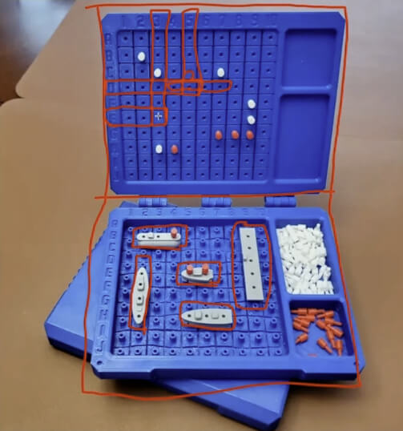

<h1 id="{{ Week 27-Advanced JavaScript | slugify }}">
  Week 27 | Advanced JavaScript
</h1>

  

  <h2 class="week-controls__previous_week">

    

      

      <a href="../week{{ previous_week_num }}">Week {{ previous_week_num }} &#8678;</a>
    

  </h2>

  Updated: 25/4/2025

  <h2 class="week-controls__next_week">

    

      

      <a href="../week{{ next_week_num }}">&#8680; Week {{ next_week_num }}</a>
    

  </h2>

---

<!-- Week 27 - Day 1 | Drag and Drop API -->

  

    <h2>
      Week 27 - Day 1 | Drag and Drop API</h2>
  

### Schedule

  - **Watch the lectures**
  - **Study the suggested material**
  - **Practice on the topics and share your questions**

### Study Plan

  Your instructor will share the video lectures with you. Here are the topics covered:

  - **Part 1:** Debugging Canvas API
  - **Part 2:** Drag and Drop API

  You can find the lecture code [here](https://github.com/in-tech-gration/WDX-180/blob/main/curriculum/week27/assets/day01/drag-and-drop.html){:target="_blank"}

  **References & Resources:**

  - [**Slides**](https://kostasx.github.io/EventLoop/frontend/html5/apis.html#/3){:target="_blank"} *(contains code and resources at the end)*  
  - **Lesson of the day: RTFM!!! Read the full MDN!!!**  
    - [How to remove the clip of a region in html 5 canvas](https://stackoverflow.com/questions/25282793/how-to-remove-the-clip-of-a-region-in-html-5-canvas){:target="_blank"}  
    - Alternative: the [reset()](https://developer.mozilla.org/en-US/docs/Web/API/CanvasRenderingContext2D/reset){:target="_blank"} context 2D  
  - [**DataTransfer**](https://developer.mozilla.org/en-US/docs/Web/API/DataTransfer){:target="_blank"}  
  - [**HTMLImageElement**](https://developer.mozilla.org/en-US/docs/Web/API/HTMLImageElement){:target="_blank"}  
    - [**HTMLImageElement.complete**](https://developer.mozilla.org/en-US/docs/Web/API/HTMLImageElement/complete){:target="_blank"} **property**  
  - [**Canvas revealing effect using requestAnimationFrame**](https://jsfiddle.net/Mekire/wq6ynruq/){:target="_blank"}  
    - This also includes a darker version of the revealing image beneath the clipping region

<!-- Summary -->

### Exercises

  - Use the **__proto__** object property to explore the Prototypal inheritance chain   
    - The **__proto__** should ONLY be used for debugging and educational purposes. You should **NEVER** use it in production.  
  - Make the draggable element paint the drop target with its background color  
  - Explore and recreate the [DnD List](https://kostasx.github.io/EventLoop/frontend/html5/webapis/drag-and-drop/resources/tasks-board.html){:target="_blank"}
    - [Source code](https://raw.githubusercontent.com/kostasx/EventLoop/master/frontend/html5/webapis/drag-and-drop/resources/tasks-board.html){:target="_blank"}  
  - Explore and recreate the [DnD Game](https://kostasx.github.io/EventLoop/frontend/html5/webapis/drag-and-drop/resources/shape-game.html){:target="_blank"}
    - [Source code](https://raw.githubusercontent.com/kostasx/EventLoop/master/frontend/html5/webapis/drag-and-drop/resources/shape-game.html){:target="_blank"}

  **IMPORTANT:** Make sure to complete all the tasks found in the **daily Progress Sheet** and update the sheet accordingly. Once you've updated the sheet, don't forget to `commit` and `push`. The progress draft sheet for this day is: **/user/week27/progress/progress.draft.w27.d01.csv**

  You should **NEVER** update the `draft` sheets directly, but rather work on a copy of them according to the instructions [found here](../modules/curriculum/progress_workflow.md).

<!-- Extra Resources -->

<!-- Sources and Attributions -->
  

<!-- Week 27 - Day 2 | Drag and Drop A11y -->

  

    <h2>
      Week 27 - Day 2 | Drag and Drop A11y</h2>
  

### Schedule

  - **Study the suggested material**
  - **Practice on the topics and share your questions**

### Study Plan

  Today you should spend some time on ♿ accessibility, because Drag-n-Drop can become a problem, not a feature when `A11y` is not properly taken care of. Here are some recommended articles to read and some code to study and explore:

  - [Are Drag and Drop Functions Allowed by WCAG?](https://accessibleweb.com/question-answer/are-drag-and-drop-functions-allowed-by-wcag/){:target="_blank"}
  - [Accessible Drag and Drop](https://liferay.design/articles/2023/accessible-drag-drop/){:target="_blank"}
  - [W3C Best Practices: Drag and Drop](https://www.w3.org/wiki/PF/ARIA/BestPractices/DragDrop){:target="_blank"}
  - [4 Major Patterns for Accessible Drag and Drop](https://medium.com/salesforce-ux/4-major-patterns-for-accessible-drag-and-drop-1d43f64ebf09){:target="_blank"}
  - [Salesforce DnD A11y Patterns](https://salesforce-ux.github.io/dnd-a11y-patterns/#/){:target="_blank"}
    - [GitHub: Salesforce DnD A11y Patterns](https://github.com/salesforce-ux/dnd-a11y-patterns){:target="_blank"}
  - [CodePen Project: Accessible Drag and Drop by Drew Lee](https://codepen.io/drewlee/project/editor/XWNLeE){:target="_blank"}

<!-- Summary -->

<!-- Exercises -->

<!-- Extra Resources -->

<!-- Sources and Attributions -->
  

<!-- Week 27 - Day 3 | FileReader API -->

  

    <h2>
      Week 27 - Day 3 | FileReader API</h2>
  

### Schedule

  - **Watch the lectures**
  - **Study the suggested material**
  - **Practice on the topics and share your questions**

### Study Plan

  Your instructor will share the video lectures with you. Here are the topics covered:

  - **Part 1:** FileReader API
  - **Part 2:** FileReader API

  You can find the lecture code [here](https://github.com/in-tech-gration/WDX-180/blob/main/curriculum/week27/assets/day03/FileReader.html){:target="_blank"}

  **References & Resources:**

  - **Drag-n-Drop in the real world**  
    - [**Outdoors fast food ordering system**](https://www.youtube.com/watch?v=ooH9LYAEGyY){:target="_blank"}  
  - **VSCode User Snippets**  
    - **Preferences > Configure User Snippets**  
  - [**FileReader**](https://developer.mozilla.org/en-US/docs/Web/API/FileReader){:target="_blank"}**:** *“The FileReader object lets web applications asynchronously read the contents of files from the users’ computer.”*  
    - [FileList](https://developer.mozilla.org/en-US/docs/Web/API/FileList){:target="_blank"}: *“...used for a list of files”*  
      - *The prototype of FileList uncovers this property:* [**Symbol(Symbol.iterator)**](https://developer.mozilla.org/en-US/docs/Web/JavaScript/Reference/Global_Objects/Symbol/iterator){:target="_blank"}:ƒ values()  
        - This gives an object the ability to iterate (loop) over its values through **[...object]** or **for..of** loop.  
      - [File](https://developer.mozilla.org/en-US/docs/Web/API/File){:target="_blank"}: *“The File interface provides information about files and allows JavaScript in a web page to access their content.”*  
  - [`<input type=”file” />`](https://developer.mozilla.org/en-US/docs/Web/HTML/Element/input/file){:target="_blank"}  
    - Limit file types: accept="image/jpeg, image/png"  
  - [**DataTransfer**](https://developer.mozilla.org/en-US/docs/Web/API/DataTransfer){:target="_blank"}: *“The DataTransfer object is used to hold the data that is being dragged during a drag and drop operation.”*  
  - [ElectronJS](https://www.electronjs.org/){:target="_blank"}: Turn any website or web app into a cross-platform Desktop application  
  - Base64:   
    - ``  
    - Base64/DataURL => file.jpeg => Read the contents => Convert them into a String  
    - ``
  - [Online Base64 Encoder/Decoder](https://www.base64encode.org/){:target="_blank"}
  - [FileReader](https://flaviocopes.com/filereader/){:target="_blank"} 
  - [https://javascript.info/file](https://javascript.info/file){:target="_blank"}
  - [File API](https://developer.mozilla.org/en-US/docs/Web/API/File_API/Using_files_from_web_applications){:target="_blank"}

<!-- Summary -->

### Exercises

  Build on the examples we’ve worked on and share any questions or apps that you’ve built.

  **IMPORTANT:** Make sure to complete all the tasks found in the **daily Progress Sheet** and update the sheet accordingly. Once you've updated the sheet, don't forget to `commit` and `push`. The progress draft sheet for this day is: **/user/week27/progress/progress.draft.w27.d03.csv**

  You should **NEVER** update the `draft` sheets directly, but rather work on a copy of them according to the instructions [found here](../modules/curriculum/progress_workflow.md).

<!-- Extra Resources -->

<!-- Sources and Attributions -->
  

<!-- Week 27 - Day 4 | Practice Day -->

  

    <h2>
      Week 27 - Day 4 | Practice Day</h2>
  

### Schedule

  - **Study the suggested material**
  - **Practice on the topics and share your questions**

<!-- Study Plan -->

<!-- Summary -->

<!-- Exercises -->

<!-- Extra Resources -->

<!-- Sources and Attributions -->
  

<!-- Week 27 - Day 5 | Battleship Game - Part 1 -->

  

    <h2>
      Week 27 - Day 5 | Battleship Game - Part 1</h2>
  

### Schedule

  - **Watch the lectures**
  - **Study the suggested material**
  - **Practice on the topics and share your questions**

### Study Plan

  

  Your instructor will share the video lectures with you. Here are the topics covered:

  - **Part 1:** Battleship game (problem solving procedure)
  - **Part 2:** Battleship game (from design board to code)

  You can find the lecture code and game requirements [here](https://github.com/in-tech-gration/WDX-180/tree/main/curriculum/week27/assets/day05/code){:target="_blank"} and the Excalidraw diagram [here](https://github.com/in-tech-gration/WDX-180/blob/main/curriculum/week27/assets/battleship.excalidraw.png){:target="_blank"}.

  **Rules for BattleShip (a Milton Bradley Game)**

  **Game Objective**

  The object of Battleship is to try and sink all of the other player's before they sink all of your ships. All of the other player's ships are somewhere on his/her board.  You try and hit them by calling out the coordinates of one of the squares on the board.  The other player also tries to hit your ships by calling out coordinates.  Neither you nor the other player can see the other's board so you must try to guess where they are.  Each board in the physical game has two grids:  the lower (horizontal) section for the player's ships and the upper part (vertical during play) for recording the player's guesses.

  **Starting a New Game**

  Each player places the 5 ships somewhere on their board.  The ships can only be placed vertically or horizontally. Diagonal placement is not allowed. No part of a ship may hang off the edge of the board.  Ships may not overlap each other.  No ships may be placed on another ship. 

  Once the guessing begins, the players may not move the ships.

  The 5 ships are:  

  - Carrier (occupies 5 spaces)
  - Battleship (4)
  - Cruiser (3)
  - Submarine (3)
  - Destroyer (2)

  

  **Playing the Game**

  Player's take turns guessing by calling out the coordinates. The opponent responds with "hit" or "miss" as appropriate.  Both players should mark their board with pegs:  red for hit, white for miss. For example, if you call out F6 and your opponent does not have any ship located at F6, your opponent would respond with "miss".  You record the miss F6 by placing a white peg on the lower part of your board at F6.  Your opponent records the miss by placing.

  When all of the squares that one your ships occupies have been hit, the ship will be sunk.   You should announce "hit and sunk".  In the physical game, a red peg is placed on the top edge of the vertical board to indicate a sunk ship. 

  As soon as all of one player's ships have been sunk, the game ends.

  **Questions**

  - How can we send data (files) from the Frontend to the Backend (server, database, etc.)  
    - Most of the time we use the **XMLHttpRequest** object or the **Fetch API** to post the file data back to the server. We can also use **plain HTML form** to send the data to the server.

  **References & Resources:**

  - [**https://www.blibliki.com/**](https://www.blibliki.com/){:target="_blank"}  
  - [**Open Game Art**](https://opengameart.org/){:target="_blank"}  
    - Search for “battleship” => [results](https://opengameart.org/content/sea-warfare-set-ships-and-more){:target="_blank"}  
  - **Tips for solving software challenges/problems** (problems of the type “build this thing”)  
    - **Break/split the problem into smaller problems/tasks**  
    - **Work on a simpler version of a problem**  
      - This rule applies both to the original problem and the sub-problems  
      - Stop and think whether the code that you wrote will scale and work equally well with a more advanced version of the problem   
    - Plan & design  
      - Use diagrams  
      - Use pen and paper  
      - Think outside the code  
    - Whenever you are working on a challenge that involves something that will be displayed to the user(s), you can begin by working out the problem of displaying the app  
      - For displaying things, Frontend devs have a lot of opportunities and lots of different technologies at their hand:  
        - SVG (XML-based Vector graphics)  
        - HTML + CSS  
        - Canvas API  
        - Images (bitmap)  
        - Media such as `<video />`, `<audio />`  
        - WebGL (?)  
    - Learn as much as you can about the requirements  
      - [Game rules](https://www.cs.nmsu.edu/~bdu/TA/487/brules.htm){:target="_blank"}  
      - [Board game image](https://media.printables.com/media/prints/157515/images/1472334_fcfca703-3f8e-48e8-a1a6-9e2962af1559/thumbs/inside/1280x960/jpg/large_display_battleship_02_157515.webp){:target="_blank"}  
      - [Wikipedia article](https://en.wikipedia.org/wiki/Battleship_(game)){:target="_blank"}  
      - Ask for the specifications  
      - Real-life technical challenge requirements: Simplified naval combat.  
        - 1. There **should be a button to start a new game**. Those. **at any time you can reset the game and start again**  
        - 2. Players (Player1 Player2) take turns making their moves (in *hotseat mode: Hotseat play allows players to play a multiplayer game with only one copy of the game on only one device.*).  
          - Show both users’ scores?  
        - 3. **There should be information about which player is currently playing**  
        - 4. The size of the playing field is 5x5 cells (we’ll keep 10x10)  
        - 5. Ships are only single-deck, can be located on adjacent cells  
          - They span a single row or column  
        - 6. The game consists of three stages 1) Arrangement of ships 2) Game 3) Announcement of the winner  
        - 1) Arrangement of ships:  
        - Users take turns placing ships. That is, one playing field is displayed (first Player1, then Player2)  
        - Each player must have 8 ships (5 ships)  
        - Click on a cell = add ship cell, click again = clear the cell  
        - To complete the placement, you must click on the 'Confirm' button, after which the placement of the next player's ships will begin  
        - After completing the placement of Player2, the Game phase begins  
        - 2) Game:  
        - Before the start of each new turn, the following is displayed: the name of the current player and the 'start move' button (the playing fields are not displayed!)  
        - During the turn, the player sees his field and the field of the enemy, but does not see the location of enemy ships (only attacked cells are shown)  
        - The user selects one cell on the opponent's field (click - select, re-click - cancel) and press 'Attack'  
        - If the user hit / did not hit the cell with an enemy ship - the message 'Killed' / 'Missed' is displayed and the cell of the enemy field is updated  
        - The user makes an attack until the first miss, after which the attack becomes unavailable  
        - If an attack is no longer available (the last one ended in a miss), a 'end turn' button appears  
        - 3) Announcement of the winner:  
        - The player who has no 'living' ships left loses  
        - Displays the name of the winner and two playing fields  
        - You can use a different field size or number of ships, it doesn't matter

<!-- Summary -->

### Exercises

  Study: [How to Solve Problems](https://www.naftaliharris.com/blog/problem-solving/){:target="_blank"}

  Study: [Coding Math: Episode 58 - Array Math](https://www.youtube.com/watch?v=75Cbkoo4Gwg){:target="_blank"}

  Start implementing the game!

  **IMPORTANT:** Make sure to complete all the tasks found in the **daily Progress Sheet** and update the sheet accordingly. Once you've updated the sheet, don't forget to `commit` and `push`. The progress draft sheet for this day is: **/user/week27/progress/progress.draft.w27.d05.csv**

  You should **NEVER** update the `draft` sheets directly, but rather work on a copy of them according to the instructions [found here](../modules/curriculum/progress_workflow.md).

<!-- Extra Resources -->

<!-- Sources and Attributions -->
  

**Weekly feedback:** Hey, it's really important for us to know how your experience with the course has been so far, so don't forget to fill in and submit your [**mandatory** feedback form](https://forms.gle/S6Zg3bbS2uuwsSZF9){:target="_blank"} before the day ends. Thanks you!

---

<!-- COMMENTS: -->
