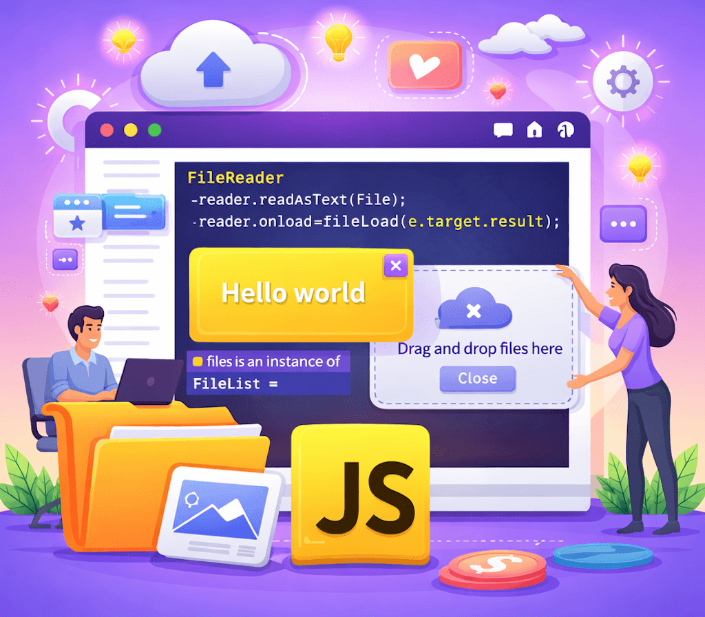

<h1 id="{{ Week 27-More Web APIs | slugify }}">
  Week 27 | More Web APIs
</h1>

  

  <h2 class="week-controls__previous_week">

    

      

      <a href="../week{{ previous_week_num }}">Week {{ previous_week_num }} &#8678;</a>
    

  </h2>

  Updated: 12/4/2026

  <h2 class="week-controls__next_week">

    

      

      <a href="../week{{ next_week_num }}">&#8680; Week {{ next_week_num }}</a>
    

  </h2>

<!-- VERSION -->

  You are viewing v2.0 of this content. To go back to v1.0 click <a href="v1.0">this link</a>.

<!-- VERSION -->

---

<!-- Week 27 - Day 1 | Drag and Drop API -->

  

    <h2>
      Week 27 - Day 1 | Drag and Drop API</h2>
  

### Schedule

  - **Watch the lectures**
  - **Study the suggested material**
  - **Practice on the topics and share your questions**

### Study Plan

  Your instructor will share the video lectures with you. Here are the topics covered:

  - Drag and Drop API

  You can find the lecture code [here](https://github.com/in-tech-gration/WDX-180/blob/main/curriculum/week27/assets/day01/drag-and-drop.html){:target="_blank"}

  **References & Resources:**

  - [**Slides**](https://kostasx.github.io/EventLoop/frontend/html5/apis.html#/3){:target="_blank"} *(contains code and resources at the end)*  
  - [**DataTransfer**](https://developer.mozilla.org/en-US/docs/Web/API/DataTransfer){:target="_blank"}  
  - [**HTMLImageElement**](https://developer.mozilla.org/en-US/docs/Web/API/HTMLImageElement){:target="_blank"}  
    - [**HTMLImageElement.complete**](https://developer.mozilla.org/en-US/docs/Web/API/HTMLImageElement/complete){:target="_blank"} **property**

<!-- Summary -->

### Exercises

  - Make the draggable element paint the drop target with its background color  
  - Explore and recreate the [DnD List](https://kostasx.github.io/EventLoop/frontend/html5/webapis/drag-and-drop/resources/tasks-board.html){:target="_blank"}
    - [Source code](https://raw.githubusercontent.com/kostasx/EventLoop/master/frontend/html5/webapis/drag-and-drop/resources/tasks-board.html){:target="_blank"}  
  - Explore and recreate the [DnD Game](https://kostasx.github.io/EventLoop/frontend/html5/webapis/drag-and-drop/resources/shape-game.html){:target="_blank"}
    - [Source code](https://raw.githubusercontent.com/kostasx/EventLoop/master/frontend/html5/webapis/drag-and-drop/resources/shape-game.html){:target="_blank"}

  **IMPORTANT:** Make sure to complete all the tasks found in the **daily Progress Sheet** and update the sheet accordingly. Once you've updated the sheet, don't forget to `commit` and `push`. The progress draft sheet for this day is: **/user/week27/progress/progress.draft.w27.d01.csv**

  You should **NEVER** update the `draft` sheets directly, but rather work on a copy of them according to the instructions [found here](../modules/curriculum/progress_workflow.md).

<!-- Extra Resources -->

<!-- Sources and Attributions -->
  

<!-- Week 27 - Day 2 | Drag and Drop A11y -->

  

    <h2>
      Week 27 - Day 2 | Drag and Drop A11y</h2>
  

### Schedule

  - **Study the suggested material**
  - **Practice on the topics and share your questions**

### Study Plan

  Today you should spend some time on ♿ accessibility, because Drag-n-Drop can become a problem, not a feature when `A11y` is not properly taken care of. Here are some recommended articles to read and some code to study and explore:

  - [Are Drag and Drop Functions Allowed by WCAG?](https://accessibleweb.com/question-answer/are-drag-and-drop-functions-allowed-by-wcag/){:target="_blank"}
  - [Accessible Drag and Drop](https://liferay.design/articles/2023/accessible-drag-drop/){:target="_blank"}
  - [W3C Best Practices: Drag and Drop](https://www.w3.org/wiki/PF/ARIA/BestPractices/DragDrop){:target="_blank"}
  - [4 Major Patterns for Accessible Drag and Drop](https://medium.com/salesforce-ux/4-major-patterns-for-accessible-drag-and-drop-1d43f64ebf09){:target="_blank"}
  - [Salesforce DnD A11y Patterns](https://salesforce-ux.github.io/dnd-a11y-patterns/#/){:target="_blank"}
    - [GitHub: Salesforce DnD A11y Patterns](https://github.com/salesforce-ux/dnd-a11y-patterns){:target="_blank"}
  - [CodePen Project: Accessible Drag and Drop by Drew Lee](https://codepen.io/drewlee/project/editor/XWNLeE){:target="_blank"}

<!-- Summary -->

<!-- Exercises -->

<!-- Extra Resources -->

<!-- Sources and Attributions -->
  

<!-- Week 27 - Day 3 | Solving Software Challenges -->

  

    <h2>
      Week 27 - Day 3 | Solving Software Challenges</h2>
  

### Schedule

  - **Study the suggested material**
  - **Practice on the topics and share your questions**

### Study Plan

  > "Please build 'this' thing!"

  How do you approach a new software challenge? How do you solve a novel problem? Here are some **tips and resources for solving software challenges/problems**:

  - **Break/split the problem into smaller problems/tasks**  
  - **Work on a simpler version of a problem**  
    - This rule applies both to the original problem and the sub-problems  
    - Stop and think whether the code that you wrote will scale and work equally well with a more advanced version of the problem   
  - Plan & design  
    - Use diagrams  
    - Use pen and paper  
    - Think outside the code  
  - Whenever you are working on a challenge that involves something that will be displayed to the user(s), you can begin by working out the problem of displaying the app  
    - For displaying things, Frontend devs have a lot of opportunities and lots of different technologies at their hand:  
      - SVG (XML-based Vector graphics)  
      - HTML + CSS  
      - Canvas API  
      - Images (bitmap)  
      - Media such as `<video />`, `<audio />`  
      - WebGL (?)

  Study: [How to Solve Problems](https://www.naftaliharris.com/blog/problem-solving/){:target="_blank"}

  Study: [Coding Math: Episode 58 - Array Math](https://www.youtube.com/watch?v=75Cbkoo4Gwg){:target="_blank"}

<!-- Summary -->

<!-- Exercises -->

<!-- Extra Resources -->

<!-- Sources and Attributions -->
  

<!-- Week 27 - Day 4 | FileReader API -->

  

    <h2>
      Week 27 - Day 4 | FileReader API</h2>
  

### Schedule

  - **Watch the lectures**
  - **Study the suggested material**
  - **Practice on the topics and share your questions**

### Study Plan

  Your instructor will share the video lectures with you. Here are the topics covered:

  - FileReader API

  You can find the lecture code [here](https://github.com/in-tech-gration/WDX-180/blob/main/curriculum/week27/assets/day03/FileReader.html){:target="_blank"}

  **References & Resources:**

  - **Drag-n-Drop in the real world**  
    - [**Outdoors fast food ordering system**](https://www.youtube.com/watch?v=ooH9LYAEGyY){:target="_blank"}  
  - **VSCode User Snippets**  
    - **Preferences > Configure User Snippets**  
  - [**FileReader**](https://developer.mozilla.org/en-US/docs/Web/API/FileReader){:target="_blank"}**:** *“The FileReader object lets web applications asynchronously read the contents of files from the users’ computer.”*  
    - [FileList](https://developer.mozilla.org/en-US/docs/Web/API/FileList){:target="_blank"}: *“...used for a list of files”*  
      - *The prototype of FileList uncovers this property:* [**Symbol(Symbol.iterator)**](https://developer.mozilla.org/en-US/docs/Web/JavaScript/Reference/Global_Objects/Symbol/iterator){:target="_blank"}:ƒ values()  
        - This gives an object the ability to iterate (loop) over its values through **[...object]** or **for..of** loop.  
      - [File](https://developer.mozilla.org/en-US/docs/Web/API/File){:target="_blank"}: *“The File interface provides information about files and allows JavaScript in a web page to access their content.”*  
  - [`<input type=”file” />`](https://developer.mozilla.org/en-US/docs/Web/HTML/Element/input/file){:target="_blank"}  
    - Limit file types: accept="image/jpeg, image/png"  
  - [**DataTransfer**](https://developer.mozilla.org/en-US/docs/Web/API/DataTransfer){:target="_blank"}: *“The DataTransfer object is used to hold the data that is being dragged during a drag and drop operation.”*  
  - [ElectronJS](https://www.electronjs.org/){:target="_blank"}: Turn any website or web app into a cross-platform Desktop application  
  - Base64:   
    - ``  
    - Base64/DataURL => file.jpeg => Read the contents => Convert them into a String  
    - ``
  - [Online Base64 Encoder/Decoder](https://www.base64encode.org/){:target="_blank"}
  - [FileReader](https://flaviocopes.com/filereader/){:target="_blank"} 
  - [https://javascript.info/file](https://javascript.info/file){:target="_blank"}
  - [File API](https://developer.mozilla.org/en-US/docs/Web/API/File_API/Using_files_from_web_applications){:target="_blank"}

  **Student Questions:**

  - Q: _"Can we store the files in some way? (think Storage APIs)"_
    - A: You can read/encode files as Base64 strings and store them on the localStorage  
  - Q: _"Can we read files from a directory or read a directory or read a hard drive?"_  
    - A: You can explore (with caution) the [File System API](https://developer.mozilla.org/en-US/docs/Web/API/File_System_API){:target="_blank"}  
    - SO: [Is it possible to read files from a directory using javascript?](https://stackoverflow.com/questions/11332042/is-it-possible-to-read-files-from-a-directory-using-javascript){:target="_blank"}

<!-- Summary -->

### Exercises

  Build on the examples we’ve worked on and share any questions or apps that you’ve built.

  **IMPORTANT:** Make sure to complete all the tasks found in the **daily Progress Sheet** and update the sheet accordingly. Once you've updated the sheet, don't forget to `commit` and `push`. The progress draft sheet for this day is: **/user/week27/progress/progress.draft.w27.d04.csv**

  You should **NEVER** update the `draft` sheets directly, but rather work on a copy of them according to the instructions [found here](../modules/curriculum/progress_workflow.md).

<!-- Extra Resources -->

<!-- Sources and Attributions -->
  

<!-- Week 27 - Day 5 | Games using Canvas API -->

  

    <h2>
      Week 27 - Day 5 | Games using Canvas API</h2>
  

### Schedule

  - **Study the suggested material**
  - **Practice on the topics and share your questions**

### Study Plan

  It's a great idea to study some tutorial videos on building games that are based on the Canvas API and grab some ideas and good practices such as using the prototype and more.

  Here are two fantastic videos to study and replicate:

  [Mary Live Codes A JavaScript Game From Scratch](https://www.youtube.com/watch?v=hbKN-9o5_Z0){:target="_blank"}

  [Coding an HTML5 Canvas Game (Pong) with JS in 5 min 30 sec](https://www.youtube.com/watch?v=KoWqdEACyLI){:target="_blank"}

<!-- Summary -->

<!-- Exercises -->

<!-- Extra Resources -->

<!-- Sources and Attributions -->
  

**Weekly feedback:** Hey, it's really important for us to know how your experience with the course has been so far, so don't forget to fill in and submit your [**mandatory** feedback form](https://forms.gle/S6Zg3bbS2uuwsSZF9){:target="_blank"} before the day ends. Thanks you!

---

<!-- COMMENTS: -->
