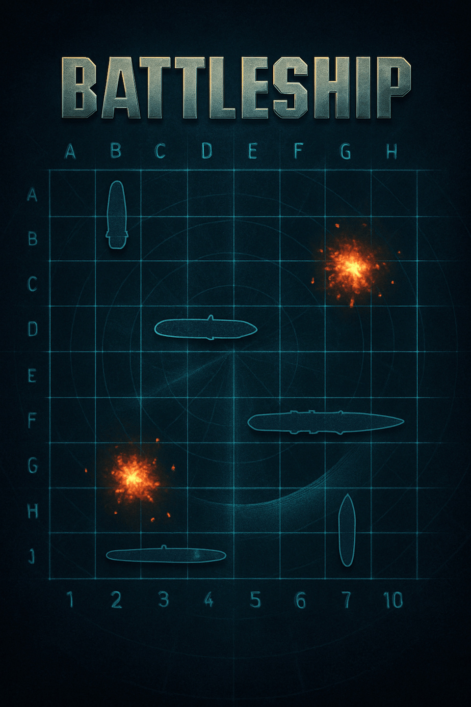
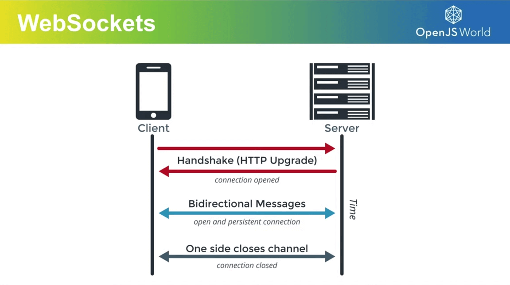

<h1 id="{{ Week 28-Battleship Game | slugify }}">
  Week 28 | Battleship Game
</h1>

  

  <h2 class="week-controls__previous_week">

    

      

      <a href="../week{{ previous_week_num }}">Week {{ previous_week_num }} &#8678;</a>
    

  </h2>

  Updated: 30/6/2025

  <h2 class="week-controls__next_week">

    

      

      <a href="../week{{ next_week_num }}">&#8680; Week {{ next_week_num }}</a>
    

  </h2>

---

<!-- Week 28 - Day 1 | Battleship Game - Part 2 -->

  

    <h2>
      Week 28 - Day 1 | Battleship Game - Part 2</h2>
  

### Schedule

  - **Watch the lectures**
  - **Study the suggested material**
  - **Practice on the topics and share your questions**

### Study Plan

  Your instructor will share the video lectures with you. Here are the topics covered:

  - **Part 1:** We continue on our Battleship game by coming up with more requirements and game rules and ways and ideas to implement them. We also take a look at error handling and creating custom errors by extending the native `Error` constructor in JavaScript. Last, but not least, we explore the IIFE pattern: Immediately Invoked Function Expression, which is one of the most powerful and widely used JS patterns.

  - **Part 2:** We continue our discussion on the IIFE pattern, debug some Battleship algorithm implementation that deals with the game board and try to come up with some abstractions that will help us deal with the complexity of the game requirements.

  You can find the lecture code [here](https://github.com/in-tech-gration/WDX-180/tree/main/curriculum/week28/assets/day01/code){:target="_blank"}

  **Lecture Notes:**

  **Questions**

  - How can we limit the number of exposed global variables?  
    - Use Modules (import/export)  
  - How can we protect our code from global variable conflicts?  
    - Avoid common names (e.g. user, password, secret, initGame, initApp, init)  
    - Prefix your global variables with something very specific, e.g. bgameUser, bgameApp, etc.

  **References & Resources:**

  - Creating custom Errors  
    - [Custom errors, extending Error](https://javascript.info/custom-errors){:target="_blank"}  
  - [IIFE: Immediately Invoked Function Expression](https://developer.mozilla.org/en-US/docs/Glossary/IIFE){:target="_blank"}  
  - **getBoundingClientRect()**: “An object providing information about the size of an element and its position relative to the viewport” [(MDN)](https://developer.mozilla.org/en-US/docs/Web/API/Element/getBoundingClientRect){:target="_blank"}  
    - returns [DOMRect](https://developer.mozilla.org/en-US/docs/Web/API/DOMRect){:target="_blank"}  
  - Debugging techniques:  
    - Comment/Uncomment lines and check and compare behavior (before/after)   
    - Change the order of lines and see what happens  
    - `console.log` everything!  
    - Manually trace the code

  **Tips for production apps:**  
    - Handle errors  
    - Minimize the code required to run the app  

<!-- Summary -->

<!-- Exercises -->

### Extra Resources

  ---

  _Photo by _

<!-- Sources and Attributions -->
  

<!-- Week 28 - Day 2 | WebSockets for Multi-Player Games -->

  

    <h2>
      Week 28 - Day 2 | WebSockets for Multi-Player Games</h2>
  

### Schedule

  - **Study the suggested material**
  - **Practice on the topics and share your questions**

### Study Plan

  Here's an interesting question: how will our human battleship players be able to play the game together online?

  There are quite a few options available, but one of the most prominent technologies these days is **WebSockets**.

  

  **What is a WebSocket**

  > "WebSocket is a standardized communication protocol that enables simultaneous two-way communication over a single TCP connection. It has full-duplex or bi-directional capabilities that distinguishes it from HTTP. WebSocket achieves HTTP compatibility by using the HTTP Upgrade header to transition protocols. 
  > 
  > It allows servers to push content to clients without initial requests and maintains open connections for continuous message exchange, making it ideal for real-time data transfer with lower overhead than alternatives like HTTP polling. 
  > 
  > WebSocket communications typically occur over TCP ports 443 (secured) or 80 (unsecured), helping bypass firewall restrictions on non-web connections. The protocol defines its own URI schemes (ws:// and wss://) for unencrypted and encrypted connections respectively and supported by all major browsers." 

  _(From the [Node.js](https://nodejs.org/en/learn/getting-started/websocket#what-is-a-websocket){:target="_blank"} documentation)_

  Here are a few resources for studying WebSockets today and experimenting with some code that will prepare us for the Battleship implementation:

  - [WebSockets Explained](https://www.youtube.com/embed/2Nt-ZrNP22A){:target="_blank"} 

  - [WebSockets (javascript.info)](https://javascript.info/websocket){:target="_blank"}

  - [In 5 minutes learn HTML5 WebSockets](https://www.youtube.com/watch?v=WDowDtfWiGQ){:target="_blank"}

<!-- Summary -->

<!-- Exercises -->

<!-- Extra Resources -->

<!-- Sources and Attributions -->
  

<!-- Week 28 - Day 3 | Coding Challenge: Data Wrangling -->

  

    <h2>
      Week 28 - Day 3 | Coding Challenge: Data Wrangling</h2>
  

### Schedule

  - **Practice on the topics and share your questions**

### Study Plan

  

  Jump straight to the `Exercises` section below and solve the data wrangling exercises!

<!-- Summary -->

### Exercises

  Download the [exercise file](https://github.com/in-tech-gration/WDX-180/blob/main/curriculum/week28/assets/day03/jqpilot.exercises.js){:target="_blank"} and start solving each exercise found inside the labelled statements (`make_all_the_keys_lowercase`, `convert_the_array_into_a_dict`, and so forth) and ensure that the tests pass.  

  You can execute and run the exercise file, either in the browser or using `Node.js`: `node --watch jqpilot.exerices.js`

  **IMPORTANT:** Make sure to complete all the tasks found in the **daily Progress Sheet** and update the sheet accordingly. Once you've updated the sheet, don't forget to `commit` and `push`. The progress draft sheet for this day is: **/user/week28/progress/progress.draft.w28.d03.csv**

  You should **NEVER** update the `draft` sheets directly, but rather work on a copy of them according to the instructions [found here](../modules/curriculum/progress_workflow.md).

<!-- Extra Resources -->

<!-- Sources and Attributions -->
  

<!-- Week 28 - Day 4 | Practice Day -->

  

    <h2>
      Week 28 - Day 4 | Practice Day</h2>
  

### Schedule

  - **Study the suggested material**
  - **Practice on the topics and share your questions**

### Study Plan

  Practice on the concepts that we've covered so far this week
  and build upon them.

  Focus on finding solutions to the Battleship game requirements,
  improving and refactoring the code to make it more readable, 
  and ready to be scaled.

<!-- Summary -->

<!-- Exercises -->

<!-- Extra Resources -->

<!-- Sources and Attributions -->
  

<!-- Week 28 - Day 5 | Games using Canvas API -->

  

    <h2>
      Week 28 - Day 5 | Games using Canvas API</h2>
  

### Schedule

  - **Study the suggested material**
  - **Practice on the topics and share your questions**

### Study Plan

  It's a great idea to study some tutorial videos on building games that are based on the Canvas API and grab some ideas and good practices such as using the prototype and more.

  Here are two fantastic videos to study and replicate:

  [Mary Live Codes A JavaScript Game From Scratch](https://www.youtube.com/watch?v=hbKN-9o5_Z0){:target="_blank"}

  [Coding an HTML5 Canvas Game (Pong) with JS in 5 min 30 sec](https://www.youtube.com/watch?v=KoWqdEACyLI){:target="_blank"}

<!-- Summary -->

<!-- Exercises -->

<!-- Extra Resources -->

<!-- Sources and Attributions -->
  

**Weekly feedback:** Hey, it's really important for us to know how your experience with the course has been so far, so don't forget to fill in and submit your [**mandatory** feedback form](https://forms.gle/S6Zg3bbS2uuwsSZF9){:target="_blank"} before the day ends. Thanks you!

---

<!-- COMMENTS: -->
