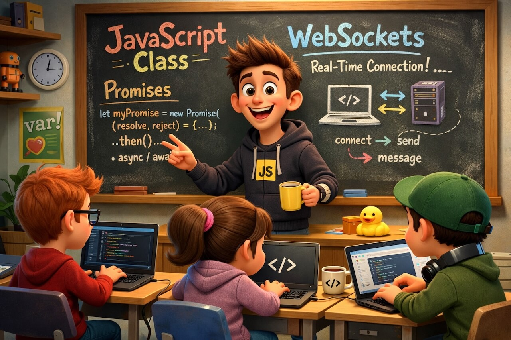
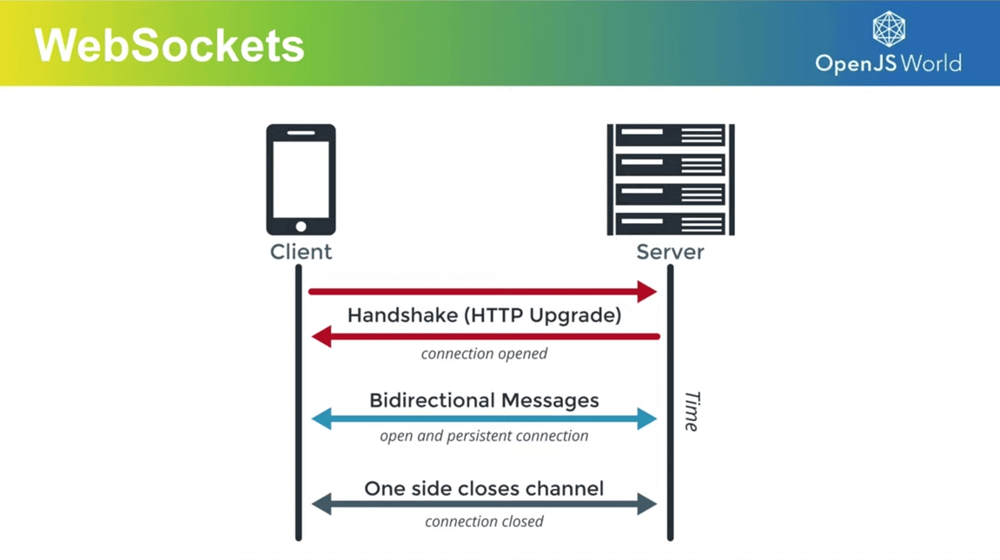

<h1 id="{{ Week 28-Advanced JavaScript | slugify }}">
  Week 28 | Advanced JavaScript
</h1>

  

  <h2 class="week-controls__previous_week">

    

      

      <a href="../week{{ previous_week_num }}">Week {{ previous_week_num }} &#8678;</a>
    

  </h2>

  Updated: 21/4/2026

  <h2 class="week-controls__next_week">

    

      

      <a href="../week{{ next_week_num }}">&#8680; Week {{ next_week_num }}</a>
    

  </h2>

<!-- VERSION -->

  You are viewing v2.0 of this content. To go back to v1.0 click <a href="v1.0">this link</a>.

<!-- VERSION -->

---

<!-- Week 28 - Day 1 | Promises -->

  

    <h2>
      Week 28 - Day 1 | Promises</h2>
  

### Schedule

  - **Watch the lectures**
  - **Study the suggested material**
  - **Practice on the topics and share your questions**

### Study Plan

  Your instructor will share the video lectures with you. Here are the topics covered:

  - More about Promises & the Promise Constructor
  - Chaining Promises

  You can find the lecture code [here](https://github.com/in-tech-gration/build-a-cms-2024/blob/1be5da1820e55ec486aa9d7adfb60a3d53ed57bc/learn/promises.js){:target="_blank"} and [here](https://github.com/in-tech-gration/build-a-cms-2024/blob/1be5da1820e55ec486aa9d7adfb60a3d53ed57bc/learn/promised.to.answer.questions.js){:target="_blank"}

<!-- Summary -->

### Exercises

  - **Study:** [https://developer.mozilla.org/en-US/docs/Web/JavaScript/Reference/Global\_Objects/Promise](https://developer.mozilla.org/en-US/docs/Web/JavaScript/Reference/Global_Objects/Promise){:target="_blank"}  
    - It’s important that you go through the whole document and probably more than once to fully understand the Promise concept.  
      - Equally important to run all the examples mentioned there and tweak them to experiment with variations to get an even better and deeper understanding.  
    - Explore number `#11` from the promises.js reference  
      - Ref: [https://developer.mozilla.org/en-US/docs/Web/JavaScript/Reference/Global\_Objects/Promise/catch](https://developer.mozilla.org/en-US/docs/Web/JavaScript/Reference/Global_Objects/Promise/catch){:target="_blank"}  
      - [https://developer.mozilla.org/en-US/docs/Web/JavaScript/Reference/Global\_Objects/Promise/all](https://developer.mozilla.org/en-US/docs/Web/JavaScript/Reference/Global_Objects/Promise/all){:target="_blank"}  
      - Check all the static `Promise.*` methods

  **IMPORTANT:** Make sure to complete all the tasks found in the **daily Progress Sheet** and update the sheet accordingly. Once you've updated the sheet, don't forget to `commit` and `push`. The progress draft sheet for this day is: **/user/week28/progress/progress.draft.w28.d01.csv**

  You should **NEVER** update the `draft` sheets directly, but rather work on a copy of them according to the instructions [found here](../modules/curriculum/progress_workflow.md).

<!-- Extra Resources -->

<!-- Sources and Attributions -->
  

<!-- Week 28 - Day 2 | WebSockets for Multi-Player Games -->

  

    <h2>
      Week 28 - Day 2 | WebSockets for Multi-Player Games</h2>
  

### Schedule

  - **Study the suggested material**
  - **Practice on the topics and share your questions**

### Study Plan

  One of the most prominent technologies that allow the Frontend to establish a two-way communication with the Backend is `WebSockets`. 

  

  **What is a WebSocket**

  > "WebSocket is a standardized communication protocol that enables simultaneous two-way communication over a single TCP connection. It has full-duplex or bi-directional capabilities that distinguishes it from HTTP. WebSocket achieves HTTP compatibility by using the HTTP Upgrade header to transition protocols. 
  > 
  > It allows servers to push content to clients without initial requests and maintains open connections for continuous message exchange, making it ideal for real-time data transfer with lower overhead than alternatives like HTTP polling. 
  > 
  > WebSocket communications typically occur over TCP ports 443 (secured) or 80 (unsecured), helping bypass firewall restrictions on non-web connections. The protocol defines its own URI schemes (ws:// and wss://) for unencrypted and encrypted connections respectively and supported by all major browsers." 

  _(From the [Node.js](https://nodejs.org/en/learn/getting-started/websocket#what-is-a-websocket){:target="_blank"} documentation)_

  Here are a few resources for studying WebSockets today and experimenting with some code:

  - [WebSockets Explained](https://www.youtube.com/embed/2Nt-ZrNP22A){:target="_blank"} 

  - [WebSockets (javascript.info)](https://javascript.info/websocket){:target="_blank"}

  - [In 5 minutes learn HTML5 WebSockets](https://www.youtube.com/watch?v=WDowDtfWiGQ){:target="_blank"}

<!-- Summary -->

<!-- Exercises -->

<!-- Extra Resources -->

<!-- Sources and Attributions -->
  

<!-- Week 28 - Day 3 | Coding Challenge: Data Wrangling -->

  

    <h2>
      Week 28 - Day 3 | Coding Challenge: Data Wrangling</h2>
  

### Schedule

  - **Practice on the topics and share your questions**

### Study Plan

  

  Jump straight to the `Exercises` section below and solve the data wrangling exercises!

<!-- Summary -->

### Exercises

  Download the [exercise file](https://github.com/in-tech-gration/WDX-180/blob/main/curriculum/week28/assets/day03/jqpilot.exercises.js){:target="_blank"} and start solving each exercise found inside the labelled statements (`make_all_the_keys_lowercase`, `convert_the_array_into_a_dict`, and so forth) and ensure that the tests pass.  

  You can execute and run the exercise file, either in the browser or using `Node.js`: `node --watch jqpilot.exerices.js`

  **IMPORTANT:** Make sure to complete all the tasks found in the **daily Progress Sheet** and update the sheet accordingly. Once you've updated the sheet, don't forget to `commit` and `push`. The progress draft sheet for this day is: **/user/week28/progress/progress.draft.w28.d03.csv**

  You should **NEVER** update the `draft` sheets directly, but rather work on a copy of them according to the instructions [found here](../modules/curriculum/progress_workflow.md).

<!-- Extra Resources -->

<!-- Sources and Attributions -->
  

<!-- Week 28 - Day 4 | Practice Day -->

  

    <h2>
      Week 28 - Day 4 | Practice Day</h2>
  

### Schedule

  - **Study the suggested material**
  - **Practice on the topics and share your questions**

### Study Plan

  Practice on the concepts that we've covered so far this week
  and build upon them.

<!-- Summary -->

<!-- Exercises -->

<!-- Extra Resources -->

<!-- Sources and Attributions -->
  

<!-- Week 28 - Day 5 | JS Functions & Practice Day -->

  

    <h2>
      Week 28 - Day 5 | JS Functions & Practice Day</h2>
  

### Schedule

  - **Study the suggested material**
  - **Practice on the topics and share your questions**

### Study Plan

  Take a few minutes to check out [this video](https://www.youtube.com/watch?v=cMt9U6kCWsM){:target="_blank"} about the different types of JS functions
  and practice by creating at least 2 or 3 examples of your own for each mode.

<!-- Summary -->

<!-- Exercises -->

<!-- Extra Resources -->

<!-- Sources and Attributions -->
  

**Weekly feedback:** Hey, it's really important for us to know how your experience with the course has been so far, so don't forget to fill in and submit your [**mandatory** feedback form](https://forms.gle/S6Zg3bbS2uuwsSZF9){:target="_blank"} before the day ends. Thanks you!

---

<!-- COMMENTS: -->
