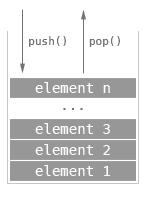
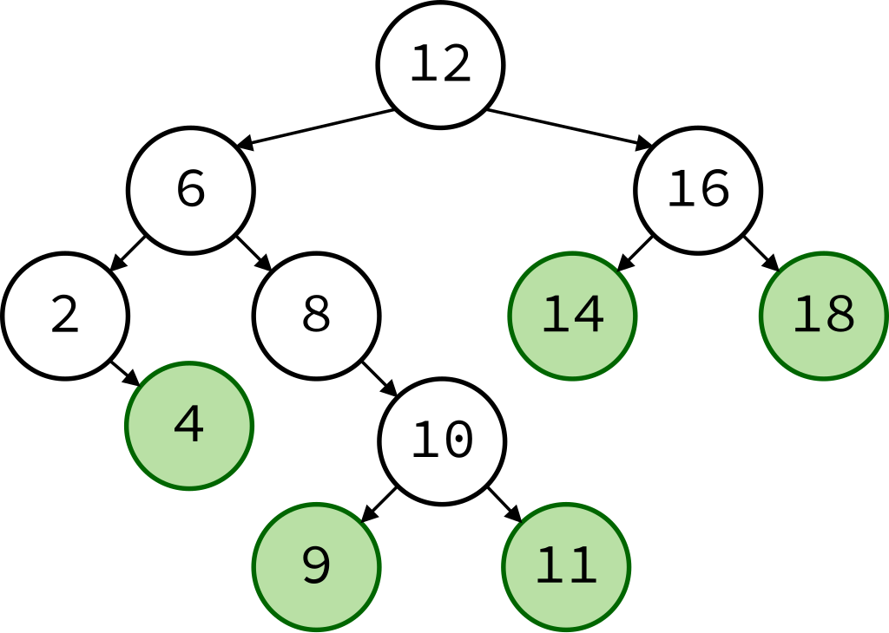
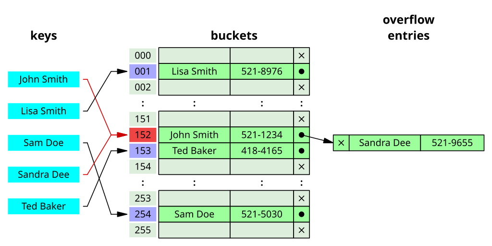
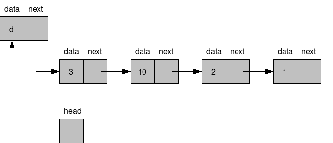
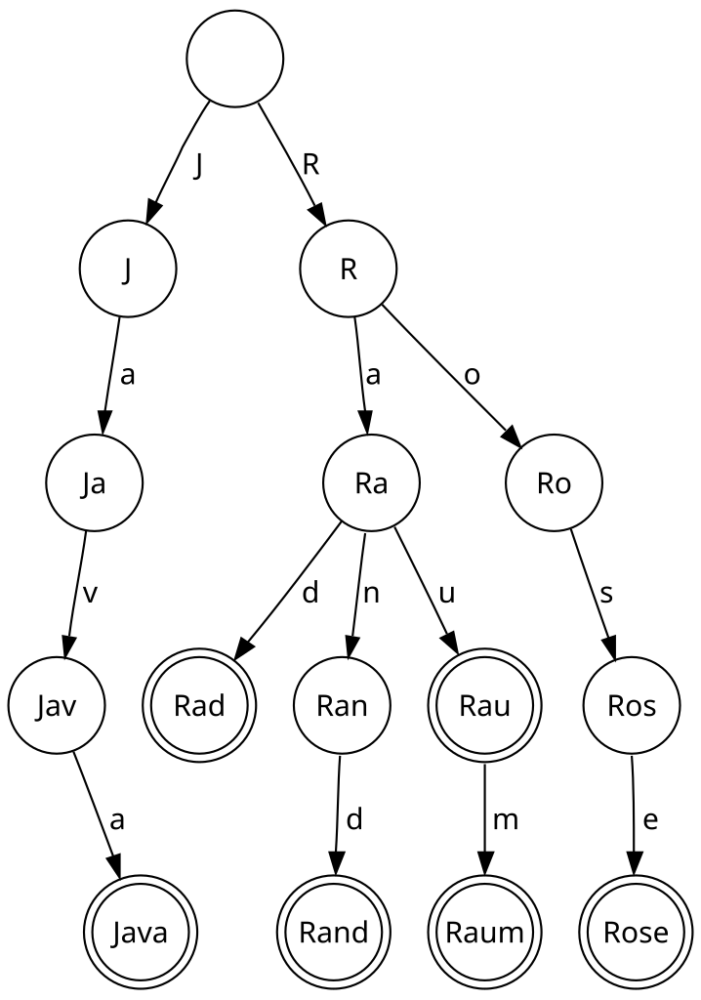
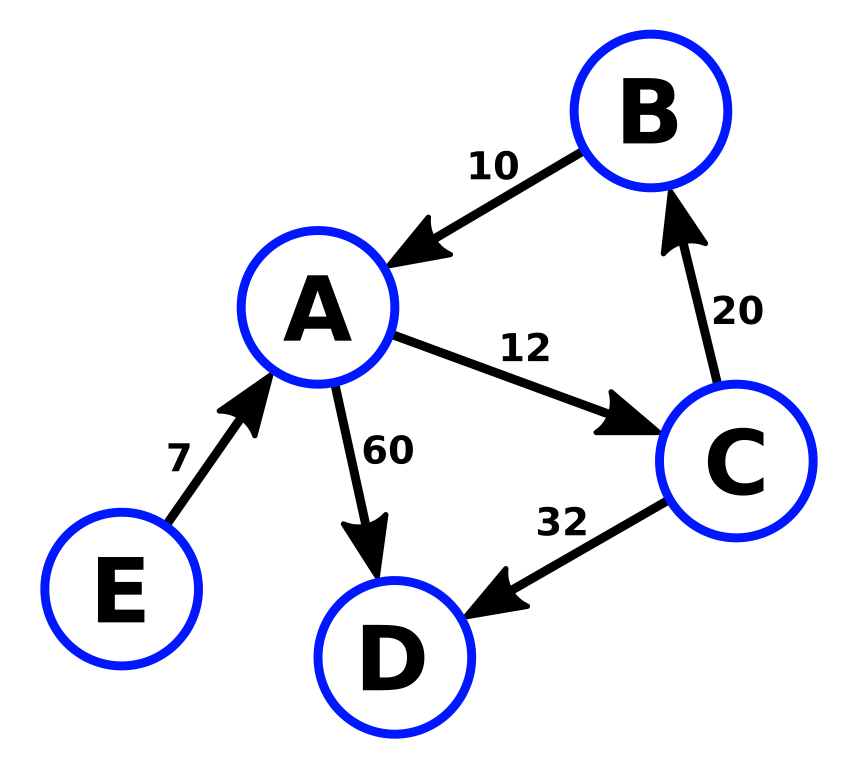

<h1 id="{{ Week 29-Battleship Game - Round 2 | slugify }}">
  Week 29 | Battleship Game - Round 2
</h1>

{{ SGEN:HEADER_IMAGE }}

  

  <h2 class="week-controls__previous_week">

    

      

      <a href="../week{{ previous_week_num }}">Week {{ previous_week_num }} &#8678;</a>
    

  </h2>

  Updated: 6/5/2025

  <h2 class="week-controls__next_week">

    

      

      <a href="../week{{ next_week_num }}">&#8680; Week {{ next_week_num }}</a>
    

  </h2>

---

<!-- Week 29 - Day 1 | Battleship Game -->

  

    <h2>
      Week 29 - Day 1 | Battleship Game</h2>
  

### Schedule

  - **Watch the lectures**
  - **Study the suggested material**
  - **Practice on the topics and share your questions**

### Study Plan

  Your instructor will share the video lectures with you. Here are the topics covered:

  - Building a Battleship game with JavaScript - Part 5 
  - Building a Battleship game with JavaScript - Part 6

  You can find the lecture code [here](https://github.com/in-tech-gration/WDX-180/tree/main/curriculum/week29/assets/day01/code){:target="_blank"}

  **Study & Practice**

  - Think about a way to display the columns and rows (A, B, C... 1, 2, 3)  
    - Start by hardcoding the cols/rows, then implement a dynamic way that scales  
    - Consider both HTML and Canvas solutions and think about the pros and cons of each solution  
    - Try to leave the player canvas functionality and code out of it. The decorative code that displays the cols and rows should not affect the **main game** functionality.

<!-- Summary -->

<!-- Exercises -->

<!-- Extra Resources -->

<!-- Sources and Attributions -->
  

<!-- Week 29 - Day 2 | Data Structures & Algorithms - Part 1 -->

  

    <h2>
      Week 29 - Day 2 | Data Structures & Algorithms - Part 1</h2>
  

### Schedule

  - **Study the suggested material**
  - **Practice on the topics and share your questions**

### Study Plan

  Whether you're building games or developing web applications,
  creating an API service or an AI-enabled mobile application,
  data structures and algorithms are a crucial ingredient for 
  all sorts of software challenges.

  Data structures give us the ability to take our raw data 
  and organize them in a way that makes it easy and efficient
  to store, search, traverse and manipulate. 

  Algorithms are the magic recipes that help us break down 
  problems into small steps that can be fed into any programming
  language.

  FreeCodeCamp has a great video tutorial on some of the most
  popular and useful algorithms and data structures.

  We highly recommend that you spend the next 3 days, studying 
  and replicating each of the chapters of this great video.

  Let's start with the first 3 data structures:

  

  - [**Stacks**](https://www.youtube.com/watch?v=t2CEgPsws3U&t=20s){:target="_blank"}

  - [**Sets**](https://www.youtube.com/watch?v=t2CEgPsws3U&t=544s){:target="_blank"}

  .svg.png)

  - [**Queues**](https://www.youtube.com/watch?v=t2CEgPsws3U&t=1164s){:target="_blank"}

<!-- Summary -->

### Exercises

  Make sure to implement and test every single data structure and algorithm
  on your local environment, either in the Browser or through Node.js.

  **IMPORTANT:** Make sure to complete all the tasks found in the **daily Progress Sheet** and update the sheet accordingly. Once you've updated the sheet, don't forget to `commit` and `push`. The progress draft sheet for this day is: **/user/week29/progress/progress.draft.w29.d02.csv**

  You should **NEVER** update the `draft` sheets directly, but rather work on a copy of them according to the instructions [found here](../week01/resources/PROGRESS-WORKFLOW.md).

<!-- Extra Resources -->

<!-- Sources and Attributions -->
  

<!-- Week 29 - Day 3 | Data Structures & Algorithms - Part 2 -->

  

    <h2>
      Week 29 - Day 3 | Data Structures & Algorithms - Part 2</h2>
  

### Schedule

  - **Study the suggested material**
  - **Practice on the topics and share your questions**

### Study Plan

  This is part 2 of watching the Data Structures and Algorithms
  course from FreeCodeCamp and coding along.

  Let's see the next 3 data structures and algorithms:

  

  - [**Binary Search Tree**](https://www.youtube.com/watch?v=t2CEgPsws3U&t=1563s){:target="_blank"}

  

  - [**Hash Table**](https://www.youtube.com/watch?v=t2CEgPsws3U&t=3200s){:target="_blank"}

  

  - [**Linked List**](https://www.youtube.com/watch?v=t2CEgPsws3U&t=3785s){:target="_blank"}

<!-- Summary -->

### Exercises

  Make sure to implement and test every single data structure and algorithm
  on your local environment, either in the Browser or through Node.js.

  **IMPORTANT:** Make sure to complete all the tasks found in the **daily Progress Sheet** and update the sheet accordingly. Once you've updated the sheet, don't forget to `commit` and `push`. The progress draft sheet for this day is: **/user/week29/progress/progress.draft.w29.d03.csv**

  You should **NEVER** update the `draft` sheets directly, but rather work on a copy of them according to the instructions [found here](../week01/resources/PROGRESS-WORKFLOW.md).

<!-- Extra Resources -->

<!-- Sources and Attributions -->
  

<!-- Week 29 - Day 4 | Data Structures & Algorithms - Part 3 -->

  

    <h2>
      Week 29 - Day 4 | Data Structures & Algorithms - Part 3</h2>
  

### Schedule

  - **Study the suggested material**
  - **Practice on the topics and share your questions**

### Study Plan

  This is part 3 of watching the Data Structures and Algorithms
  course from FreeCodeCamp and coding along.

  Let's see the last 3 data structures and algorithms mentioned:

  

  - [**Trie**](https://www.youtube.com/watch?v=t2CEgPsws3U&t=4500s){:target="_blank"}

  - [**Heap**](https://www.youtube.com/watch?v=t2CEgPsws3U&t=5249s){:target="_blank"}

  

  - [**Graph**](https://www.youtube.com/watch?v=t2CEgPsws3U&t=6128s){:target="_blank"}

<!-- Summary -->

### Exercises

  Make sure to implement and test every single data structure and algorithm
  on your local environment, either in the Browser or through Node.js.

  **IMPORTANT:** Make sure to complete all the tasks found in the **daily Progress Sheet** and update the sheet accordingly. Once you've updated the sheet, don't forget to `commit` and `push`. The progress draft sheet for this day is: **/user/week29/progress/progress.draft.w29.d04.csv**

  You should **NEVER** update the `draft` sheets directly, but rather work on a copy of them according to the instructions [found here](../week01/resources/PROGRESS-WORKFLOW.md).

<!-- Extra Resources -->

<!-- Sources and Attributions -->
  

<!-- Week 29 - Day 5 | TBA -->

  

    <h2>
      Week 29 - Day 5 | TBA</h2>
  

### Schedule

  - **Watch the lectures**
  - **Study the suggested material**
  - **Practice on the topics and share your questions**

### Study Plan

  Your instructor will share the video lectures with you. Here are the topics covered:

  - **Part 1:** 
  - **Part 2:**

  You can find the lecture code [here](){:target="_blank"}

  **Lecture Notes & Questions:**

  **References & Resources:**

<!-- Summary -->

<!-- Exercises -->

### Extra Resources

  ---

  _Photo by _

<!-- Sources and Attributions -->
  

**Weekly feedback:** Hey, it's really important for us to know how your experience with the course has been so far, so don't forget to fill in and submit your [**mandatory** feedback form](https://forms.gle/S6Zg3bbS2uuwsSZF9){:target="_blank"} before the day ends. Thanks you!

---

<!-- COMMENTS: -->
