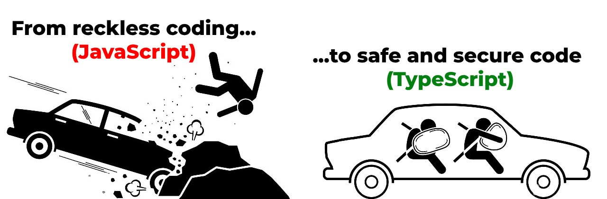

<h1 id="{{ Week 30-TypeScript | slugify }}">
  Week 30 | TypeScript
</h1>

  

  <h2 class="week-controls__previous_week">

    

      

      <a href="../week{{ previous_week_num }}">Week {{ previous_week_num }} &#8678;</a>
    

  </h2>

  Updated: 16/5/2025

  <h2 class="week-controls__next_week">

    

      

      <a href="../week{{ next_week_num }}">&#8680; Week {{ next_week_num }}</a>
    

  </h2>

---

<!-- Week 30 - Day 1 | Strictly Typed JavaScript -->

  

    <h2>
      Week 30 - Day 1 | Strictly Typed JavaScript</h2>
  

### Schedule

  - **Watch the lectures**
  - **Study the suggested material**
  - **Practice on the topics and share your questions**

### Study Plan

  Your instructor will share the video lectures with you. Here are the topics covered:

  - **Part 1:** Intro to TypeScript: High level overview
  - **Part 2:** Intro to TypeScript: Type Checking in JavaScript using JSDoc

  You can find the lecture code [here](){:target="_blank"}

  **Lecture Questions:**

  - *What options are available for contact forms?*  
    - (Especially ones that do not require a server and are free)  
    - Netlify + Contact form  
    - Just include your email (but make sure to obfuscate it to avoid spammers)  
      - Google: how to protect my email +static web site  
      - `<a href=”notme@mail.com”>Contact me</a>`  
        - JS: dynamically create the correct email address and append it to the `<a>`  
      - You can also open the visitors’ email client, containing your email address and a subject. [Google for that...](https://stackoverflow.com/questions/13231125/automatically-open-default-email-client-and-pre-populate-content){:target="_blank"}

  **References & Resources:**

  - **TypeScript**  
    - [TS is JS + Types + Cool features](https://serokell.io/files/0u/0ufu1q21.js-ts.jpg){:target="_blank"}  
    - [Official Website](https://www.typescriptlang.org/){:target="_blank"}  
    - [TypeScript Error Codes](https://typescript.tv/errors/){:target="_blank"}  
    - Enable TS check on plain JS  
      - 1) `// @ts-check` (comment/directive at the top of the file)  
      - 2) VSCode => Settings => Search for “implicitProjectConfig check js”  
        - Setting Code ID: `js/ts.implicitProjectConfig.checkJs`   
    - Disable TS check on next line: `// @ts-ignore`  
    - Checking in 3 levels:  
      - Enabling ts-check (semantic check) in JS  
      - Enabling ts-check + use [JSDoc](https://www.typescriptlang.org/docs/handbook/jsdoc-supported-types.html){:target="_blank"}  
  - [Emailjs](https://www.emailjs.com/){:target="_blank"}: Send Email Directly From Your Code. Free, no-server, 200 emails per-month limit

<!-- Summary -->

### Exercises

  - [**Explore JSDoc types**](https://www.typescriptlang.org/docs/handbook/jsdoc-supported-types.html){:target="_blank"} and use the [playground](https://www.typescriptlang.org/play/?filetype=js#code/PTAEAEBcGcFoGMAWBTeBrAUB4AqHFIBPAB2VAG9zQBDALlGkgCcBLAOwHMAaUAI3rYBXALa9kTUAF9JoHMAzwA9m0agAbtSYBOUAF4KNegBYATD36gARKctSsufFBJlKhhs3bc+AkWInTZeSUVSHVNAEYABj0DOisbc2MTKSA){:target="_blank"} to practice  
    - (Make sure that **Lang is set to JavaScript** in the TS Config)  
  - Code through: [Type safety in JavaScript with JSDoc and VSCode](https://github.com/in-tech-gration/type-safety-in-javascript){:target="_blank"}  
  - Read: [Type Safe JavaScript with JSDoc](https://medium.com/@trukrs/type-safe-javascript-with-jsdoc-7a2a63209b76){:target="_blank"}  
    - [https://www.stefanjudis.com/today-i-learned/vs-code-supports-jsdoc-powered-type-checking/](https://www.stefanjudis.com/today-i-learned/vs-code-supports-jsdoc-powered-type-checking/){:target="_blank"}  
  - **JSDoc Cheatsheet**: [https://devhints.io/jsdoc](https://devhints.io/jsdoc){:target="_blank"}  
  - **Enforce JSDoc Typing in one of your projects**  
  - **Research:** does `ts-check` run on inline `