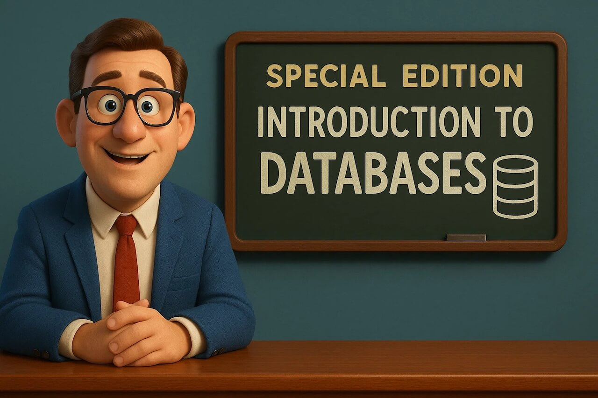
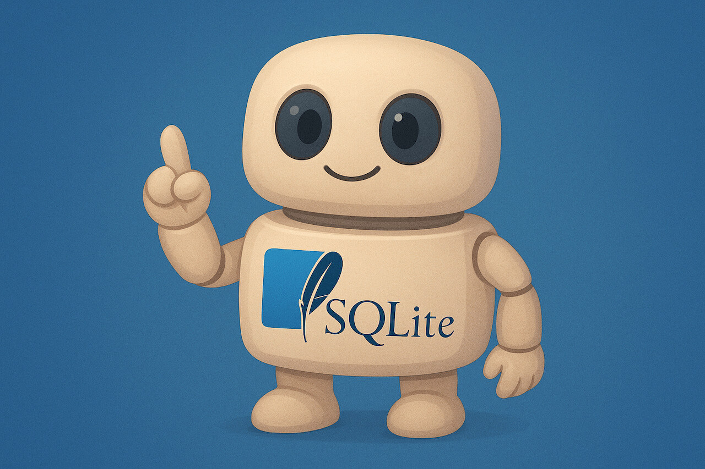
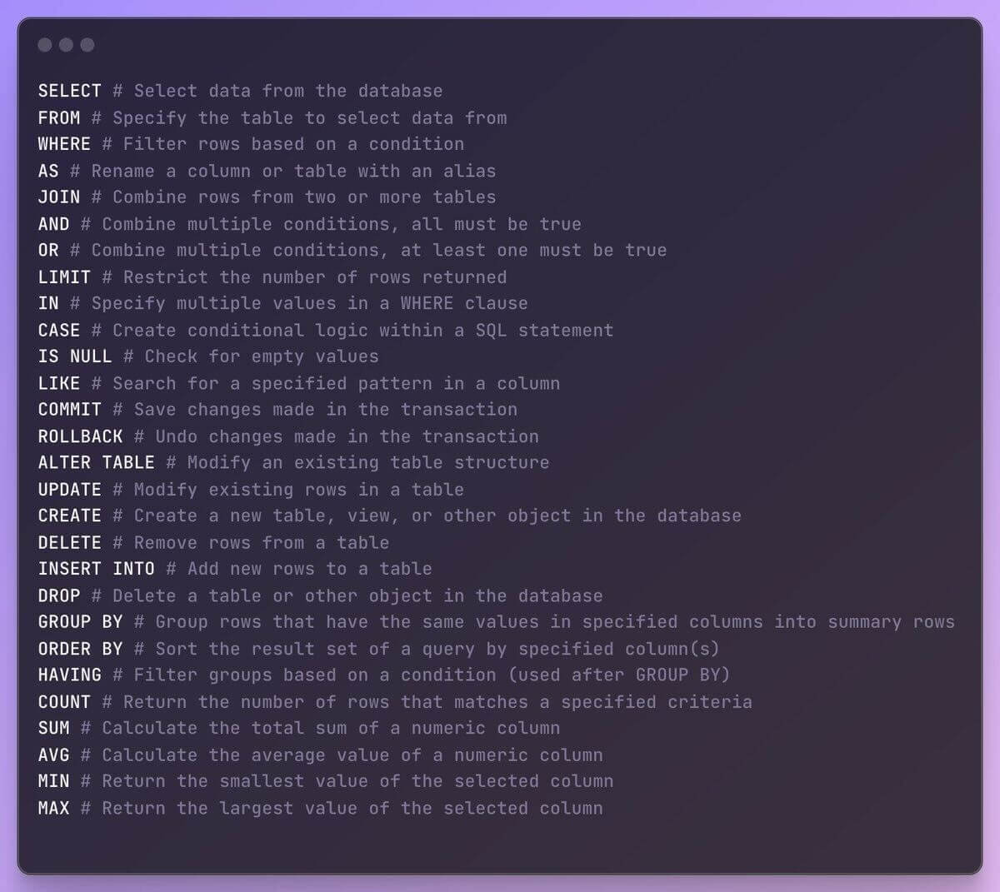
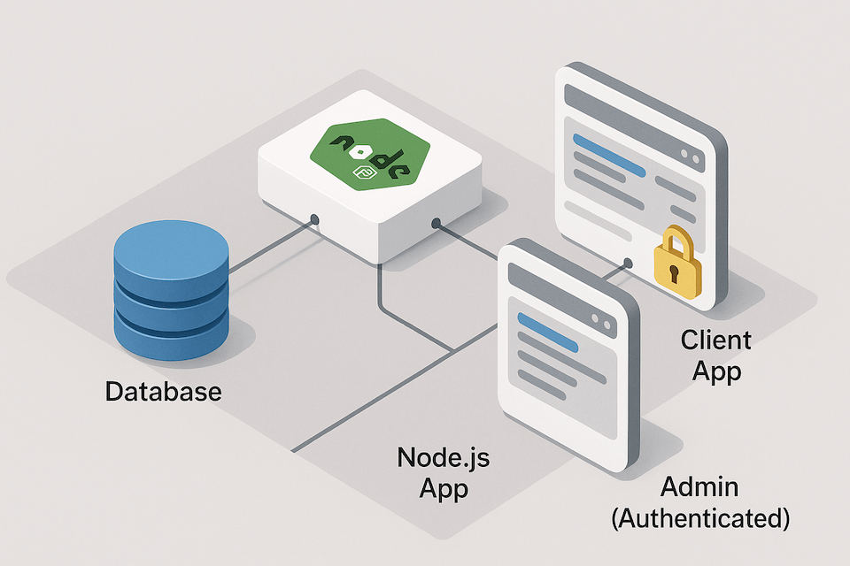

<h1 id="{{ Week 33-Intro to Databases | slugify }}">
  Week 33 | Intro to Databases
</h1>

  

  <h2 class="week-controls__previous_week">

    

      

      <a href="../week{{ previous_week_num }}">Week {{ previous_week_num }} &#8678;</a>
    

  </h2>

  Updated: 6/6/2025

  <h2 class="week-controls__next_week">

    

      

      <a href="../week{{ next_week_num }}">&#8680; Week {{ next_week_num }}</a>
    

  </h2>

---

<!-- Week 33 - Day 1 | Introduction to Databases -->

  

    <h2>
      Week 33 - Day 1 | Introduction to Databases</h2>
  

### Schedule

  - **Watch the lectures**
  - **Study the suggested material**
  - **Practice on the topics and share your questions**

### Study Plan

  Your instructor will share the video lectures with you. Here are the topics covered:

  - **Part 1:** Gravatars and hashes.
  - **Part 2:** Intro to Relational Databases
  - **Part 3:** Intro to Relational Databases

  **References & Resources:**

  - [**A Shelfish Starter Guide to Databases**](https://maggieappleton.com/databases){:target="_blank"}  
  - Try SQL online (no DB installation on your system required)  
    - [https://sqlfiddle.com](https://sqlfiddle.com){:target="_blank"} (Select SQLite)  
    - [https://www.db-fiddle.com](https://www.db-fiddle.com){:target="_blank"} (Select SQLite)  
  - [SQL at W3Schools](https://www.w3schools.com/sql/default.asp){:target="_blank"}  
  - [**The School Database as a Spreadsheet**](https://docs.google.com/spreadsheets/d/1DeTyspgfT-38JbufGDw_pV5arDF2UanVJ3qDFIiZmmY/edit?usp=sharing){:target="_blank"}  
  - [Gravatar](https://gravatar.com/){:target="_blank"}  
    - [https://docs.gravatar.com/api/avatars/images/](https://docs.gravatar.com/api/avatars/images/){:target="_blank"}  
    - [https://docs.gravatar.com/api/profiles/](https://docs.gravatar.com/api/profiles/){:target="_blank"}  
  - Calculate SHA256 using the CLI:  
    - `echo -n somestring | sha256sum`  
  - How we store information in a relational database:  
    - **Find the Entities you need:** Think about the type of data you want to store (think *Entities*, the types of things we want to store: products, movies, students, transactions, accounts, gravatars)  
      - define Entity: *“a thing with distinct and independent existence.”*  
    - **Think about the specific properties that describe these Entities**  
    - **Create Tables for each of these Entities**  
      - **You have to come up a very specific and precise *Schema*** (aka Shape): boils down to number of columns, name of these columns and the data types (integers, strings)  
    - **Think and describe the relationship between those Entities**   
      - One-to-Many, One-to-One, Many-to-Many  
  - [The SQL ISO Standard](https://en.wikipedia.org/wiki/SQL:2023){:target="_blank"}  
  - [List of relational database management systems](https://en.wikipedia.org/wiki/List_of_relational_database_management_systems){:target="_blank"}  
  - [SQL.js](https://sql.js.org/#/){:target="_blank"} (SQLite compiled from C to JS (webassembly))  
    - [SQLite available data types](https://sqlite.org/datatype3.html){:target="_blank"}  
    - Cheatsheets:  
      - [https://vhernando.github.io/sqlite3-cheat-sheet](https://vhernando.github.io/sqlite3-cheat-sheet){:target="_blank"}  
      - [https://www.sqlitetutorial.net/sqlite-cheat-sheet/](https://www.sqlitetutorial.net/sqlite-cheat-sheet/){:target="_blank"}

<!-- Summary -->

### Exercises

  - Watch and try all the examples in this video: [SQL Tutorial for Beginners \| SQL Crash Course](https://www.youtube.com/watch?v=2kHV2_CXJ38){:target="_blank"}  
  - Google for examples (real-life) of all the SQL relations (1-1, 1-m, m-m)  
  - [**https://sqlfiddle.com/**](https://sqlfiddle.com/){:target="_blank"}  
  - [**https://www.db-fiddle.com/**](https://www.db-fiddle.com/){:target="_blank"}  
  - **Challenge: add a phone table to the School Database with a 1-1 relation**  
  - Study this SO thread to learn more about secure DB IDs:  
    - [Exposing database IDs \- security risk?](https://stackoverflow.com/questions/396164/exposing-database-ids-security-risk){:target="_blank"}  
  - How to use Gravatar to display users’ avatar on your app based on their email, without exposing their email  
    - 1) First you have to get the user’s email **(always with consent)**  
    - 2) Calculate a **special hash** based on their email:  
      - [https://docs.gravatar.com/api/avatars/hash/](https://docs.gravatar.com/api/avatars/hash/){:target="_blank"}   
      - [https://www.gravatar.com/avatar/**3b3be63a4c2a439b013787725dfce802**?d=identicon](https://www.gravatar.com/avatar/3b3be63a4c2a439b013787725dfce802?d=identicon){:target="_blank"}  
      - One-way hash: email => hash  
      - There’s no way to get the email <= hash (no other way round)  
      - Guide for [Node.js](https://docs.gravatar.com/api/avatars/node/){:target="_blank"}  
      - [SHA256 for the Browser](https://www.30secondsofcode.org/js/s/hash-sha-256/){:target="_blank"}  
  - Study the resources  
  - Install [SQLite](https://sqlite.org/){:target="_blank"} on your system and explore the [Getting Started](https://sqlite.org/cli.html){:target="_blank"} CLI guide  
    - Don’t forget: While exploring new technologies, try to be active on Slack!

  **IMPORTANT:** Make sure to complete all the tasks found in the **daily Progress Sheet** and update the sheet accordingly. Once you've updated the sheet, don't forget to `commit` and `push`. The progress draft sheet for this day is: **/user/week33/progress/progress.draft.w33.d01.csv**

  You should **NEVER** update the `draft` sheets directly, but rather work on a copy of them according to the instructions [found here](../modules/curriculum/progress_workflow.md).

<!-- Extra Resources -->

<!-- Sources and Attributions -->
  

<!-- Week 33 - Day 2 | SQL Databases -->

  

    <h2>
      Week 33 - Day 2 | SQL Databases</h2>
  

### Schedule

  - **Study the suggested material**
  - **Practice on the topics and share your questions**

### Study Plan

  

  Today is a good opportunity to watch the following videos related to Relational Databases (aka SQL-databases):

  - One of the best introductions: [SQL Tutorial for Beginners \| SQL Crash Course](https://www.youtube.com/watch?v=2kHV2_CXJ38){:target="_blank"} (1h)

  - [Intro to Databases by Al Zimmerman](https://www.youtube.com/watch?v=D98mNPLccSg){:target="_blank"}
  
  - An amazing [introduction to SQL](https://www.youtube.com/watch?v=KLwnfxhobIQ){:target="_blank"} by the incredible Eddie Woo 

  - If you are into Podcasts or just want to take a little break AFK and take a walk, [here's a great episode](http://kopec.live/episode/e63557fe721b446c/databases){:target="_blank"} by "Kopec Explains Software", explaining Databases. We highly recommend that you check out the other episodes of this Podcast.

  When you are done going through the theory, jump into practice through this interactive SQL book:

  - [Select Star SQL](https://selectstarsql.com){:target="_blank"}

  - Here's the repository with the code accompanying the "SQL Crash Course"
    - [https://github.com/in-tech-gration/sql-crash-course](https://github.com/in-tech-gration/sql-crash-course){:target="_blank"}

<!-- Summary -->

<!-- Exercises -->

<!-- Extra Resources -->

<!-- Sources and Attributions -->
  

<!-- Week 33 - Day 3 | SQLite -->

  

    <h2>
      Week 33 - Day 3 | SQLite</h2>
  

### Schedule

  - **Watch the lectures**
  - **Study the suggested material**
  - **Practice on the topics and share your questions**

### Study Plan

  

  Your instructor will share the video lectures with you. Here are the topics covered:

  - **Part 1:** Relational Databases - A Full stack overview 
  - **Part 2:** SQLite & The Database Murder Mystery

  You can find the lecture diagrams [here](https://github.com/in-tech-gration/WDX-180/tree/main/curriculum/week33/assets/day03){:target="_blank"}

  **Lecture Notes & Questions:**

  - CLI: `sqlite3`
    - `.help`
    - `.quit`
    - Create a new DB: `sqlite3 test.db`

  **Lecture Questions:**

  - What is the difference between SQL and MySQL?  
    - **SQL** is the Structured Query Language **standard**  
    - **MySQL** is a **Database** and a **variation of the SQL**  
      - **Software + SQL: a DB server that speaks a particular dialect of SQL**  
    - **SQLite is a Database software and a SQL dialect**  
    -  **MySQL, SQLite, PostgreSQL, SQL Server are RDBMS**  
  - What Database should I learn or use?  
    - Try to stick with either MySQL or **PostgreSQL (through Supabase)**  
      - *MariaDB is the open source version of MySQL*  
  - *After I install SQLite on Windows, there’s no sqlite3 or sqlite command available. What’s going on?*  
    - Check the PATH configuration:   
      - [https://www.tutorialspoint.com/sqlite/sqlite\_installation.htm](https://www.tutorialspoint.com/sqlite/sqlite_installation.htm){:target="_blank"}  
      - [https://www.linkedin.com/pulse/part-5-how-install-sqlite-your-machine-windows-linux-mac-julles/](https://www.linkedin.com/pulse/part-5-how-install-sqlite-your-machine-windows-linux-mac-julles/){:target="_blank"}  
      - [https://stackoverflow.com/a/46042259/4861760](https://stackoverflow.com/a/46042259/4861760){:target="_blank"}

  **References & Resources:**

  - Star this repo please: [https://github.com/NUKnightLab/sql-mysteries](https://github.com/NUKnightLab/sql-mysteries){:target="_blank"}  
  - Some cloud SQL services: [https://gist.github.com/bmaupin/0ce79806467804fdbbf8761970511b8c](https://gist.github.com/bmaupin/0ce79806467804fdbbf8761970511b8c){:target="_blank"}  
  - VSCode Extension: [SQLite Viewer](https://marketplace.visualstudio.com/items?itemName=qwtel.sqlite-viewer){:target="_blank"}  
  - [Visual JOIN](https://joins.spathon.com/){:target="_blank"}
  - [DB Browser for SQLite](https://sqlitebrowser.org/){:target="_blank"}

<!-- Summary -->

### Exercises

  - Solve the DB Mystery game: [https://in-tech-gration.github.io/database-mysteries/](https://in-tech-gration.github.io/database-mysteries/){:target="_blank"}

  - Design the Schema for what your Smartphone’s Contact table looks like and start adding entries and querying. Think how your phone will look up a number when you write the name. SMS => Emily => query => 6912345678 => Send message.   

  - Try: [https://selectstarsql.com/](https://selectstarsql.com/){:target="_blank"}

  **IMPORTANT:** Make sure to complete all the tasks found in the **daily Progress Sheet** and update the sheet accordingly. Once you've updated the sheet, don't forget to `commit` and `push`. The progress draft sheet for this day is: **/user/week33/progress/progress.draft.w33.d03.csv**

  You should **NEVER** update the `draft` sheets directly, but rather work on a copy of them according to the instructions [found here](../modules/curriculum/progress_workflow.md).

<!-- Extra Resources -->

<!-- Sources and Attributions -->
  

<!-- Week 33 - Day 4 | SQL Practice Day -->

  

    <h2>
      Week 33 - Day 4 | SQL Practice Day</h2>
  

### Schedule

  - **Study the suggested material**
  - **Practice on the topics and share your questions**

### Study Plan

  

  Time to earn your first SQL certificate!

  Head over to the `Exercises` section below and start
  the Solo Learn SQL course.

<!-- Summary -->

### Exercises

  - Time to earn your first SQL certificate! Try to complete the [Solo Learn SQL intro course](https://www.sololearn.com/en/learn/courses/sql-introduction){:target="_blank"}.

  - Done with SoloLearn? On with [SQLite Tutorial](https://www.tutorialspoint.com/sqlite/index.htm){:target="_blank"}.

  - **SQL Commands**

  

  - A nice resource for [SQL](https://www.atlassian.com/data/sql){:target="_blank"} and [SQL joins](https://www.atlassian.com/data/sql/sql-join-types-explained-visually){:target="_blank"} also check [inner join](https://dataschool.com/how-to-teach-people-sql/inner-join-animated/){:target="_blank"}

  **IMPORTANT:** Make sure to complete all the tasks found in the **daily Progress Sheet** and update the sheet accordingly. Once you've updated the sheet, don't forget to `commit` and `push`. The progress draft sheet for this day is: **/user/week33/progress/progress.draft.w33.d04.csv**

  You should **NEVER** update the `draft` sheets directly, but rather work on a copy of them according to the instructions [found here](../modules/curriculum/progress_workflow.md).

<!-- Extra Resources -->

<!-- Sources and Attributions -->
  

<!-- Week 33 - Day 5 | Node.js & SQLite -->

  

    <h2>
      Week 33 - Day 5 | Node.js & SQLite</h2>
  

### Schedule

  - **Watch the lectures**
  - **Study the suggested material**
  - **Practice on the topics and share your questions**

### Study Plan

  

  Your instructor will share the video lectures with you. Here are the topics covered:

  - Going Fullstack: Connecting SQLite with our Node.js app

  **References & Resources:**

  - **Environment(al) variables:** are key/value pairs that are stored in a text file (usually prefixed with .env) and are read during build time and made available to either the Node.js or the Browser.  
  - **CAUTION:** Make sure to read the documentation and understand **how to set private env variables** that will only be available on the server (Node.js) and **how to set public env variables** (available in the Browser). Ensure that you are strictly following the documentation procedures. (Be extra cautious and careful with things like Vite, Create React App, Webpack)  
  - FE Frameworks:  
    - React  
    - Angular  
    - Vue  
  - Full Stack Frameworks:  
    - Next.js (React)  
    - Nest.js (Angular)  
    - Nuxt.js (Vue)  
  - [DB Browser](https://sqlitebrowser.org/){:target="_blank"}: a GUI for SQLite  
  - DB Beaver: [https://dbeaver.io](https://dbeaver.io){:target="_blank"} (also supports other databases)  
  - [**VSCode SQLite Viewer**](https://marketplace.visualstudio.com/items?itemName=qwtel.sqlite-viewer){:target="_blank"}  
  - SQLite3  
    - Show Table Schema: **PRAGMA table_info(table_name);**  
    - **Ctrl+L** will clear the sqlite console  
  - `npm install PACKAGE` will immediately install the PACKAGE and **run any post/pre build scripts**  
  - [**npq**](https://www.npmjs.com/package/npq){:target="_blank"} **install PACKAGE** runs some verifications before installing  
  - [Supabase](https://supabase.com){:target="_blank"}  
  - VSCode: fold on first level: Ctrl+K+1, second level: Ctrl+K+2, etc.

<!-- Summary -->

### Exercises

  - **Read: [https://vitejs.dev/guide/env-and-mode](https://vitejs.dev/guide/env-and-mode){:target="_blank"} to learn all about the security measures and best practices**  
  - **SQLite Quick start: [https://sqlite.org/quickstart.html](https://sqlite.org/quickstart.html){:target="_blank"}**  
  - **Study** the [sqlite3](https://www.npmjs.com/package/sqlite3){:target="_blank"} package docs (API):   
  - Quick start example can be found here: [https://github.com/TryGhost/node-sqlite3#usage](https://github.com/TryGhost/node-sqlite3#usage){:target="_blank"}  
  - [https://github.com/TryGhost/node-sqlite3/wiki](https://github.com/TryGhost/node-sqlite3/wiki){:target="_blank"}  
    - [https://github.com/TryGhost/node-sqlite3/wiki/API](https://github.com/TryGhost/node-sqlite3/wiki/API){:target="_blank"}  
  - Challenge: change the “:memory:” value to something silly and Google for what the error that comes back mean: `Error: SQLITE_ERROR: table lorem already exists`...  
  - Learn more about Prepared Statements [https://en.wikipedia.org/wiki/Prepared_statement](https://en.wikipedia.org/wiki/Prepared_statement){:target="_blank"}  
    - Always use prepared Statements when the queries involve some kind of user input (CONSIDER ALL USER INPUT EVIL / GUILTY UNTIL PROVEN INNOCENT)  
  - **CHALLENGE:** Find out what the rowid is all about and it comes from. Check what the AS SQL operator does.

  **IMPORTANT:** Make sure to complete all the tasks found in the **daily Progress Sheet** and update the sheet accordingly. Once you've updated the sheet, don't forget to `commit` and `push`. The progress draft sheet for this day is: **/user/week33/progress/progress.draft.w33.d05.csv**

  You should **NEVER** update the `draft` sheets directly, but rather work on a copy of them according to the instructions [found here](../modules/curriculum/progress_workflow.md).

<!-- Extra Resources -->

<!-- Sources and Attributions -->
  

**Weekly feedback:** Hey, it's really important for us to know how your experience with the course has been so far, so don't forget to fill in and submit your [**mandatory** feedback form](https://forms.gle/S6Zg3bbS2uuwsSZF9){:target="_blank"} before the day ends. Thanks you!

---

<!-- COMMENTS: -->
