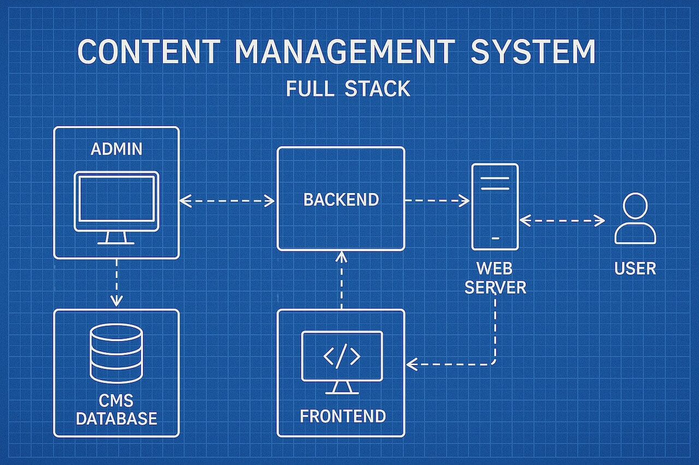
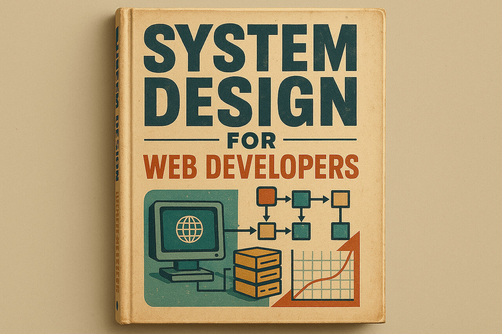
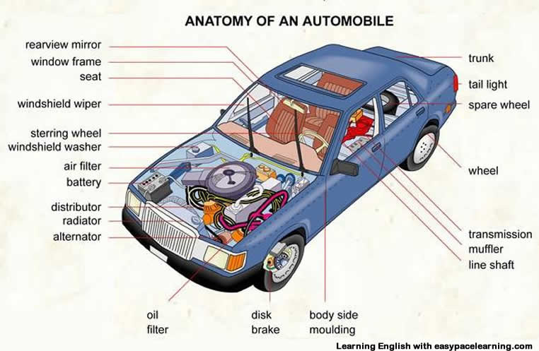

<hr class="mb-0">

<h1 id="{{ Week 34-Mini CMS Project | slugify }}">
  <span class="week-prefix">Week 34 |</span> Mini CMS Project
</h1>



<div class="week-controls">

  

  <h2 class="week-controls__previous_week">

    

      

      <a href="../week{{ previous_week_num }}">Week {{ previous_week_num }} &#8678;</a>
    

  </h2>

  <span>Updated: 13/6/2025</span>

  <h2 class="week-controls__next_week">

    

      

      <a href="../week{{ next_week_num }}">&#8680; Week {{ next_week_num }}</a>
    

  </h2>

</div>

---

<!-- Week 34 - Day 1 | Building a Mini CMS - Part 1 -->
<details markdown="1">
  <summary>
    <h2>
      <span class="summary-day">Week 34 - Day 1</span> | Building a Mini CMS - Part 1</h2>
  </summary>

### Schedule

  - **Watch the lectures**
  - **Study the suggested material**
  - **Practice on the topics and share your questions**

### Study Plan

  Your instructor will share the video lectures with you. Here are the topics covered:

  - **Part 1:** What is a Content Management System (CMS)?
  - **Part 2:** Setting up our Node.js project

  You can find the lecture code [here](https://github.com/in-tech-gration/build-a-cms-2024/tree/62f0d9743c8abe36e4a351c42b98c06310ff0aa9){:target="_blank"}

  **References & Resources:**

  - [How to set up a Node server with TypeScript in 2024](https://www.learnwithjason.dev/blog/modern-node-server-typescript-2024/){:target="_blank"}  
  - [Learn with Jason](https://www.learnwithjason.dev/episodes/){:target="_blank"}  
  - [VSCode Excalidraw Extension](https://marketplace.visualstudio.com/items?itemName=pomdtr.excalidraw-editor){:target="_blank"}  
  - TypeScript definitions for [node http](https://microsoft.github.io/PowerBI-JavaScript/modules/_node_modules__types_node_http_d_._http_.html){:target="_blank"} *(@types/node*)  
  - [How to use TypeScript in Node.js](https://www.executeprogram.com/courses/typescript-basics/articles/how-to-use-typescript-in-node-js){:target="_blank"}  
  - Some more Node/TypeScript boilerplates and guides  
    - [https://betterstack.com/community/guides/scaling-nodejs/nodejs-typescript/](https://betterstack.com/community/guides/scaling-nodejs/nodejs-typescript/){:target="_blank"}  
    - [https://github.com/jsynowiec/node-typescript-boilerplate](https://github.com/jsynowiec/node-typescript-boilerplate){:target="_blank"}
  - [Try WordPress Playground](https://wordpress.org/playground/){:target="_blank"}

<!-- Summary -->

<!-- Exercises -->

<!-- Extra Resources -->

<!-- Sources and Attributions -->
  
</details>

<hr class="mt-1">

<!-- Week 34 - Day 2 | System Design -->
<details markdown="1">
  <summary>
    <h2>
      <span class="summary-day">Week 34 - Day 2</span> | System Design</h2>
  </summary>

### Schedule

  - **Study the suggested material**
  - **Practice on the topics and share your questions**

### Study Plan

  

  Since we are going to be designing our Database soon, here are two really
  interesting videos that will walk you through designing a system 
  (an Instagram-like app in one case, a calendar app in the other). 

  You can learn a lot from this process, such as thinking about the system 
  from a high level and breaking it up in different modules and deciding 
  on the Database entities (tables) and Schema (columns and types).

  Enjoy and gain some insights!

  - [Design Instagram: 30'](https://www.youtube.com/watch?v=VJpfO6KdyWE){:target="_blank"} 

  - [Design Calendar Application: 25'](https://www.youtube.com/watch?v=39eAITqeu7g){:target="_blank"}

<!-- Summary -->

<!-- Exercises -->

<!-- Extra Resources -->

<!-- Sources and Attributions -->
  
</details>

<hr class="mt-1">

<!-- Week 34 - Day 3 | Object Relational Mapping -->
<details markdown="1">
  <summary>
    <h2>
      <span class="summary-day">Week 34 - Day 3</span> | Object Relational Mapping</h2>
  </summary>

### Schedule

  - **Watch the lectures**
  - **Study the suggested material**
  - **Practice on the topics and share your questions**

### Study Plan

  

  Your instructor will share the video lectures with you. Here are the topics covered:

  - **Part 1:** Databases & ORMs (Object Relational Mapping)
  - **Part 2:** Modular architecture and creating and populating Database tables with data

  You can find the lecture code [here](https://github.com/in-tech-gration/build-a-cms-2024/tree/7a20932556ee71cef0efe498161aaadfcb0d2e17){:target="_blank"}

  **References & Resources:**

  - [Dark Reader Chrome and Firefox extension](https://chromewebstore.google.com/detail/dark-reader/eimadpbcbfnmbkopoojfekhnkhdbieeh?authuser=1){:target="_blank"}  
    - [GitHub](https://github.com/darkreader/darkreader){:target="_blank"}  
    - [**ORM: Object–relational mapping**](https://en.wikipedia.org/wiki/Object%E2%80%93relational_mapping){:target="_blank"}  
      - **Examples of ORMs:**  
        - [https://sequelize.org/](https://sequelize.org/){:target="_blank"}  
        - [https://www.npmjs.com/package/sqlite3orm\#selectinsertupdatedelete-using-daos](https://www.npmjs.com/package/sqlite3orm#selectinsertupdatedelete-using-daos){:target="_blank"}  
        - [https://www.npmjs.com/package/@mikro-orm/better-sqlite](https://www.npmjs.com/package/@mikro-orm/better-sqlite){:target="_blank"}  
        - [https://github.com/thebinarysearchtree/flyweight](https://github.com/thebinarysearchtree/flyweight){:target="_blank"}  
    - Modular Architecture  
      - [Think simple](https://o.quizlet.com/8.9Oa8PTRRKzrhUh-bE8mA_b.jpg){:target="_blank"}  
      - Google for  “modular architecture”

<!-- Summary -->

### Exercises

  - Search for patterns to connect the web server module and the database module  
  - Study the `sqlite3` API documentation

  **IMPORTANT:** Make sure to complete all the tasks found in the **daily Progress Sheet** and update the sheet accordingly. Once you've updated the sheet, don't forget to `commit` and `push`. The progress draft sheet for this day is: **/user/week34/progress/progress.draft.w34.d03.csv**

  You should **NEVER** update the `draft` sheets directly, but rather work on a copy of them according to the instructions [found here](../modules/curriculum/progress_workflow.md).


<!-- Extra Resources -->

<!-- Sources and Attributions -->
  
</details>

<hr class="mt-1">

<!-- Week 34 - Day 4 | Practice Day -->
<details markdown="1">
  <summary>
    <h2>
      <span class="summary-day">Week 34 - Day 4</span> | Practice Day</h2>
  </summary>

### Schedule

  - **Study the suggested material**
  - **Practice on the topics and share your questions**

### Study Plan

  Today is practice day. Practice on the topics and coding challenges
  for the Mini CMS project we are working on and spend some time on MDN
  and other Internet resources to read more about the technologies involved.

<!-- Summary -->

<!-- Exercises -->

<!-- Extra Resources -->

<!-- Sources and Attributions -->
  
</details>

<hr class="mt-1">

<!-- Week 34 - Day 5 | Mini CMS: Database Connection -->
<details markdown="1">
  <summary>
    <h2>
      <span class="summary-day">Week 34 - Day 5</span> | Mini CMS: Database Connection</h2>
  </summary>

### Schedule

  - **Practice on the topics and share your questions**

### Study Plan

  Let's practice! Skip to the `Exercises` section below for 
  a guide on what to code today.

<!-- Summary -->

### Exercises

  Take this opportunity and try to work on the CMS project (you can find the code to start from [here](https://github.com/in-tech-gration/WDX-180/tree/main/curriculum/modules/javascript/misc/_w34d05/assets){:target="_blank"}) to accomplish the following tasks:

  - Create a new `src/db/basic.ts` file and paste the official `sqlite3` example found here: [https://github.com/TryGhost/node-sqlite3?tab=readme-ov-file#usage](https://github.com/TryGhost/node-sqlite3?tab=readme-ov-file#usage){:target="_blank"}. We'll just keep the other database-related files aside for now.

  - Instead of creating a sample `lorem` table, like the example, update the code and create 2 tables that will hold our CMS `Users` and their Blog `Posts`. Make sure that these two tables have a one-to-many relation, where one `User` can create many `Posts`. Make use of the `Primary/Foreign Keys` to connect the two tables and populate then with a few sample users and posts. ChatGPT can help you come up with some sample user names, blog post titles and sample content.

  - Think carefully about the Schema of these two tables (column names and value types).

  - Rename `src/index.ts` to `src/web.ts` and create a new file named `src/index.ts`. Find a way to import both the `src/db/basic.ts` and `src/web.ts` into `src/index.ts` and "wire" them up correctly so that the web server starts listening when the database has been initialized and the table creation (CREATE TABLE) and population (INSERT INTO) have completed. You will have to create some functions and of course make use of some callbacks in order to achieve that. 

  - Create another route named `/blog` that will read the contents of the `Posts` table and send the contents back to the user in the form of an HTML page.

  Here is some code to get you started:

  index.mjs:

  ```js
  import webInit from "./web.mjs";
  import dbInit from "./db.mjs";

  dbInit( webInit );
  ```

  web.mjs:

  ```js
  export default function webInit(db){
    console.log("Web server initialized!");
    function listen(){
      console.log("Table:", db);
    }
    listen();
  }
  ```

  db.mjs

  ```js
  export default function dbInit(cb){
    console.log("Database server initialized!");
    setTimeout(()=>{
      console.log("Table ready!");
      cb({ table: "Users" });
    },500);
  }
  ```

  Run: `node index.mjs`

  Output:

  ```
  Database server initialized!
  Table ready!
  Web server initialized!
  Table: { table: 'Users' }
  ```

  That's it!

  **IMPORTANT:** Make sure to complete all the tasks found in the **daily Progress Sheet** and update the sheet accordingly. Once you've updated the sheet, don't forget to `commit` and `push`. The progress draft sheet for this day is: **/user/week34/progress/progress.draft.w34.d05.csv**

  You should **NEVER** update the `draft` sheets directly, but rather work on a copy of them according to the instructions [found here](../modules/curriculum/progress_workflow.md).


<!-- Extra Resources -->

<!-- Sources and Attributions -->
  
</details>


<hr class="mt-1">

**Weekly feedback:** Hey, it's really important for us to know how your experience with the course has been so far, so don't forget to fill in and submit your [**mandatory** feedback form](https://forms.gle/S6Zg3bbS2uuwsSZF9){:target="_blank"} before the day ends. Thanks you!


---

<!-- COMMENTS: -->
<script src="https://utteranc.es/client.js"
  repo="in-tech-gration/WDX-180"
  issue-term="pathname"
  theme="github-dark"
  crossorigin="anonymous"
  async>
</script>