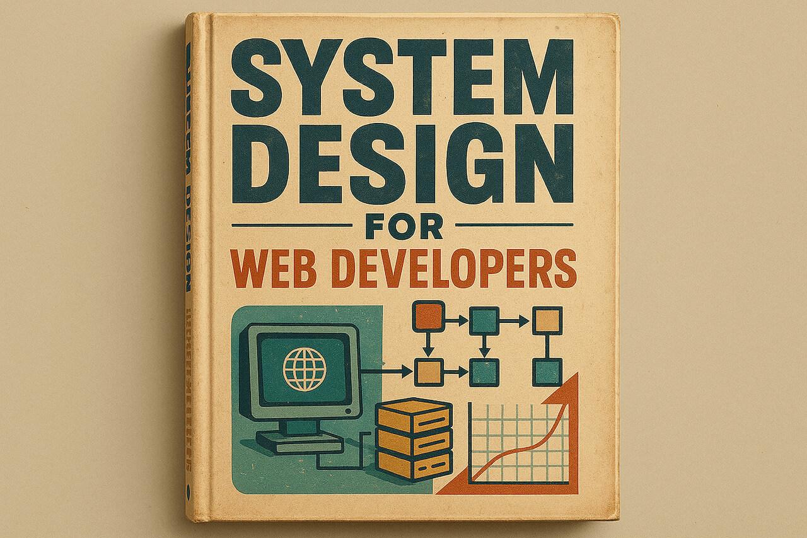

<h1 id="{{ Week 34-Full Stack Project | slugify }}">
  Week 34 | Full Stack Project
</h1>

  

  <h2 class="week-controls__previous_week">

    

      

      <a href="../week{{ previous_week_num }}">Week {{ previous_week_num }} &#8678;</a>
    

  </h2>

  Updated: 30/5/2026

  <h2 class="week-controls__next_week">

    

      

      <a href="../week{{ next_week_num }}">&#8680; Week {{ next_week_num }}</a>
    

  </h2>

<!-- VERSION -->

  You are viewing v2.0 of this content. To go back to v1.0 click <a href="v1.0">this link</a>.

<!-- VERSION -->

---

<!-- Week 34 - Day 1 | Work in Progress -->

  

    <h2>
      Week 34 - Day 1 | Work in Progress</h2>
  

<!-- Schedule -->

### Study Plan

#### Work in progress...

  **Stay tuned**

<!-- Summary -->

<!-- Exercises -->

<!-- Extra Resources -->

<!-- Sources and Attributions -->
  

<!-- Week 34 - Day 2 | System Design -->

  

    <h2>
      Week 34 - Day 2 | System Design</h2>
  

### Schedule

  - **Study the suggested material**
  - **Practice on the topics and share your questions**

### Study Plan

  

  Since we are going to be designing our Database soon, here are two really
  interesting videos that will walk you through designing a system 
  (an Instagram-like app in one case, a calendar app in the other). 

  You can learn a lot from this process, such as thinking about the system 
  from a high level and breaking it up in different modules and deciding 
  on the Database entities (tables) and Schema (columns and types).

  Enjoy and gain some insights!

  - [Design Instagram: 30'](https://www.youtube.com/watch?v=VJpfO6KdyWE){:target="_blank"} 

  - [Design Calendar Application: 25'](https://www.youtube.com/watch?v=39eAITqeu7g){:target="_blank"}

<!-- Summary -->

<!-- Exercises -->

<!-- Extra Resources -->

<!-- Sources and Attributions -->
  

<!-- Week 34 - Day 3 | Work in Progress -->

  

    <h2>
      Week 34 - Day 3 | Work in Progress</h2>
  

<!-- Schedule -->

### Study Plan

#### Work in progress...

  **Stay tuned**

<!-- Summary -->

<!-- Exercises -->

<!-- Extra Resources -->

<!-- Sources and Attributions -->
  

<!-- Week 34 - Day 4 | Practice Day -->

  

    <h2>
      Week 34 - Day 4 | Practice Day</h2>
  

### Schedule

  - **Study the suggested material**
  - **Practice on the topics and share your questions**

### Study Plan

  Today is practice day. Practice on the topics and coding challenges
  for the Mini CMS project we are working on and spend some time on MDN
  and other Internet resources to read more about the technologies involved.

<!-- Summary -->

<!-- Exercises -->

<!-- Extra Resources -->

<!-- Sources and Attributions -->
  

<!-- Week 34 - Day 5 | Work in Progress -->

  

    <h2>
      Week 34 - Day 5 | Work in Progress</h2>
  

<!-- Schedule -->

### Study Plan

#### Work in progress...

  **Stay tuned**

<!-- Summary -->

<!-- Exercises -->

<!-- Extra Resources -->

<!-- Sources and Attributions -->
  

**Weekly feedback:** Hey, it's really important for us to know how your experience with the course has been so far, so don't forget to fill in and submit your [**mandatory** feedback form](https://forms.gle/S6Zg3bbS2uuwsSZF9){:target="_blank"} before the day ends. Thanks you!

---

<!-- COMMENTS: -->
