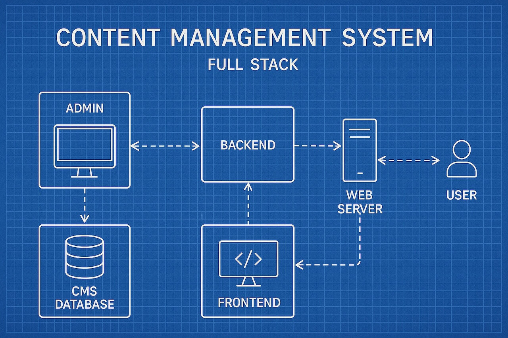

<h1 id="{{ Week 35-Full Stack Project | slugify }}">
  Week 35 | Full Stack Project
</h1>

  

  <h2 class="week-controls__previous_week">

    

      

      <a href="../week{{ previous_week_num }}">Week {{ previous_week_num }} &#8678;</a>
    

  </h2>

  Updated: 1/6/2026

  <h2 class="week-controls__next_week">

    

      

      <a href="../week{{ next_week_num }}">&#8680; Week {{ next_week_num }}</a>
    

  </h2>

<!-- VERSION -->

  You are viewing v2.0 of this content. To go back to v1.0 click <a href="v1.0">this link</a>.

<!-- VERSION -->

---

<!-- Week 35 - Day 1 | Full Stack Project - Part 6 -->

  

    <h2>
      Week 35 - Day 1 | Full Stack Project - Part 6</h2>
  

### Schedule

  - **Study the suggested material**
  - **Practice on the topics and share your questions**

### Study Plan

  Study Part 6 of the Full Stack Project series:

  **Pagination**

  - Part 1 - [Express + EJS Fundamentals](../modules/javascript/misc/fullstack/day01.html){:target="_blank"}
  - Part 2 - [Planning, Architecture & Diagrams](../modules/javascript/misc/fullstack/day02.html){:target="_blank"}
  - Part 3 - [Public Routes & Basic CRUD](../modules/javascript/misc/fullstack/day03.html){:target="_blank"}
  - Part 4 - [Single Product Pages & Database-Driven Routing](../modules/javascript/misc/fullstack/day04.html){:target="_blank"}
  - Part 5 - [Creating Products (CREATE)](../modules/javascript/misc/fullstack/day05.html){:target="_blank"}
  - ➡️ **Part 6 - [Pagination](../modules/javascript/misc/fullstack/day06.html){:target="_blank"}**
  - Part 7 - [Search & Filtering](../modules/javascript/misc/fullstack/day07.html){:target="_blank"}
  - Part 8 - [Updating Products (UPDATE)](../modules/javascript/misc/fullstack/day08.html){:target="_blank"}
  - Part 9 - [Deleting Products (DELETE)](../modules/javascript/misc/fullstack/day09.html){:target="_blank"}
  - Part 10 - [File Uploads & Image Management](../modules/javascript/misc/fullstack/day10.html){:target="_blank"}
  - Part 11 - [Authentication & Login Systems](../modules/javascript/misc/fullstack/day11.html){:target="_blank"}
  - Part 12 - [Authorization, Roles & Permissions](../modules/javascript/misc/fullstack/day12.html){:target="_blank"}
  - Part 13 - [Validation, Error Handling & Defensive Programming](../modules/javascript/misc/fullstack/day13.html){:target="_blank"}
  - Part 14 - [Testing Express Applications](../modules/javascript/misc/fullstack/day14.html){:target="_blank"}
  - Part 15 - [Deployment, Production & Launching Your CMS](../modules/javascript/misc/fullstack/day15.html){:target="_blank"}

<!-- Summary -->

<!-- Exercises -->

<!-- Extra Resources -->

<!-- Sources and Attributions -->
  

<!-- Week 35 - Day 2 | Full Stack Project - Part 7 -->

  

    <h2>
      Week 35 - Day 2 | Full Stack Project - Part 7</h2>
  

### Schedule

  - **Study the suggested material**
  - **Practice on the topics and share your questions**

### Study Plan

  Study Part 7 of the Full Stack Project series:

  **Search & Filtering**

  - Part 1 - [Express + EJS Fundamentals](../modules/javascript/misc/fullstack/day01.html){:target="_blank"}
  - Part 2 - [Planning, Architecture & Diagrams](../modules/javascript/misc/fullstack/day02.html){:target="_blank"}
  - Part 3 - [Public Routes & Basic CRUD](../modules/javascript/misc/fullstack/day03.html){:target="_blank"}
  - Part 4 - [Single Product Pages & Database-Driven Routing](../modules/javascript/misc/fullstack/day04.html){:target="_blank"}
  - Part 5 - [Creating Products (CREATE)](../modules/javascript/misc/fullstack/day05.html){:target="_blank"}
  - Part 6 - [Pagination](../modules/javascript/misc/fullstack/day06.html){:target="_blank"}
  - ➡️ **Part 7 - [Search & Filtering](../modules/javascript/misc/fullstack/day07.html){:target="_blank"}**
  - Part 8 - [Updating Products (UPDATE)](../modules/javascript/misc/fullstack/day08.html){:target="_blank"}
  - Part 9 - [Deleting Products (DELETE)](../modules/javascript/misc/fullstack/day09.html){:target="_blank"}
  - Part 10 - [File Uploads & Image Management](../modules/javascript/misc/fullstack/day10.html){:target="_blank"}
  - Part 11 - [Authentication & Login Systems](../modules/javascript/misc/fullstack/day11.html){:target="_blank"}
  - Part 12 - [Authorization, Roles & Permissions](../modules/javascript/misc/fullstack/day12.html){:target="_blank"}
  - Part 13 - [Validation, Error Handling & Defensive Programming](../modules/javascript/misc/fullstack/day13.html){:target="_blank"}
  - Part 14 - [Testing Express Applications](../modules/javascript/misc/fullstack/day14.html){:target="_blank"}
  - Part 15 - [Deployment, Production & Launching Your CMS](../modules/javascript/misc/fullstack/day15.html){:target="_blank"}

<!-- Summary -->

<!-- Exercises -->

<!-- Extra Resources -->

<!-- Sources and Attributions -->
  

<!-- Week 35 - Day 3 | Full Stack Project - Part 8 -->

  

    <h2>
      Week 35 - Day 3 | Full Stack Project - Part 8</h2>
  

### Schedule

  - **Study the suggested material**
  - **Practice on the topics and share your questions**

### Study Plan

  Study Part 8 of the Full Stack Project series:

  **Updating Products (UPDATE)**

  - Part 1 - [Express + EJS Fundamentals](../modules/javascript/misc/fullstack/day01.html){:target="_blank"}
  - Part 2 - [Planning, Architecture & Diagrams](../modules/javascript/misc/fullstack/day02.html){:target="_blank"}
  - Part 3 - [Public Routes & Basic CRUD](../modules/javascript/misc/fullstack/day03.html){:target="_blank"}
  - Part 4 - [Single Product Pages & Database-Driven Routing](../modules/javascript/misc/fullstack/day04.html){:target="_blank"}
  - Part 5 - [Creating Products (CREATE)](../modules/javascript/misc/fullstack/day05.html){:target="_blank"}
  - Part 6 - [Pagination](../modules/javascript/misc/fullstack/day06.html){:target="_blank"}
  - Part 7 - [Search & Filtering](../modules/javascript/misc/fullstack/day07.html){:target="_blank"}
  - ➡️ **Part 8 - [Updating Products (UPDATE)](../modules/javascript/misc/fullstack/day08.html){:target="_blank"}**
  - Part 9 - [Deleting Products (DELETE)](../modules/javascript/misc/fullstack/day09.html){:target="_blank"}
  - Part 10 - [File Uploads & Image Management](../modules/javascript/misc/fullstack/day10.html){:target="_blank"}
  - Part 11 - [Authentication & Login Systems](../modules/javascript/misc/fullstack/day11.html){:target="_blank"}
  - Part 12 - [Authorization, Roles & Permissions](../modules/javascript/misc/fullstack/day12.html){:target="_blank"}
  - Part 13 - [Validation, Error Handling & Defensive Programming](../modules/javascript/misc/fullstack/day13.html){:target="_blank"}
  - Part 14 - [Testing Express Applications](../modules/javascript/misc/fullstack/day14.html){:target="_blank"}
  - Part 15 - [Deployment, Production & Launching Your CMS](../modules/javascript/misc/fullstack/day15.html){:target="_blank"}

<!-- Summary -->

<!-- Exercises -->

<!-- Extra Resources -->

<!-- Sources and Attributions -->
  

<!-- Week 35 - Day 4 | Full Stack Project - Part 9 -->

  

    <h2>
      Week 35 - Day 4 | Full Stack Project - Part 9</h2>
  

### Schedule

  - **Study the suggested material**
  - **Practice on the topics and share your questions**

### Study Plan

  Study Part 9 of the Full Stack Project series:

  **Deleting Products (DELETE)**

  By the end of this lesson, students will be able to:

  * Understand DELETE operations
  * Build delete workflows
  * Implement confirmation pages
  * Execute SQL DELETE statements
  * Handle missing records
  * Understand soft deletes
  * Understand hard deletes
  * Prevent accidental data loss
  * Build safer CRUD applications

  - Part 1 - [Express + EJS Fundamentals](../modules/javascript/misc/fullstack/day01.html){:target="_blank"}
  - Part 2 - [Planning, Architecture & Diagrams](../modules/javascript/misc/fullstack/day02.html){:target="_blank"}
  - Part 3 - [Public Routes & Basic CRUD](../modules/javascript/misc/fullstack/day03.html){:target="_blank"}
  - Part 4 - [Single Product Pages & Database-Driven Routing](../modules/javascript/misc/fullstack/day04.html){:target="_blank"}
  - Part 5 - [Creating Products (CREATE)](../modules/javascript/misc/fullstack/day05.html){:target="_blank"}
  - Part 6 - [Pagination](../modules/javascript/misc/fullstack/day06.html){:target="_blank"}
  - Part 7 - [Search & Filtering](../modules/javascript/misc/fullstack/day07.html){:target="_blank"}
  - Part 8 - [Updating Products (UPDATE)](../modules/javascript/misc/fullstack/day08.html){:target="_blank"}
  - ➡️ **Part 9 - [Deleting Products (DELETE)](../modules/javascript/misc/fullstack/day09.html){:target="_blank"}**
  - Part 10 - [File Uploads & Image Management](../modules/javascript/misc/fullstack/day10.html){:target="_blank"}
  - Part 11 - [Authentication & Login Systems](../modules/javascript/misc/fullstack/day11.html){:target="_blank"}
  - Part 12 - [Authorization, Roles & Permissions](../modules/javascript/misc/fullstack/day12.html){:target="_blank"}
  - Part 13 - [Validation, Error Handling & Defensive Programming](../modules/javascript/misc/fullstack/day13.html){:target="_blank"}
  - Part 14 - [Testing Express Applications](../modules/javascript/misc/fullstack/day14.html){:target="_blank"}
  - Part 15 - [Deployment, Production & Launching Your CMS](../modules/javascript/misc/fullstack/day15.html){:target="_blank"}

<!-- Summary -->

<!-- Exercises -->

<!-- Extra Resources -->

<!-- Sources and Attributions -->
  

<!-- Week 35 - Day 5 | Full Stack Project - Part 10 -->

  

    <h2>
      Week 35 - Day 5 | Full Stack Project - Part 10</h2>
  

### Schedule

  - **Study the suggested material**
  - **Practice on the topics and share your questions**

### Study Plan

  Study Part 10 of the Full Stack Project series:

  **File Uploads & Image Management**

  - Part 1 - [Express + EJS Fundamentals](../modules/javascript/misc/fullstack/day01.html){:target="_blank"}
  - Part 2 - [Planning, Architecture & Diagrams](../modules/javascript/misc/fullstack/day02.html){:target="_blank"}
  - Part 3 - [Public Routes & Basic CRUD](../modules/javascript/misc/fullstack/day03.html){:target="_blank"}
  - Part 4 - [Single Product Pages & Database-Driven Routing](../modules/javascript/misc/fullstack/day04.html){:target="_blank"}
  - Part 5 - [Creating Products (CREATE)](../modules/javascript/misc/fullstack/day05.html){:target="_blank"}
  - Part 6 - [Pagination](../modules/javascript/misc/fullstack/day06.html){:target="_blank"}
  - Part 7 - [Search & Filtering](../modules/javascript/misc/fullstack/day07.html){:target="_blank"}
  - Part 8 - [Updating Products (UPDATE)](../modules/javascript/misc/fullstack/day08.html){:target="_blank"}
  - Part 9 - [Deleting Products (DELETE)](../modules/javascript/misc/fullstack/day09.html){:target="_blank"}
  - ➡️ **Part 10 - [File Uploads & Image Management](../modules/javascript/misc/fullstack/day10.html){:target="_blank"}**
  - Part 11 - [Authentication & Login Systems](../modules/javascript/misc/fullstack/day11.html){:target="_blank"}
  - Part 12 - [Authorization, Roles & Permissions](../modules/javascript/misc/fullstack/day12.html){:target="_blank"}
  - Part 13 - [Validation, Error Handling & Defensive Programming](../modules/javascript/misc/fullstack/day13.html){:target="_blank"}
  - Part 14 - [Testing Express Applications](../modules/javascript/misc/fullstack/day14.html){:target="_blank"}
  - Part 15 - [Deployment, Production & Launching Your CMS](../modules/javascript/misc/fullstack/day15.html){:target="_blank"}

<!-- Summary -->

<!-- Exercises -->

<!-- Extra Resources -->

<!-- Sources and Attributions -->
  

**Weekly feedback:** Hey, it's really important for us to know how your experience with the course has been so far, so don't forget to fill in and submit your [**mandatory** feedback form](https://forms.gle/S6Zg3bbS2uuwsSZF9){:target="_blank"} before the day ends. Thanks you!

---

<!-- COMMENTS: -->
