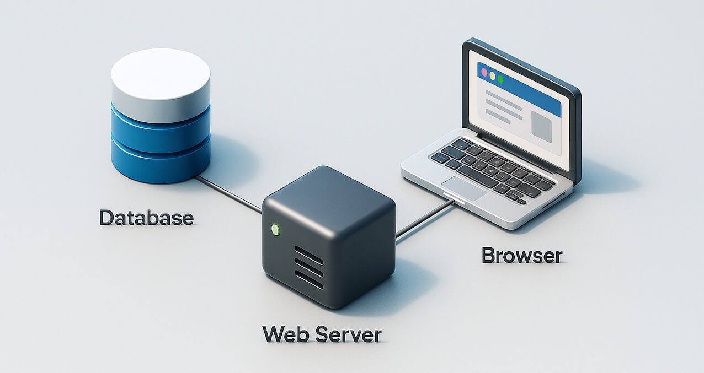
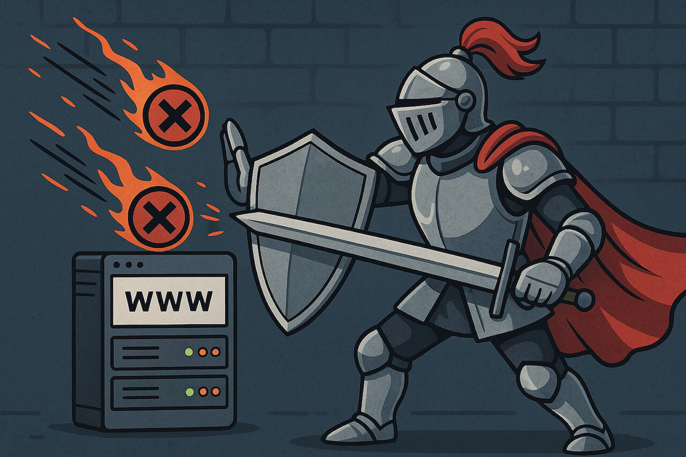

<h1 id="{{ Week 36-Mini CMS | slugify }}">
  Week 36 | Mini CMS
</h1>

  

  <h2 class="week-controls__previous_week">

    

      

      <a href="../week{{ previous_week_num }}">Week {{ previous_week_num }} &#8678;</a>
    

  </h2>

  Updated: 30/6/2025

  <h2 class="week-controls__next_week">

    

      

      <a href="../week{{ next_week_num }}">&#8680; Week {{ next_week_num }}</a>
    

  </h2>

---

<!-- Week 36 - Day 1 | Mini CMS Project -->

  

    <h2>
      Week 36 - Day 1 | Mini CMS Project</h2>
  

### Schedule

  - **Watch the lectures**
  - **Study the suggested material**
  - **Practice on the topics and share your questions**

### Study Plan

  Your instructor will share the video lectures with you. Here are the topics covered:

  - **Part 1:** Creating a POST Controller for handling the creation of new Blog posts
  - **Part 2:** Creating a View and a Controller for displaying all the available Blog posts in our Database.

  You can find the lecture code [here](https://github.com/in-tech-gration/build-a-cms-2024/tree/85d63328668637dec30266c944dc5da927770f2a){:target="_blank"}

  **Important:** The code link above, points to a particular commit in the repository. Click the `Code` => `Download Zip` button on GitHub, to download the code as it was in that exact commit.

  **References & Resources:**

  - [SQL Constraints](https://www.tutorialspoint.com/sqlite/sqlite_constraints.htm){:target="_blank"}  
  - [HTTP Status Codes Reference](https://httpstatuses.io/){:target="_blank"}  
  - Date: [toLocaleTimeString](https://developer.mozilla.org/en-US/docs/Web/JavaScript/Reference/Global_Objects/Date/toLocaleTimeString){:target="_blank"}, [toLocaleDateString](https://developer.mozilla.org/en-US/docs/Web/JavaScript/Reference/Global_Objects/Date/toLocaleDateString){:target="_blank"}

<!-- Summary -->

### Exercises

  **CHALLENGE:** Find out how you can automatically redirect the user to the newly created Post page.

  **IMPORTANT:** Make sure to complete all the tasks found in the **daily Progress Sheet** and update the sheet accordingly. Once you've updated the sheet, don't forget to `commit` and `push`. The progress draft sheet for this day is: **/user/week36/progress/progress.draft.w36.d01.csv**

  You should **NEVER** update the `draft` sheets directly, but rather work on a copy of them according to the instructions [found here](../modules/curriculum/progress_workflow.md).

<!-- Extra Resources -->

<!-- Sources and Attributions -->
  

<!-- Week 36 - Day 2 | Practice Day -->

  

    <h2>
      Week 36 - Day 2 | Practice Day</h2>
  

### Schedule

  - **Practice on the topics and share your questions**

### Study Plan

  Today is practice day. Practice on the topics covered so far
  and share your thoughts, questions and insights.

  Happy hacking!

<!-- Summary -->

<!-- Exercises -->

<!-- Extra Resources -->

<!-- Sources and Attributions -->
  

<!-- Week 36 - Day 3 | Authentication -->

  

    <h2>
      Week 36 - Day 3 | Authentication</h2>
  

### Schedule

  - **Watch the lectures**
  - **Study the suggested material**
  - **Practice on the topics and share your questions**

### Study Plan

  

  Your instructor will share the video lectures with you. Here are the topics covered:

  - **Part 1:** Work on the Home Page Controller
  - **Part 2:** Authentication

  You can find the lecture code [here](https://github.com/in-tech-gration/build-a-cms-2024/tree/7ae3568842a082682b7c363eff0bd00ba856f486){:target="_blank"} and the diagrams [here](https://github.com/in-tech-gration/WDX-180/tree/main/curriculum/modules/javascript/misc/_w36d03/assets/day03/diagrams){:target="_blank"}.

  **Important:** The code link above, points to a particular commit in the repository. Click the `Code` => `Download Zip` button on GitHub, to download the code as it was in that exact commit.

  **Lecture Notes & Questions:**

  **References & Resources:**

  - Authentication (AuthN) vs Authorization (AuthZ)  
    - [https://www.cloudflare.com/learning/access-management/authn-vs-authz/](https://www.cloudflare.com/learning/access-management/authn-vs-authz/){:target="_blank"}

<!-- Summary -->

<!-- Exercises -->

<!-- Extra Resources -->

<!-- Sources and Attributions -->
  

<!-- Week 36 - Day 4 | Practice Day -->

  

    <h2>
      Week 36 - Day 4 | Practice Day</h2>
  

### Schedule

  - **Practice on the topics and share your questions**

### Study Plan

  Today is practice day. Practice on the topics covered so far
  and share your thoughts, questions and insights.

  Happy hacking!

<!-- Summary -->

<!-- Exercises -->

<!-- Extra Resources -->

<!-- Sources and Attributions -->
  

<!-- Week 36 - Day 5 | Protected Routes -->

  

    <h2>
      Week 36 - Day 5 | Protected Routes</h2>
  

### Schedule

  - **Watch the lectures**
  - **Study the suggested material**
  - **Practice on the topics and share your questions**

### Study Plan

  Your instructor will share the video lectures with you. Here are the topics covered:

  - **Part 1:** Authentication & Security
  - **Part 2:** Authentication & Security

  You can find the lecture code [here](https://github.com/in-tech-gration/build-a-cms-2024/tree/9dd8f9d4cd986ccddce5578c0d59415e42b7391b){:target="_blank"} and the diagrams [here](https://github.com/in-tech-gration/WDX-180/tree/main/curriculum/week36/assets/day05){:target="_blank"}.

  **Important:** The code link above, points to a particular commit in the repository. Click the `Code` => `Download Zip` button on GitHub, to download the code as it was in that exact commit.
  **References & Resources:**

  - [POST Method details](https://developer.mozilla.org/en-US/docs/Web/HTTP/Methods/POST){:target="_blank"} (encoding, etc.)  
    - [Percent encoding](https://en.wikipedia.org/wiki/Percent-encoding){:target="_blank"}  
    - Base64 Encoding/Decoding  
      - [https://developer.mozilla.org/en-US/docs/Web/API/Window/btoa](https://developer.mozilla.org/en-US/docs/Web/API/Window/btoa){:target="_blank"}  
      - [https://developer.mozilla.org/en-US/docs/Web/API/Window/atob](https://developer.mozilla.org/en-US/docs/Web/API/Window/atob){:target="_blank"}  
    - Be very careful with the test data and accounts that you use during development/debugging. It’s important for this data and accounts not ending up in production. (Especially the DB accounts with weak passwords)  
    - [HTTP Set-Cookie header](https://developer.mozilla.org/en-US/docs/Web/HTTP/Headers/Set-Cookie){:target="_blank"}  
    - **ALWAYS REMEMBER: "No data from the browser is trustworthy"**  
    - **When the user logs out, the cookie must always be removed or invalidated.**

<!-- Summary -->

### Exercises

  Here's your challenges for today:

  - Find out all the appropriate HTTP status codes and make sure that all endpoints send back the appropriate codes, e.g. 404, 200, 401, 302, etc.  
  - Learn about the differences between the various encoding schemes: percent encoding, URI encoding, base64, etc.  
    - [https://stackoverflow.com/questions/10267597/url-encode-vs-base64-encoding-usages](https://stackoverflow.com/questions/10267597/url-encode-vs-base64-encoding-usages){:target="_blank"}  
  - Explore cookies in-depth and try out things, deal with more `key=value` pairs, like parsing multiple cookies and restricting cookies to particular paths and setting an expiration date  
    - References: [https://stackoverflow.com/a/20912911/4861760](https://stackoverflow.com/a/20912911/4861760){:target="_blank"}  
  - Research: how to detect cookie tampering  
    - [https://stackoverflow.com/questions/6230565/how-to-prevent-users-from-modifying-cookie-values](https://stackoverflow.com/questions/6230565/how-to-prevent-users-from-modifying-cookie-values){:target="_blank"}  
  - CHALLENGE: secure the cookie authentication mechanism by introducing hashing [(learn/Cookie.Tampering.101.md)](https://github.com/in-tech-gration/build-a-cms-2024/blob/9dd8f9d4cd986ccddce5578c0d59415e42b7391b/learn/Cookie.Tampering.101.md){:target="_blank"}

  - Use Tailwind CSS to prettify the Post pages! (Pick a ready made template)

  **IMPORTANT:** Make sure to complete all the tasks found in the **daily Progress Sheet** and update the sheet accordingly. Once you've updated the sheet, don't forget to `commit` and `push`. The progress draft sheet for this day is: **/user/week36/progress/progress.draft.w36.d05.csv**

  You should **NEVER** update the `draft` sheets directly, but rather work on a copy of them according to the instructions [found here](../modules/curriculum/progress_workflow.md).

<!-- Extra Resources -->

<!-- Sources and Attributions -->
  

**Weekly feedback:** Hey, it's really important for us to know how your experience with the course has been so far, so don't forget to fill in and submit your [**mandatory** feedback form](https://forms.gle/S6Zg3bbS2uuwsSZF9){:target="_blank"} before the day ends. Thanks you!

---

<!-- COMMENTS: -->
