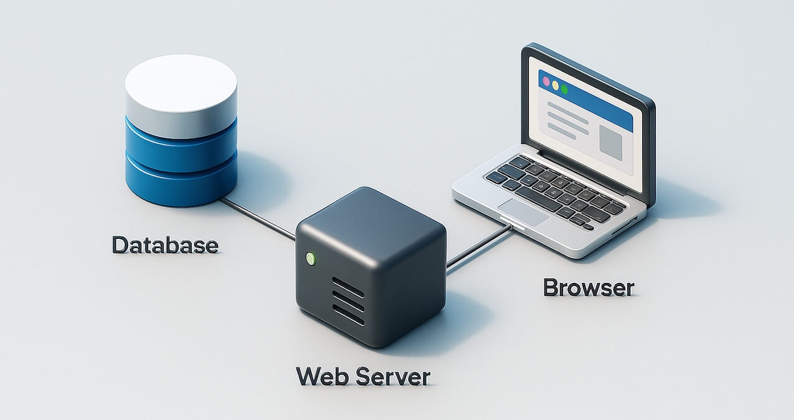

<h1 id="{{ Week 36-Full Stack Project | slugify }}">
  Week 36 | Full Stack Project
</h1>

  

  <h2 class="week-controls__previous_week">

    

      

      <a href="../week{{ previous_week_num }}">Week {{ previous_week_num }} &#8678;</a>
    

  </h2>

  Updated: 1/6/2026

  <h2 class="week-controls__next_week">

    

      

      <a href="../week{{ next_week_num }}">&#8680; Week {{ next_week_num }}</a>
    

  </h2>

<!-- VERSION -->

  You are viewing v2.0 of this content. To go back to v1.0 click <a href="v1.0">this link</a>.

<!-- VERSION -->

---

<!-- Week 36 - Day 1 | Full Stack Project - Part 11 -->

  

    <h2>
      Week 36 - Day 1 | Full Stack Project - Part 11</h2>
  

### Schedule

  - **Study the suggested material**
  - **Practice on the topics and share your questions**

### Study Plan

  Study Part 11 of the Full Stack Project series:

  **Authentication & Login Systems**

  By the end of this lesson, students will be able to:

  * Understand authentication fundamentals
  * Understand sessions
  * Understand cookies
  * Build login forms
  * Hash passwords securely
  * Verify user credentials
  * Create authenticated sessions
  * Protect routes
  * Implement logout functionality
  * Understand common authentication vulnerabilities

  - Part 1 - [Express + EJS Fundamentals](../modules/javascript/misc/fullstack/day01.html){:target="_blank"}
  - Part 2 - [Planning, Architecture & Diagrams](../modules/javascript/misc/fullstack/day02.html){:target="_blank"}
  - Part 3 - [Public Routes & Basic CRUD](../modules/javascript/misc/fullstack/day03.html){:target="_blank"}
  - Part 4 - [Single Product Pages & Database-Driven Routing](../modules/javascript/misc/fullstack/day04.html){:target="_blank"}
  - Part 5 - [Creating Products (CREATE)](../modules/javascript/misc/fullstack/day05.html){:target="_blank"}
  - Part 6 - [Pagination](../modules/javascript/misc/fullstack/day06.html){:target="_blank"}
  - Part 7 - [Search & Filtering](../modules/javascript/misc/fullstack/day07.html){:target="_blank"}
  - Part 8 - [Updating Products (UPDATE)](../modules/javascript/misc/fullstack/day08.html){:target="_blank"}
  - Part 9 - [Deleting Products (DELETE)](../modules/javascript/misc/fullstack/day09.html){:target="_blank"}
  - Part 10 - [File Uploads & Image Management](../modules/javascript/misc/fullstack/day10.html){:target="_blank"}
  - ➡️ **Part 11 - [Authentication & Login Systems](../modules/javascript/misc/fullstack/day11.html){:target="_blank"}**
  - Part 12 - [Authorization, Roles & Permissions](../modules/javascript/misc/fullstack/day12.html){:target="_blank"}
  - Part 13 - [Validation, Error Handling & Defensive Programming](../modules/javascript/misc/fullstack/day13.html){:target="_blank"}
  - Part 14 - [Testing Express Applications](../modules/javascript/misc/fullstack/day14.html){:target="_blank"}
  - Part 15 - [Deployment, Production & Launching Your CMS](../modules/javascript/misc/fullstack/day15.html){:target="_blank"}

<!-- Summary -->

<!-- Exercises -->

<!-- Extra Resources -->

<!-- Sources and Attributions -->
  

<!-- Week 36 - Day 2 | Full Stack Project - Part 12 -->

  

    <h2>
      Week 36 - Day 2 | Full Stack Project - Part 12</h2>
  

### Schedule

  - **Study the suggested material**
  - **Practice on the topics and share your questions**

### Study Plan

  Study Part 12 of the Full Stack Project series:

  **Authorization, Roles & Permissions**

  By the end of this lesson, students will be able to:

  * Understand authorization
  * Implement user roles
  * Restrict route access
  * Build authorization middleware
  * Understand role hierarchies
  * Hide unauthorized UI elements
  * Prevent privilege escalation
  * Understand ownership-based permissions
  * Design scalable permission systems

  - Part 1 - [Express + EJS Fundamentals](../modules/javascript/misc/fullstack/day01.html){:target="_blank"}
  - Part 2 - [Planning, Architecture & Diagrams](../modules/javascript/misc/fullstack/day02.html){:target="_blank"}
  - Part 3 - [Public Routes & Basic CRUD](../modules/javascript/misc/fullstack/day03.html){:target="_blank"}
  - Part 4 - [Single Product Pages & Database-Driven Routing](../modules/javascript/misc/fullstack/day04.html){:target="_blank"}
  - Part 5 - [Creating Products (CREATE)](../modules/javascript/misc/fullstack/day05.html){:target="_blank"}
  - Part 6 - [Pagination](../modules/javascript/misc/fullstack/day06.html){:target="_blank"}
  - Part 7 - [Search & Filtering](../modules/javascript/misc/fullstack/day07.html){:target="_blank"}
  - Part 8 - [Updating Products (UPDATE)](../modules/javascript/misc/fullstack/day08.html){:target="_blank"}
  - Part 9 - [Deleting Products (DELETE)](../modules/javascript/misc/fullstack/day09.html){:target="_blank"}
  - Part 10 - [File Uploads & Image Management](../modules/javascript/misc/fullstack/day10.html){:target="_blank"}
  - Part 11 - [Authentication & Login Systems](../modules/javascript/misc/fullstack/day11.html){:target="_blank"}
  - ➡️ **Part 12 - [Authorization, Roles & Permissions](../modules/javascript/misc/fullstack/day12.html){:target="_blank"}**
  - Part 13 - [Validation, Error Handling & Defensive Programming](../modules/javascript/misc/fullstack/day13.html){:target="_blank"}
  - Part 14 - [Testing Express Applications](../modules/javascript/misc/fullstack/day14.html){:target="_blank"}
  - Part 15 - [Deployment, Production & Launching Your CMS](../modules/javascript/misc/fullstack/day15.html){:target="_blank"}

<!-- Summary -->

<!-- Exercises -->

<!-- Extra Resources -->

<!-- Sources and Attributions -->
  

<!-- Week 36 - Day 3 | Full Stack Project - Part 13 -->

  

    <h2>
      Week 36 - Day 3 | Full Stack Project - Part 13</h2>
  

### Schedule

  - **Study the suggested material**
  - **Practice on the topics and share your questions**

### Study Plan

  Study Part 13 of the Full Stack Project series:

  **Validation, Error Handling & Defensive Programming**

  By the end of this lesson, students will be able to:

  * Understand validation fundamentals
  * Validate input safely
  * Separate validation from business logic
  * Handle application errors gracefully
  * Create custom error middleware
  * Understand operational vs programmer errors
  * Build reusable validators
  * Display validation feedback
  * Understand defensive programming
  * Design more reliable systems

  - Part 1 - [Express + EJS Fundamentals](../modules/javascript/misc/fullstack/day01.html){:target="_blank"}
  - Part 2 - [Planning, Architecture & Diagrams](../modules/javascript/misc/fullstack/day02.html){:target="_blank"}
  - Part 3 - [Public Routes & Basic CRUD](../modules/javascript/misc/fullstack/day03.html){:target="_blank"}
  - Part 4 - [Single Product Pages & Database-Driven Routing](../modules/javascript/misc/fullstack/day04.html){:target="_blank"}
  - Part 5 - [Creating Products (CREATE)](../modules/javascript/misc/fullstack/day05.html){:target="_blank"}
  - Part 6 - [Pagination](../modules/javascript/misc/fullstack/day06.html){:target="_blank"}
  - Part 7 - [Search & Filtering](../modules/javascript/misc/fullstack/day07.html){:target="_blank"}
  - Part 8 - [Updating Products (UPDATE)](../modules/javascript/misc/fullstack/day08.html){:target="_blank"}
  - Part 9 - [Deleting Products (DELETE)](../modules/javascript/misc/fullstack/day09.html){:target="_blank"}
  - Part 10 - [File Uploads & Image Management](../modules/javascript/misc/fullstack/day10.html){:target="_blank"}
  - Part 11 - [Authentication & Login Systems](../modules/javascript/misc/fullstack/day11.html){:target="_blank"}
  - Part 12 - [Authorization, Roles & Permissions](../modules/javascript/misc/fullstack/day12.html){:target="_blank"}
  - ➡️ **Part 13 - [Validation, Error Handling & Defensive Programming](../modules/javascript/misc/fullstack/day13.html){:target="_blank"}**
  - Part 14 - [Testing Express Applications](../modules/javascript/misc/fullstack/day14.html){:target="_blank"}
  - Part 15 - [Deployment, Production & Launching Your CMS](../modules/javascript/misc/fullstack/day15.html){:target="_blank"}

<!-- Summary -->

<!-- Exercises -->

<!-- Extra Resources -->

<!-- Sources and Attributions -->
  

<!-- Week 36 - Day 4 | Full Stack Project - Part 14 -->

  

    <h2>
      Week 36 - Day 4 | Full Stack Project - Part 14</h2>
  

### Schedule

  - **Study the suggested material**
  - **Practice on the topics and share your questions**

### Study Plan

  Study Part 14 of the Full Stack Project series:

  **Testing Express Applications**

  By the end of this lesson, students will be able to:

  * Understand software testing fundamentals
  * Write unit tests
  * Write integration tests
  * Test Express routes
  * Test validation logic
  * Test authentication flows
  * Mock dependencies
  * Understand test isolation
  * Build reliable applications
  * Develop a testing mindset

  - Part 1 - [Express + EJS Fundamentals](../modules/javascript/misc/fullstack/day01.html){:target="_blank"}
  - Part 2 - [Planning, Architecture & Diagrams](../modules/javascript/misc/fullstack/day02.html){:target="_blank"}
  - Part 3 - [Public Routes & Basic CRUD](../modules/javascript/misc/fullstack/day03.html){:target="_blank"}
  - Part 4 - [Single Product Pages & Database-Driven Routing](../modules/javascript/misc/fullstack/day04.html){:target="_blank"}
  - Part 5 - [Creating Products (CREATE)](../modules/javascript/misc/fullstack/day05.html){:target="_blank"}
  - Part 6 - [Pagination](../modules/javascript/misc/fullstack/day06.html){:target="_blank"}
  - Part 7 - [Search & Filtering](../modules/javascript/misc/fullstack/day07.html){:target="_blank"}
  - Part 8 - [Updating Products (UPDATE)](../modules/javascript/misc/fullstack/day08.html){:target="_blank"}
  - Part 9 - [Deleting Products (DELETE)](../modules/javascript/misc/fullstack/day09.html){:target="_blank"}
  - Part 10 - [File Uploads & Image Management](../modules/javascript/misc/fullstack/day10.html){:target="_blank"}
  - Part 11 - [Authentication & Login Systems](../modules/javascript/misc/fullstack/day11.html){:target="_blank"}
  - Part 12 - [Authorization, Roles & Permissions](../modules/javascript/misc/fullstack/day12.html){:target="_blank"}
  - Part 13 - [Validation, Error Handling & Defensive Programming](../modules/javascript/misc/fullstack/day13.html){:target="_blank"}
  - ➡️ **Part 14 - [Testing Express Applications](../modules/javascript/misc/fullstack/day14.html){:target="_blank"}**
  - Part 15 - [Deployment, Production & Launching Your CMS](../modules/javascript/misc/fullstack/day15.html){:target="_blank"}

<!-- Summary -->

<!-- Exercises -->

<!-- Extra Resources -->

<!-- Sources and Attributions -->
  

<!-- Week 36 - Day 5 | Full Stack Project - Part 15 -->

  

    <h2>
      Week 36 - Day 5 | Full Stack Project - Part 15</h2>
  

### Schedule

  - **Study the suggested material**
  - **Practice on the topics and share your questions**

### Study Plan

  Study Part 15 of the Full Stack Project series:

  **Deployment, Production & Launching Your CMS**

  By the end of this lesson, students will be able to:

  * Understand deployment fundamentals
  * Prepare applications for production
  * Use environment variables correctly
  * Configure production databases
  * Serve applications securely
  * Understand reverse proxies
  * Understand HTTPS
  * Implement logging strategies
  * Monitor applications
  * Deploy a complete CMS

 - Part 1 - [Express + EJS Fundamentals](../modules/javascript/misc/fullstack/day01.html){:target="_blank"}
 - Part 2 - [Planning, Architecture & Diagrams](../modules/javascript/misc/fullstack/day02.html){:target="_blank"}
 - Part 3 - [Public Routes & Basic CRUD](../modules/javascript/misc/fullstack/day03.html){:target="_blank"}
 - Part 4 - [Single Product Pages & Database-Driven Routing](../modules/javascript/misc/fullstack/day04.html){:target="_blank"}
 - Part 5 - [Creating Products (CREATE)](../modules/javascript/misc/fullstack/day05.html){:target="_blank"}
 - Part 6 - [Pagination](../modules/javascript/misc/fullstack/day06.html){:target="_blank"}
 - Part 7 - [Search & Filtering](../modules/javascript/misc/fullstack/day07.html){:target="_blank"}
 - Part 8 - [Updating Products (UPDATE)](../modules/javascript/misc/fullstack/day08.html){:target="_blank"}
 - Part 9 - [Deleting Products (DELETE)](../modules/javascript/misc/fullstack/day09.html){:target="_blank"}
 - Part 10 - [File Uploads & Image Management](../modules/javascript/misc/fullstack/day10.html){:target="_blank"}
 - Part 11 - [Authentication & Login Systems](../modules/javascript/misc/fullstack/day11.html){:target="_blank"}
 - Part 12 - [Authorization, Roles & Permissions](../modules/javascript/misc/fullstack/day12.html){:target="_blank"}
 - Part 13 - [Validation, Error Handling & Defensive Programming](../modules/javascript/misc/fullstack/day13.html){:target="_blank"}
 - Part 14 - [Testing Express Applications](../modules/javascript/misc/fullstack/day14.html){:target="_blank"}
 - ➡️ **Part 15 - [Deployment, Production & Launching Your CMS](../modules/javascript/misc/fullstack/day15.html){:target="_blank"}**

<!-- Summary -->

<!-- Exercises -->

<!-- Extra Resources -->

<!-- Sources and Attributions -->
  

**Weekly feedback:** Hey, it's really important for us to know how your experience with the course has been so far, so don't forget to fill in and submit your [**mandatory** feedback form](https://forms.gle/S6Zg3bbS2uuwsSZF9){:target="_blank"} before the day ends. Thanks you!

---

<!-- COMMENTS: -->
