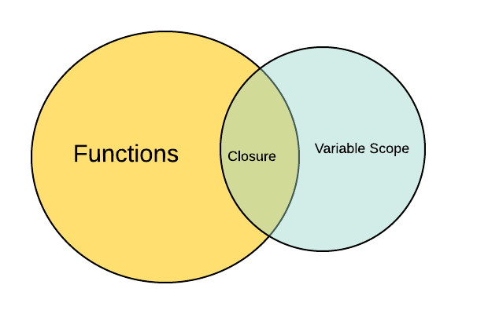
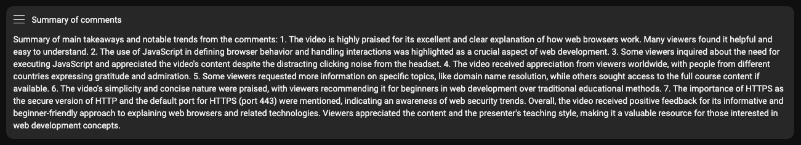
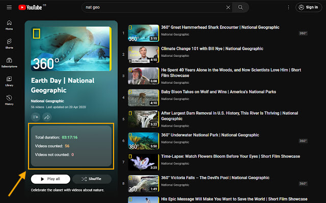

# Learning and Productivity Tips

___"Truth flourishes where the student's lamp has shone, 
And there alone,"___, W.B. Yeats

## Study*

_*from latin **Studium**, meaning **zeal, painstaking application, dedication**._

- When learning new concepts, ensure that you **always accompany them with imagery**. For example, when learning about `closures` in JavaScript, google for `closure javascript` and switch to `Images` search mode to find useful diagrams, images, charts or any other type of imagery that will help you "connect" with the concept you are trying to learn and get a visual representation that will help you build a strong mental model behind each concept. There is a great deal of scientific research and studies that confirm [the important role of visual input in processing and retaining information](../teaching/README.md#dual-coding-theory--picture-superiority-effect).

_(A quick Google image search for "closure javascript" results in this nice visual diagram by [Edward Huangabout](https://edward-huang.com/about/))_

- **YouTube Videos:** 

  - **Switch to a different playback speed:** if you feel the default speed (1x) is either too fast or too slow for you. You can configure the playback speed by clicking the `Settings` icon and then selecting a `Playback Speed`. Speeds over 1 (1.25, 1.5, etc.) will accelerate the playback rate, while speed values under 0 (0.75, 0.5, etc.) will slow down the video and audio.

  - **Use an AdBlocker:** you are probably going to need an AdBlocker while watching YouTube videos, as it can become really distracting (not to mention annoying and time consuming) watching ads popping up all of the time. You can install something like [Adblock Plus - free ad blocker](https://chrome.google.com/webstore/detail/adblock-plus-free-ad-bloc/cfhdojbkjhnklbpkdaibdccddilifddb) for Chrome.

  - **Check the comments section**: for additional feedback, outdated content, errata and extra information that might be helpful. Look for comments that mention that the content is outdated or contains misleading information. **Tip:** you can install the Chrome extension [SummifyYT](https://chrome.google.com/webstore/detail/summifyyt-summarize-youtu/mcjgidambippeaajehcfimmephgholco) which does a pretty good job reading all the comments and summarizing the overall feedback _(see screenshot below)_.

  
  

### Where to look for information

- [The **Mozilla Developer Network** website](https://developer.mozilla.org/en-US/) _(probably one of the best sites to look for information related to web technologies)_

- [**Wikipedia**](https://www.wikipedia.org/)

- [**YouTube**](https://www.youtube.com/)

- [**StackOverflow**](https://stackoverflow.com/)

- [The **PCMag Encyclopedia**](https://www.pcmag.com/encyclopedia)

- [The **Kopec Explains Software** Podcast](http://kopec.live/)

### How to draw to remember more

[How to draw to remember more | Graham Shaw | TEDxVienna](https://www.youtube.com/watch?v=gj3ZnKlHqxI)
YouTube video, 17min

---

## Browser

- [Create and save Chrome tab groups](https://www.theverge.com/23384844/chrome-google-tab-groups-create-save-how-to)

## ChatGPT

Use `ChatGPT` with extreme caution!

[When ChatGPT is confidently wrong](https://www.youtube.com/watch?v=ZZoT005p8ko)
YouTube video, 8min

---

## Tools

- [**Excalidraw**](https://excalidraw.com/): Virtual whiteboard for sketching hand-drawn like diagrams
- [**Adblock Plus - free ad blocker**](https://chrome.google.com/webstore/detail/adblock-plus-free-ad-bloc/cfhdojbkjhnklbpkdaibdccddilifddb/)
- [**Youtube Playlist Duration Calculator**](https://chrome.google.com/webstore/detail/youtube-playlist-duration/pijbakhgmhhadeakaocjfockpndcpobk): An extension to calculate & display the total duration of a youtube playlist.

- [**Screenshot YouTube:** Take a screenshot of any YouTube video with one click](https://chrome.google.com/webstore/detail/screenshot-youtube/gjoijpfmdhbjkkgnmahganhoinjjpohk)
- [**SummifyYT:** Summarize YouTube Comments (Chrome Extension)](https://chrome.google.com/webstore/detail/summifyyt-summarize-youtu/mcjgidambippeaajehcfimmephgholco)
- [**Wikiwand:** Wikipedia Modernized](https://chrome.google.com/webstore/detail/wikiwand-wikipedia-modern/emffkefkbkpkgpdeeooapgaicgmcbolj)
- [**Just Read** Chrome Extension for ](https://chrome.google.com/webstore/detail/just-read/dgmanlpmmkibanfdgjocnabmcaclkmod) Read articles in a customizable, simplified format - like a read mode but better!
  - [Click here](assets/Just.Read.jpg) to see a comparison between an old web page and the `Just Read` version.
- [**CodeGrepper:** The Query & Answer System for the Coder Community
](https://chrome.google.com/webstore/detail/grepper/amaaokahonnfjjemodnpmeenfpnnbkco)
- [**Git Bash**](https://git-scm.com/downloads). List of available commands:
  - `ping` / `cURL` / `ftp` / `nslookup.exe` / `vim` / `python` (not available. Will launch the installer)
- [**WSL:** Windows Subsystem for Linux](https://learn.microsoft.com/en-us/windows/wsl/install). List of available commands:
  - `ping` / `cURL` / `ftp` / `telnet` / `rsync` / `tracepath` / `python` / `vim` / `nslookup` / `nc`
