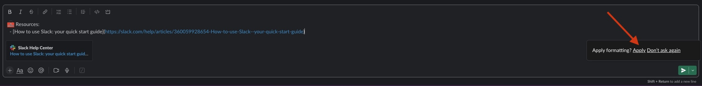
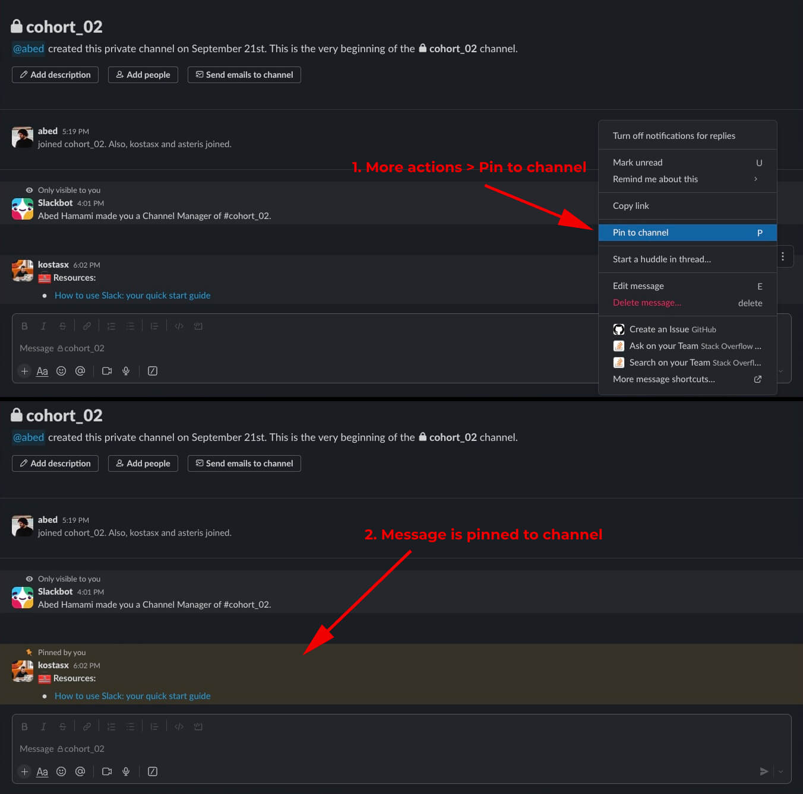

# Web Development X - Introductory Course

## Staff & Mentors

  - After you've joined our Slack platform, make sure to **update your Slack profile** and add your current role at intechgration.io, so our students are able to easily find the staff members and reach out to them.

### Useful Tools 

  **Scheduling Calls** _(Office Hours)_:
  - [**Calendly**](https://calendly.com/)
  - [**SavvyCal**](https://savvycal.com/)

---

## Onboarding

### **Invite Student to [Slack](https://intechgration.slack.com)** and send the following message:

  ```
  Hello team <TEAM_NAME>!

  You are now part of one of the 5 teams of the WDX-Intro course.
  You will be working together as a team of 4 super-heros. :slightly_smiling_face:

  Each group is named after a person that contributed (or still contributes) to programming and computer science.

  First task of the team: find out why this group is named <TEAM_NAME>. ;)    
  ```

  **TEAM_NAME:** Ada, Alan, Claude, Tim, Grace.

### Add Students and Volunteers to the specified Slack User Groups

  - Students should be added to the `@students` group

### **Share details about tracking their progress:** 

  These two videos can help them understand all about maintaining and updating their progress:

  - [**WDX-180 - Setting up: SSH Keys, Cloning repo & update progress** (progress tracking starts at 13:37)](https://youtu.be/S9Qg3Ltf__c?t=813)
  - [**VSCode: Working efficiently with CSV files**](https://www.youtube.com/watch?v=6biPbWK2Mtw)

### **Pin useful resources on Slack Channel:**

  Copy and paste the following markdown content into the Cohort and self-paced channels and click `Apply` when the `Apply formatting?` message pops up in the message area. 

  

  ```
  :toolbox: Resources:
    - [How to use Slack: your quick start guide](https://slack.com/help/articles/360059928654-How-to-use-Slack--your-quick-start-guide)
    - List of instructors/mentors/volunteers:
      - Name / Slack username / [email]
  ```

  Then, click on the the `More actions` icon (the ... 3 dots) and select [`Pin to channel`](https://slack.com/help/articles/205239997-Pin-messages-and-bookmark-links).

  [](./assets/Pin.Resources.to.Channel.jpg)

---

## Graduation Tasks  

### Issuing Certificates of Completion