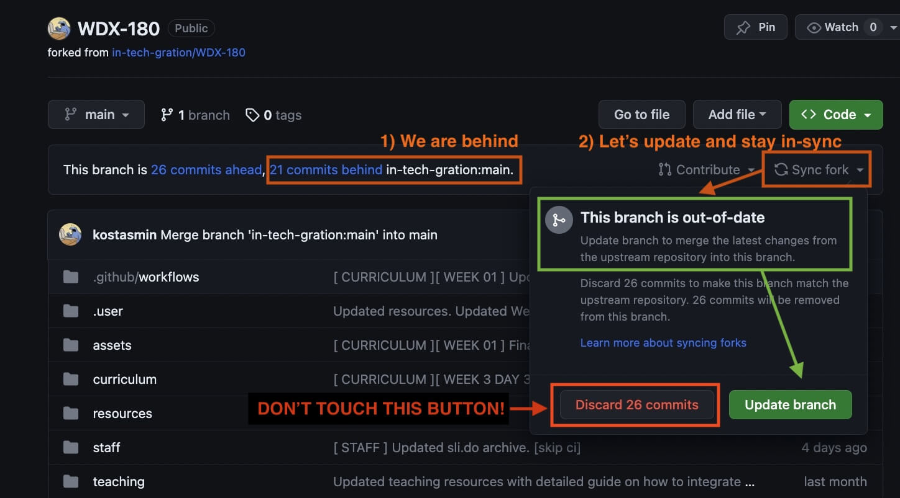

# Sli.do Questions

Every week, we move (archive) all the questions from [**sli.do**](https://www.slido.com/) _(the online tool we use to let our students post questions during the week)_ into our repository. 

For this task, we grab the questions and responses and add them to the [`staff/archive/slido.md`](./slido.md) file.

**Instructions:**

- Open your **forked** version of the [WDX-180 GitHub repository](https://github.com/in-tech-gration/WDX-180/)

- Make sure that your forked repository is up-to-date with the original repository. If it's not, update it by clicking the **Sync fork** button and selecting **Update branch**.

- Open the `sli.do` link. The link should look something like this `https://app.sli.do/event/<LARGE_UNIQUE_ID>/live/questions`

- Open the `staff/archive/slido.md` file. 

- Add all the questions and responses to the `slido.md` under the appropriate sections, e.g. `## Week 02 (Day 01-05)`.

- Commit, push and open a PR with an appropriate title: **Archived slido questions for Week 02** 

**Reminders:**

- When archiving sli.do questions, make sure to first disable access (ability for participants to post new questions) then move all questions from archive back to main so that all questions are archived properly.

- Make sure to click the  **1 more reply** buttons to grab all the replies.

- Separate each question by 3 hypens `---`.

- Mark each question with a **Q:** or **QUESTION:** and each reply with an **A:** or **QUESTION:**. 

Muchas Gracias!

(P.S. We are trying to automate this process by developing a JS script that can run in the browser and download 
all the questions and answers automatically. If you are up to the challenge, let us know :wink: )