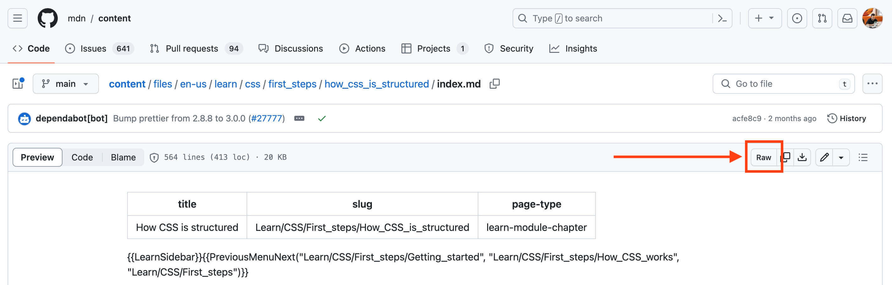
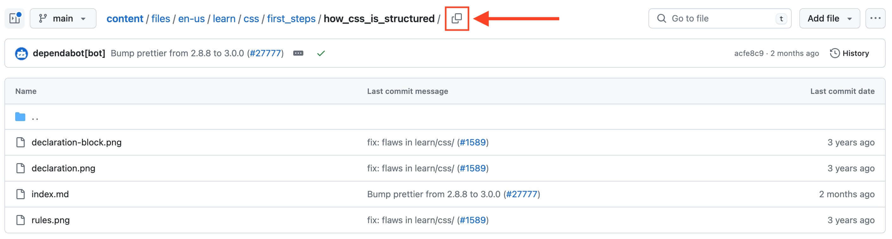
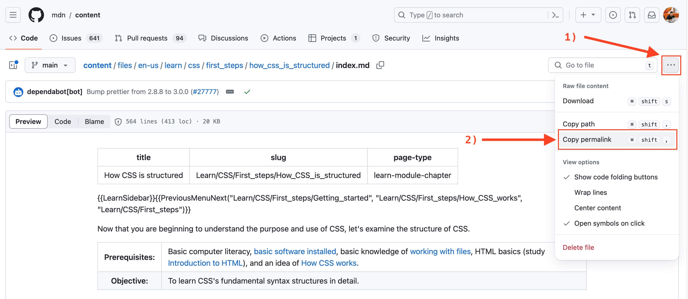

# Teaching Resources

## About

## Going Live: How to prepare for webinars and YouTube videos

  Create a Chrome Bookmark, name it something like "Clear Browser Data" and attach the following URL: `chrome://settings/clearBrowserData` to it. 
  
  This quick link can come in handy before running a live lecture or starting to record a YouTube video, as it will clear the browsing history that can sometimes reveal sensitive and personal links via the address bar auto-suggest.

## Important Concepts

### Dual-coding Theory & Picture Superiority Effect

  Dual-coding theory is a theory of cognition that suggests that the mind processes information along two different channels; verbal, and visual. It was hypothesized by Allan Paivio of the University of Western Ontario in 1971. In developing this theory, Paivio used the idea that the formation of mental images aids learning through the picture superiority effect, which states that pictures and images are more likely to be remembered than are words. This effect has been demonstrated in numerous experiments using different methods. The Picture Superiority Effect has applications in education, where learners can structure a mental model when processing a picture initially so that no further model construction may be required for subsequent processing of a text.

  Studies have shown that presenting picture before text is beneficial to students with low prior knowledge as it improves comprehension levels. According to Paivio, there are two ways a person could expand on learned material: verbal associations and imagery. Both imagery and verbal codes can be used when recalling information. **The ability to code a stimulus two different ways increases the chance of remembering** that item compared to if the stimulus was only coded one way.

  Supporting evidence shows that memory for some verbal information is enhanced if a relevant visual is also presented or if the learner can imagine a visual image to go with the verbal information. Likewise, visual information can often be enhanced when paired with relevant verbal information, whether real-world or imagined.

  Paivio's work has implications for literacy, visual mnemonics, idea generation, "Human performance technology", human factors, interface design, as well as the development of educational materials among others.

  **Sources:**

  - [Dual-coding Theory (Wikipedia)](https://en.wikipedia.org/wiki/Dual-coding_theory) 
  - [Picture Superiority Effect (Wikipedia)](https://en.wikipedia.org/wiki/Picture_superiority_effect)
  - [Eitel & Scheiter, 2015](https://link.springer.com/article/10.1007/s10648-014-9264-4)
  - [Salmerón, Baccino, Cañas, Madrid, & Fajardo, 2009](https://www.sciencedirect.com/science/article/abs/pii/S0360131509001602?via%3Dihub)

  **Terminology:**

  - [**Dual-Coding Theory**](#dual-coding-theory--the-picture-superiority-effect)
  - [**Picture Superiority Effect**](#dual-coding-theory--the-picture-superiority-effect)

## Integrating MDN Articles in our Curriculum

  1. Find the MDN article, and keep the title and URL
    
  - For example, title: "How CSS is structured", URL: "https://developer.mozilla.org/en-US/docs/Learn/CSS/First_steps/How_CSS_is_structured"

  2. Scroll down to the `Summary` section and click on `Edit the page on GitHub`

  3. This will open up the `index.md` GitHub page. Click on the parent subfolder to get back to the folder containing both the `index.md` and other assets.

  - For example, if the GitHub path is `content/edit/main/files/en-us/learn/css/first_steps/how_css_is_structured/index.md` you should click on the **/how_css_is_structured/** clickable part of the path.

  4. Create a folder where the article will be stored. Most of the times, the folder name is taken from the parent folder. For example, if the path is `content/edit/main/files/en-us/learn/css/first_steps/how_css_is_structured/index.md` the folder should be created under `curriculum/weekXX/resources/how_css_is_structured/`. 

  5. Create a `README.md` file inside the article folder: `curriculum/weekXX/resources/how_css_is_structured/README.md` and grab the RAW markdown from GitHub by clicking the `Raw` button on the top right of the file menu bar. For example, [go here](https://github.com/mdn/content/blob/main/files/en-us/learn/css/first_steps/how_css_is_structured/index.md) and click the `Raw` button.

  

  Copy and paste the raw markdown content in the `README.md` local file. At this point, it's a good idea to stage the file by running `git add`.

  6. Now, it's time to parse the MDN content using the `yari.parser.js` script.

  - For example: `node tools/yari.parser.js curriculum/weekXX/resources/how_css_is_structured/README.md`
  - After the parsing is completed, carefully go through the document and examine if all substitutions are looking good.

  7. Check for assets and download them. Are there any images in the folder apart from the `index.md`, e.g. `.png`, `.jpg`, etc.? In this case you will need to download these assets to the local folder using the `yari.download.js` 

  - Syntax: `node tools/yari.download.js <GITHUB_PATH> <TARGET_PATH>`
  - You can get the `<GITHUB_PATH>` by clicking the button shown in the screenshot below: 

    

  - The `<TARGET_PATH>` should be a folder where the images will be downloaded. **The folder path must end in `assets/`**. Example: `node tools/yari.download.js files/en-us/learn/css/first_steps/what_is_css curriculum/week03/resources/what_is_css/assets/`

  8. At the bottom of the `README.md`, you should always include a `Sources and Attributions` section that include the title and link of the article **along with the Permalink**. You can grab the permalink by clicking the `Copy permalink` button found under the `More file actions` menu (...).

  

  9. Review the content and make any necessary updates. For example, you can remove mentions to previous/next MDN articles as these might not be included in our curriculum or be replaced by other resources. If the article does not contain assessments, consider adding some exercises or code challenges.

  10. You can regularly validate the `README.md` file using the `tools/validator.js` script.

